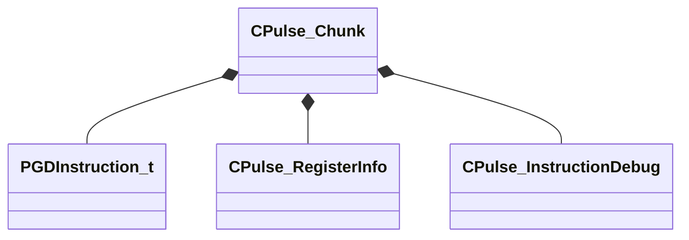

[Schemas](../../schemas.md) / [pulse_runtime_lib](../pulse_runtime_lib.md) / CPulse_Chunk

# CPulse_Chunk

> Source: **Build 25000182** · 2026-08-28 · `windows-x86_64` · schema `0.10.0`

**Kind:** class · **Size:** 88 bytes (`0x58`) · **Align:** 8 · **Module:** pulse_runtime_lib

**Relationships:**

## Memory layout

3 fields (3 declared here, 0 inherited). Offsets are absolute from the object base.

| Offset | Field | Type | From | Annotations |
|--------|-------|------|------|-------------|
| `0x0` | `m_Instructions` | CUtlLeanVector< [PGDInstruction_t](../pulse_runtime_lib/PGDInstruction_t.md) > |  |  |
| `0x10` | `m_Registers` | CUtlLeanVector< [CPulse_RegisterInfo](../pulse_runtime_lib/CPulse_RegisterInfo.md) > |  |  |
| `0x20` | `m_InstructionDebugInfos` | CUtlLeanVector< [CPulse_InstructionDebug](../pulse_runtime_lib/CPulse_InstructionDebug.md) > |  |  |

KV3 class defaults

<pre>{
	&quot;m_Instructions&quot;:
	[
	],
	&quot;m_Registers&quot;:
	[
	],
	&quot;m_InstructionDebugInfos&quot;:
	[
	]
}</pre>

