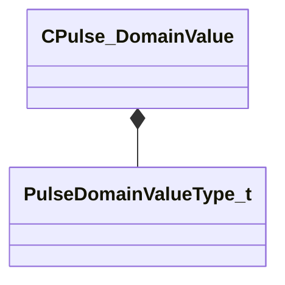

[Schemas](../../schemas.md) / [pulse_runtime_lib](../pulse_runtime_lib.md) / CPulse_DomainValue

# CPulse_DomainValue

> Source: **Build 25000182** · 2026-08-28 · `windows-x86_64` · schema `0.10.0`

**Kind:** class · **Size:** 48 bytes (`0x30`) · **Align:** 8 · **Module:** pulse_runtime_lib

**Relationships:**

## Memory layout

3 fields (3 declared here, 0 inherited). Offsets are absolute from the object base.

| Offset | Field | Type | From | Annotations |
|--------|-------|------|------|-------------|
| `0x0` | `m_nType` | [PulseDomainValueType_t](../pulse_runtime_lib/PulseDomainValueType_t.md) |  |  |
| `0x8` | `m_Value` | CGlobalSymbolCaseSensitive |  |  |
| `0x10` | `m_RequiredRuntimeType` | CPulseValueFullType |  |  |

KV3 class defaults

<pre>{
	&quot;m_nType&quot;: &quot;INVALID&quot;,
	&quot;m_Value&quot;: &quot;&quot;,
	&quot;m_RequiredRuntimeType&quot;: &quot;PVAL_VOID&quot;
}</pre>

