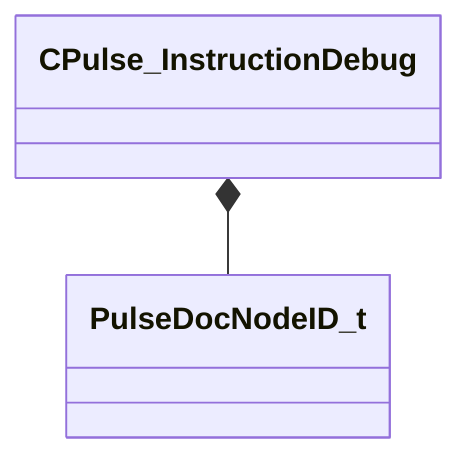

[Schemas](../../schemas.md) / [pulse_runtime_lib](../pulse_runtime_lib.md) / CPulse_InstructionDebug

# CPulse_InstructionDebug

> Source: **Build 25000182** · 2026-08-28 · `windows-x86_64` · schema `0.10.0`

**Kind:** class · **Size:** 24 bytes (`0x18`) · **Align:** 8 · **Module:** pulse_runtime_lib

**Relationships:**

## Memory layout

3 fields (3 declared here, 0 inherited). Offsets are absolute from the object base.

| Offset | Field | Type | From | Annotations |
|--------|-------|------|------|-------------|
| `0x0` | `m_nFlowNodeID` | [PulseDocNodeID_t](../pulse_runtime_lib/PulseDocNodeID_t.md) |  |  |
| `0x4` | `m_nValueNodeID` | [PulseDocNodeID_t](../pulse_runtime_lib/PulseDocNodeID_t.md) |  |  |
| `0x8` | `m_SequencePointName` | PulseSymbol_t |  |  |

KV3 class defaults

<pre>{
	&quot;m_nFlowNodeID&quot;: -1,
	&quot;m_nValueNodeID&quot;: -1,
	&quot;m_SequencePointName&quot;: &quot;&quot;
}</pre>

