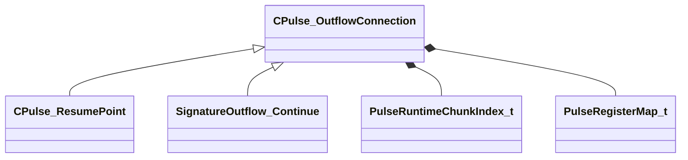

[Schemas](../../schemas.md) / [pulse_runtime_lib](../pulse_runtime_lib.md) / CPulse_OutflowConnection

# CPulse_OutflowConnection

**Kind:** class · **Size:** 72 bytes (`0x48`) · **Align:** 255 · **Module:** pulse_runtime_lib

**Derived by:** [CPulse_ResumePoint](../pulse_runtime_lib/CPulse_ResumePoint.md), [SignatureOutflow_Continue](../pulse_runtime_lib/SignatureOutflow_Continue.md)

**Relationships:**

## Memory layout

4 fields (4 declared here, 0 inherited). Offsets are absolute from the object base.

| Offset | Field | Type | From | Annotations |
|--------|-------|------|------|-------------|
| `0x0` | `m_SourceOutflowName` | PulseSymbol_t |  |  |
| `0x10` | `m_nDestChunk` | [PulseRuntimeChunkIndex_t](../pulse_runtime_lib/PulseRuntimeChunkIndex_t.md) |  |  |
| `0x14` | `m_nInstruction` | int32 |  |  |
| `0x18` | `m_OutflowRegisterMap` | [PulseRegisterMap_t](../pulse_runtime_lib/PulseRegisterMap_t.md) |  |  |
