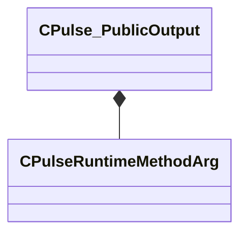

[Schemas](../../schemas.md) / [pulse_runtime_lib](../pulse_runtime_lib.md) / CPulse_PublicOutput

# CPulse_PublicOutput

**Kind:** class · **Size:** 40 bytes (`0x28`) · **Align:** 8 · **Module:** pulse_runtime_lib

**Relationships:**

## Memory layout

3 fields (3 declared here, 0 inherited). Offsets are absolute from the object base.

| Offset | Field | Type | From | Annotations |
|--------|-------|------|------|-------------|
| `0x0` | `m_Name` | PulseSymbol_t |  |  |
| `0x10` | `m_Description` | CUtlString |  |  |
| `0x18` | `m_Args` | CUtlLeanVector< [CPulseRuntimeMethodArg](../pulse_runtime_lib/CPulseRuntimeMethodArg.md) > |  |  |

KV3 class defaults

<pre>{
	&quot;m_Name&quot;: &quot;&quot;,
	&quot;m_Description&quot;: &quot;&quot;,
	&quot;m_Args&quot;:
	[
	]
}</pre>

