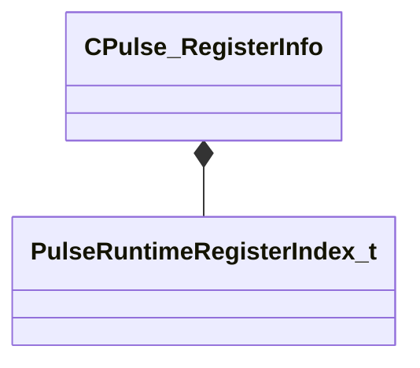

[Schemas](../../schemas.md) / [pulse_runtime_lib](../pulse_runtime_lib.md) / CPulse_RegisterInfo

# CPulse_RegisterInfo

> Source: **Build 25000182** · 2026-08-28 · `windows-x86_64` · schema `0.10.0`

**Kind:** class · **Size:** 96 bytes (`0x60`) · **Align:** 8 · **Module:** pulse_runtime_lib

**Relationships:**

## Memory layout

5 fields (5 declared here, 0 inherited). Offsets are absolute from the object base.

| Offset | Field | Type | From | Annotations |
|--------|-------|------|------|-------------|
| `0x0` | `m_nReg` | [PulseRuntimeRegisterIndex_t](../pulse_runtime_lib/PulseRuntimeRegisterIndex_t.md) |  |  |
| `0x8` | `m_Type` | CPulseValueFullType |  |  |
| `0x20` | `m_OriginName` | CKV3MemberNameWithStorage |  |  |
| `0x58` | `m_nWrittenByInstruction` | int32 |  |  |
| `0x5c` | `m_nLastReadByInstruction` | int32 |  |  |

KV3 class defaults

<pre>{
	&quot;m_nReg&quot;: -1,
	&quot;m_Type&quot;: &quot;PVAL_VOID&quot;,
	&quot;m_OriginName&quot;: &quot;&quot;,
	&quot;m_nWrittenByInstruction&quot;: -1,
	&quot;m_nLastReadByInstruction&quot;: -1
}</pre>

