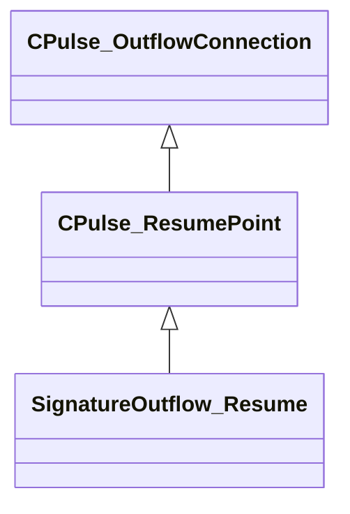

[Schemas](../../schemas.md) / [pulse_runtime_lib](../pulse_runtime_lib.md) / CPulse_ResumePoint

# CPulse_ResumePoint

> Source: **Build 25000182** · 2026-08-28 · `windows-x86_64` · schema `0.10.0`

**Kind:** class · **Size:** 72 bytes (`0x48`) · **Align:** n/a (unspecified) · **Module:** pulse_runtime_lib

**Inherits from:** [CPulse_OutflowConnection](../pulse_runtime_lib/CPulse_OutflowConnection.md)

**Derived by:** [SignatureOutflow_Resume](../pulse_runtime_lib/SignatureOutflow_Resume.md)

**Relationships:**

## Memory layout

4 fields (0 declared here, 4 inherited). Offsets are absolute from the object base.

| Offset | Field | Type | From | Annotations |
|--------|-------|------|------|-------------|
| `0x0` | `m_SourceOutflowName` | PulseSymbol_t | [CPulse_OutflowConnection](../pulse_runtime_lib/CPulse_OutflowConnection.md) |  |
| `0x10` | `m_nDestChunk` | [PulseRuntimeChunkIndex_t](../pulse_runtime_lib/PulseRuntimeChunkIndex_t.md) | [CPulse_OutflowConnection](../pulse_runtime_lib/CPulse_OutflowConnection.md) |  |
| `0x14` | `m_nInstruction` | int32 | [CPulse_OutflowConnection](../pulse_runtime_lib/CPulse_OutflowConnection.md) |  |
| `0x18` | `m_OutflowRegisterMap` | [PulseRegisterMap_t](../pulse_runtime_lib/PulseRegisterMap_t.md) | [CPulse_OutflowConnection](../pulse_runtime_lib/CPulse_OutflowConnection.md) |  |
