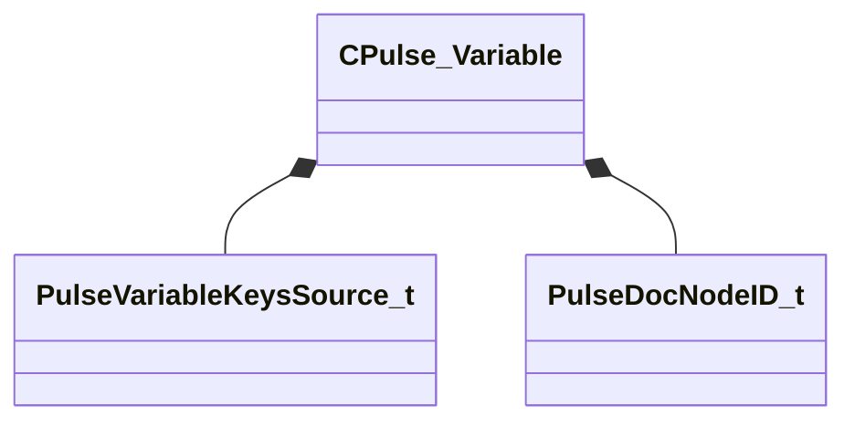

[Schemas](../../schemas.md) / [pulse_runtime_lib](../pulse_runtime_lib.md) / CPulse_Variable

# CPulse_Variable

**Kind:** class · **Size:** 96 bytes (`0x60`) · **Align:** 8 · **Module:** pulse_runtime_lib

**Relationships:**

## Memory layout

9 fields (9 declared here, 0 inherited). Offsets are absolute from the object base.

| Offset | Field | Type | From | Annotations |
|--------|-------|------|------|-------------|
| `0x0` | `m_Name` | PulseSymbol_t |  |  |
| `0x10` | `m_Description` | CUtlString |  |  |
| `0x18` | `m_Type` | CPulseValueFullType |  |  |
| `0x30` | `m_DefaultValue` | KeyValues3 |  |  |
| `0x44` | `m_nKeysSource` | [PulseVariableKeysSource_t](../pulse_runtime_lib/PulseVariableKeysSource_t.md) |  |  |
| `0x48` | `m_bIsPublicBlackboardVariable` | bool |  |  |
| `0x49` | `m_bIsObservable` | bool |  |  |
| `0x4c` | `m_nEditorNodeID` | [PulseDocNodeID_t](../pulse_runtime_lib/PulseDocNodeID_t.md) |  |  |
| `0x50` | `m_Metadata` | KeyValues3 |  |  |

KV3 class defaults

<pre>{
	&quot;m_Name&quot;: &quot;&quot;,
	&quot;m_Description&quot;: &quot;&quot;,
	&quot;m_Type&quot;: &quot;PVAL_VOID&quot;,
	&quot;m_DefaultValue&quot;: null,
	&quot;m_nKeysSource&quot;: &quot;PRIVATE&quot;,
	&quot;m_bIsPublicBlackboardVariable&quot;: false,
	&quot;m_bIsObservable&quot;: false,
	&quot;m_nEditorNodeID&quot;: -1,
	&quot;m_Metadata&quot;: null
}</pre>

