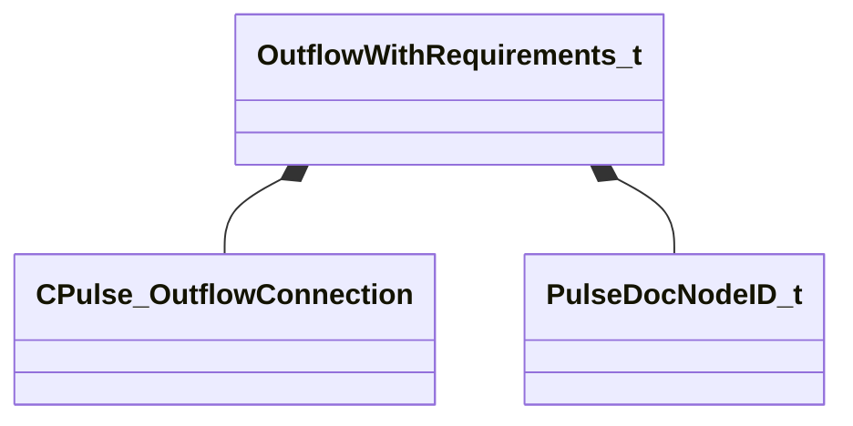

[Schemas](../../schemas.md) / [pulse_runtime_lib](../pulse_runtime_lib.md) / OutflowWithRequirements_t

# OutflowWithRequirements_t

**Kind:** class · **Size:** 128 bytes (`0x80`) · **Align:** 8 · **Module:** pulse_runtime_lib

**Relationships:**

## Memory layout

4 fields (4 declared here, 0 inherited). Offsets are absolute from the object base.

| Offset | Field | Type | From | Annotations |
|--------|-------|------|------|-------------|
| `0x0` | `m_Connection` | [CPulse_OutflowConnection](../pulse_runtime_lib/CPulse_OutflowConnection.md) |  |  |
| `0x48` | `m_DestinationFlowNodeID` | [PulseDocNodeID_t](../pulse_runtime_lib/PulseDocNodeID_t.md) |  |  |
| `0x50` | `m_RequirementNodeIDs` | CUtlVector< [PulseDocNodeID_t](../pulse_runtime_lib/PulseDocNodeID_t.md) > |  |  |
| `0x68` | `m_nCursorStateBlockIndex` | CUtlVector< int32 > |  |  |

KV3 class defaults

<pre>{
	&quot;m_Connection&quot;:
	{
		&quot;m_SourceOutflowName&quot;: &quot;&quot;,
		&quot;m_nDestChunk&quot;: -1,
		&quot;m_nInstruction&quot;: -1
	},
	&quot;m_DestinationFlowNodeID&quot;: -1,
	&quot;m_RequirementNodeIDs&quot;:
	[
	],
	&quot;m_nCursorStateBlockIndex&quot;:
	[
	]
}</pre>

