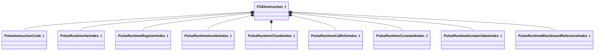

[Schemas](../../schemas.md) / [pulse_runtime_lib](../pulse_runtime_lib.md) / PGDInstruction_t

# PGDInstruction_t

**Kind:** class · **Size:** 56 bytes (`0x38`) · **Align:** 8 · **Module:** pulse_runtime_lib

**Relationships:**

## Memory layout

12 fields (12 declared here, 0 inherited). Offsets are absolute from the object base.

| Offset | Field | Type | From | Annotations |
|--------|-------|------|------|-------------|
| `0x0` | `m_nCode` | [PulseInstructionCode_t](../pulse_runtime_lib/PulseInstructionCode_t.md) |  |  |
| `0x4` | `m_nVar` | [PulseRuntimeVarIndex_t](../pulse_runtime_lib/PulseRuntimeVarIndex_t.md) |  |  |
| `0x8` | `m_nReg0` | [PulseRuntimeRegisterIndex_t](../pulse_runtime_lib/PulseRuntimeRegisterIndex_t.md) |  |  |
| `0xa` | `m_nReg1` | [PulseRuntimeRegisterIndex_t](../pulse_runtime_lib/PulseRuntimeRegisterIndex_t.md) |  |  |
| `0xc` | `m_nReg2` | [PulseRuntimeRegisterIndex_t](../pulse_runtime_lib/PulseRuntimeRegisterIndex_t.md) |  |  |
| `0x10` | `m_nInvokeBindingIndex` | [PulseRuntimeInvokeIndex_t](../pulse_runtime_lib/PulseRuntimeInvokeIndex_t.md) |  |  |
| `0x14` | `m_nChunk` | [PulseRuntimeChunkIndex_t](../pulse_runtime_lib/PulseRuntimeChunkIndex_t.md) |  |  |
| `0x18` | `m_nDestInstruction` | int32 |  |  |
| `0x1c` | `m_nCallInfoIndex` | [PulseRuntimeCallInfoIndex_t](../pulse_runtime_lib/PulseRuntimeCallInfoIndex_t.md) |  |  |
| `0x20` | `m_nConstIdx` | [PulseRuntimeConstantIndex_t](../pulse_runtime_lib/PulseRuntimeConstantIndex_t.md) |  |  |
| `0x22` | `m_nDomainValueIdx` | [PulseRuntimeDomainValueIndex_t](../pulse_runtime_lib/PulseRuntimeDomainValueIndex_t.md) |  |  |
| `0x24` | `m_nBlackboardReferenceIdx` | [PulseRuntimeBlackboardReferenceIndex_t](../pulse_runtime_lib/PulseRuntimeBlackboardReferenceIndex_t.md) |  |  |

KV3 class defaults

<pre>{
	&quot;m_nCode&quot;: &quot;INVALID&quot;,
	&quot;m_nVar&quot;: -1,
	&quot;m_nReg0&quot;: -1,
	&quot;m_nReg1&quot;: -1,
	&quot;m_nReg2&quot;: -1,
	&quot;m_nInvokeBindingIndex&quot;: -1,
	&quot;m_nChunk&quot;: -1,
	&quot;m_nDestInstruction&quot;: 0,
	&quot;m_nCallInfoIndex&quot;: -1,
	&quot;m_nConstIdx&quot;: -1,
	&quot;m_nDomainValueIdx&quot;: -1,
	&quot;m_nBlackboardReferenceIdx&quot;: -1
}</pre>

