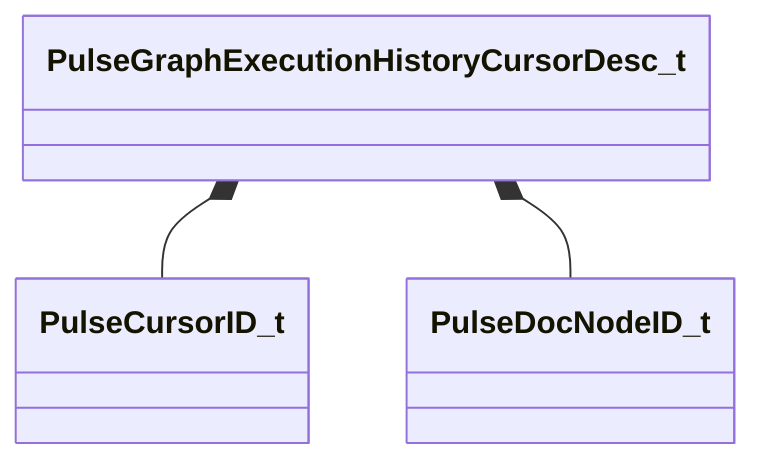

[Schemas](../../schemas.md) / [pulse_runtime_lib](../pulse_runtime_lib.md) / PulseGraphExecutionHistoryCursorDesc_t

# PulseGraphExecutionHistoryCursorDesc_t

> Source: **Build 25000182** · 2026-08-28 · `windows-x86_64` · schema `0.10.0`

**Kind:** class · **Size:** 48 bytes (`0x30`) · **Align:** 8 · **Module:** pulse_runtime_lib

**Relationships:**

## Memory layout

6 fields (6 declared here, 0 inherited). Offsets are absolute from the object base.

| Offset | Field | Type | From | Annotations |
|--------|-------|------|------|-------------|
| `0x0` | `vecAncestorCursorIDs` | CUtlVector< [PulseCursorID_t](../pulse_runtime_lib/PulseCursorID_t.md) > |  |  |
| `0x18` | `nSpawnNodeID` | [PulseDocNodeID_t](../pulse_runtime_lib/PulseDocNodeID_t.md) |  |  |
| `0x1c` | `nRetiredAtNodeID` | [PulseDocNodeID_t](../pulse_runtime_lib/PulseDocNodeID_t.md) |  |  |
| `0x20` | `flLastReferenced` | float32 |  |  |
| `0x24` | `nLastValidEntryIdx` | int32 |  |  |
| `0x28` | `bWasAnObservableComputation` | bool |  |  |

KV3 class defaults

<pre>{
	&quot;vecAncestorCursorIDs&quot;:
	[
	],
	&quot;nSpawnNodeID&quot;: -1,
	&quot;nRetiredAtNodeID&quot;: -1,
	&quot;flLastReferenced&quot;: 0.000000,
	&quot;nLastValidEntryIdx&quot;: 0,
	&quot;bWasAnObservableComputation&quot;: false
}</pre>

