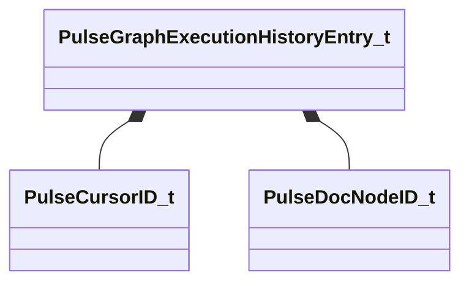

[Schemas](../../schemas.md) / [pulse_runtime_lib](../pulse_runtime_lib.md) / PulseGraphExecutionHistoryEntry_t

# PulseGraphExecutionHistoryEntry_t

> Source: **Build 25000182** · 2026-08-28 · `windows-x86_64` · schema `0.10.0`

**Kind:** class · **Size:** 32 bytes (`0x20`) · **Align:** 8 · **Module:** pulse_runtime_lib

**Relationships:**

## Memory layout

5 fields (5 declared here, 0 inherited). Offsets are absolute from the object base.

| Offset | Field | Type | From | Annotations |
|--------|-------|------|------|-------------|
| `0x0` | `nCursorID` | [PulseCursorID_t](../pulse_runtime_lib/PulseCursorID_t.md) |  |  |
| `0x4` | `nEditorID` | [PulseDocNodeID_t](../pulse_runtime_lib/PulseDocNodeID_t.md) |  |  |
| `0x8` | `flExecTime` | float32 |  |  |
| `0xc` | `unFlags` | uint32 |  |  |
| `0x10` | `tagName` | PulseSymbol_t |  |  |

KV3 class defaults

<pre>{
	&quot;nCursorID&quot;: -1,
	&quot;nEditorID&quot;: -1,
	&quot;flExecTime&quot;: 0.000000,
	&quot;unFlags&quot;: 0,
	&quot;tagName&quot;: &quot;&quot;
}</pre>

