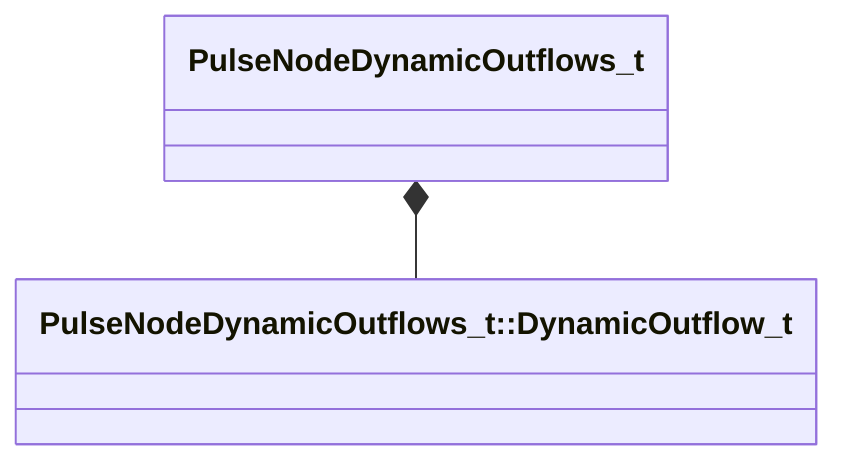

[Schemas](../../schemas.md) / [pulse_runtime_lib](../pulse_runtime_lib.md) / PulseNodeDynamicOutflows_t

# PulseNodeDynamicOutflows_t

> Source: **Build 25000182** · 2026-08-28 · `windows-x86_64` · schema `0.10.0`

**Kind:** class · **Size:** 24 bytes (`0x18`) · **Align:** 8 · **Module:** pulse_runtime_lib

**Relationships:**

## Memory layout

1 field (1 declared here, 0 inherited). Offsets are absolute from the object base.

| Offset | Field | Type | From | Annotations |
|--------|-------|------|------|-------------|
| `0x0` | `m_Outflows` | CUtlVector< [PulseNodeDynamicOutflows_t::DynamicOutflow_t](../pulse_runtime_lib/PulseNodeDynamicOutflows_t.DynamicOutflow_t.md) > |  |  |

KV3 class defaults

<pre>{
	&quot;m_Outflows&quot;:
	[
	]
}</pre>

