# Module: pulse_system

[📊 View UML Diagram](../diagrams/pulse_system.md)

| Name | Kind | Bases | Fields |
|------|------|-------|--------|
| [CPulseCell_ExampleCriteria](#cpulsecell_examplecriteria) | class | CPulseCell_BaseRequirement | 0 |
| [CPulseCell_ExampleCriteria::Criteria_t](#cpulsecell_examplecriteriacriteria_t) | class |  | 3 |
| [CPulseCell_ExampleSelector](#cpulsecell_exampleselector) | class | CPulseCell_BaseFlow | 1 |
| [CPulseCell_Outflow_TestExplicitYesNo](#cpulsecell_outflow_testexplicityesno) | class | CPulseCell_BaseFlow | 2 |
| [CPulseCell_Outflow_TestRandomYesNo](#cpulsecell_outflow_testrandomyesno) | class | CPulseCell_BaseFlow | 2 |
| [CPulseCell_Step_TestDomainCreateFakeEntity](#cpulsecell_step_testdomaincreatefakeentity) | class | CPulseCell_BaseFlow | 0 |
| [CPulseCell_Step_TestDomainDestroyFakeEntity](#cpulsecell_step_testdomaindestroyfakeentity) | class | CPulseCell_BaseFlow | 0 |
| [CPulseCell_Step_TestDomainEntFire](#cpulsecell_step_testdomainentfire) | class | CPulseCell_BaseFlow | 1 |
| [CPulseCell_Step_TestDomainTracepoint](#cpulsecell_step_testdomaintracepoint) | class | CPulseCell_BaseFlow | 0 |
| [CPulseCell_TestWaitWithCursorState](#cpulsecell_testwaitwithcursorstate) | class | CPulseCell_BaseYieldingInflow | 3 |
| [CPulseCell_TestWaitWithCursorState::CursorState_t](#cpulsecell_testwaitwithcursorstatecursorstate_t) | class |  | 2 |
| [CPulseCell_Test_MultiInflow_NoDefault](#cpulsecell_test_multiinflow_nodefault) | class | CPulseCell_BaseFlow | 0 |
| [CPulseCell_Test_MultiInflow_WithDefault](#cpulsecell_test_multiinflow_withdefault) | class | CPulseCell_BaseFlow | 0 |
| [CPulseCell_Test_MultiOutflow_WithParams](#cpulsecell_test_multioutflow_withparams) | class | CPulseCell_BaseFlow | 2 |
| [CPulseCell_Test_MultiOutflow_WithParams_Yielding](#cpulsecell_test_multioutflow_withparams_yielding) | class | CPulseCell_BaseYieldingInflow | 5 |
| [CPulseCell_Test_MultiOutflow_WithParams_Yielding::CursorState_t](#cpulsecell_test_multioutflow_withparams_yieldingcursorstate_t) | class |  | 1 |
| [CPulseCell_Test_NoInflow](#cpulsecell_test_noinflow) | class | CPulseCell_BaseFlow | 0 |
| [CPulseCell_Val_TestDomainFindEntityByName](#cpulsecell_val_testdomainfindentitybyname) | class | CPulseCell_BaseValue | 0 |
| [CPulseCell_Val_TestDomainGetEntityName](#cpulsecell_val_testdomaingetentityname) | class | CPulseCell_BaseValue | 0 |
| [CPulseCell_Value_TestValue50](#cpulsecell_value_testvalue50) | class | CPulseCell_BaseValue | 0 |
| [CPulseGraphInstance_TestDomain](#cpulsegraphinstance_testdomain) | class | CBasePulseGraphInstance | 9 |
| [CPulseGraphInstance_TestDomain_Derived](#cpulsegraphinstance_testdomain_derived) | class | CPulseGraphInstance_TestDomain | 1 |
| [CPulseGraphInstance_TestDomain_FakeEntityOwner](#cpulsegraphinstance_testdomain_fakeentityowner) | class | CBasePulseGraphInstance | 0 |
| [CPulseGraphInstance_TestDomain_UseReadOnlyBlackboardView](#cpulsegraphinstance_testdomain_usereadonlyblackboardview) | class | CPulseGraphInstance_TestDomain | 0 |
| [CPulseGraphInstance_TurtleGraphics](#cpulsegraphinstance_turtlegraphics) | class | CBasePulseGraphInstance | 0 |
| [CPulseTestFuncs_LibraryA](#cpulsetestfuncs_librarya) | class |  | 0 |
| [CPulseTurtleGraphicsCursor](#cpulseturtlegraphicscursor) | class | CPulseExecCursor | 4 |
| [CTestDomainDerived_Cursor](#ctestdomainderived_cursor) | class | CPulseExecCursor | 2 |
| [FakeEntityDerivedA_tAPI](#fakeentityderiveda_tapi) | class |  | 0 |
| [FakeEntityDerivedB_tAPI](#fakeentityderivedb_tapi) | class |  | 0 |
| [FakeEntity_tAPI](#fakeentity_tapi) | class |  | 0 |
| [PulseTestEnumColor_t](#pulsetestenumcolor_t) | enum |  | 5 |
| [PulseTestEnumShape_t](#pulsetestenumshape_t) | enum |  | 3 |
| [TestComponent_t](#testcomponent_t) | class |  | 1 |
| [TestComponent_tAPI](#testcomponent_tapi) | class |  | 0 |

---

### CPulseCell_ExampleCriteria

**Inherits from:** [CPulseCell_BaseRequirement](pulse_runtime_lib.md#cpulsecell_baserequirement)

**Metadata:** `MGetKV3ClassDefaults {
	"_class": "CPulseCell_ExampleCriteria",
	"m_nEditorNodeID": -1
}`, `MPropertyFriendlyName "Example Criteria"`, `MPropertyDescription "An example of requirement data with ports"`

**Relationships:**

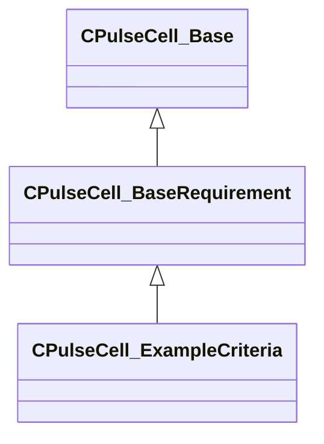
```mermaid
classDiagram
    CPulseCell_BaseRequirement <|-- CPulseCell_ExampleCriteria
    CPulseCell_Base <|-- CPulseCell_BaseRequirement
```

### CPulseCell_ExampleCriteria::Criteria_t

**Fields:**

| Name | Type | Annotations |
|------|------|-------------|
| `m_flFloatValue1` | float32 |  |
| `m_flFloatValue2` | float32 |  |
| `m_bMyBool` | bool |  |

### CPulseCell_ExampleSelector

**Inherits from:** [CPulseCell_BaseFlow](pulse_runtime_lib.md#cpulsecell_baseflow)

**Metadata:** `MGetKV3ClassDefaults {
	"_class": "CPulseCell_ExampleSelector",
	"m_nEditorNodeID": -1,
	"m_OutflowList":
	{
		"m_Outflows":
		[
		]
	}
}`, `MPropertyFriendlyName "Select Example Criteria"`, `MPropertyDescription "Evaluate the requirements of each connected node"`, `MPulseEditorHeaderIcon "tools/images/pulse_editor/requirements.png"`, `MPulseEditorCanvasItemSpecKV3 "{ className='IsControlFlowNode AllOutflowsInSpecialSection IsSelectorNode' create_special_outflows_section=true }"`

**Relationships:**

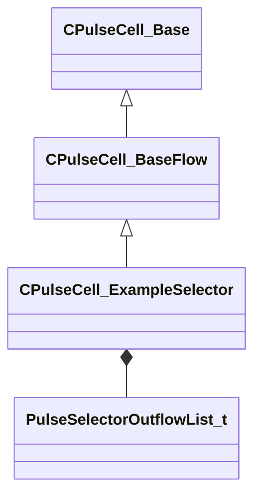
```mermaid
classDiagram
    CPulseCell_BaseFlow <|-- CPulseCell_ExampleSelector
    CPulseCell_Base <|-- CPulseCell_BaseFlow
    CPulseCell_ExampleSelector *-- PulseSelectorOutflowList_t
```

**Fields:**

| Name | Type | Annotations |
|------|------|-------------|
| `m_OutflowList` | [PulseSelectorOutflowList_t](../schemas/pulse_runtime_lib.md#pulseselectoroutflowlist_t) |  |

### CPulseCell_Outflow_TestExplicitYesNo

**Inherits from:** [CPulseCell_BaseFlow](pulse_runtime_lib.md#cpulsecell_baseflow)

**Metadata:** `MGetKV3ClassDefaults {
	"_class": "CPulseCell_Outflow_TestExplicitYesNo",
	"m_nEditorNodeID": -1,
	"m_Yes":
	{
		"m_SourceOutflowName": "",
		"m_nDestChunk": -1,
		"m_nInstruction": -1
	},
	"m_No":
	{
		"m_SourceOutflowName": "",
		"m_nDestChunk": -1,
		"m_nInstruction": -1
	}
}`, `MPropertyFriendlyName "[Test] Explicit Yes/No Outflow"`, `MPropertyDescription "Test node that picks between two outflows as specified in the test domain."`

**Relationships:**

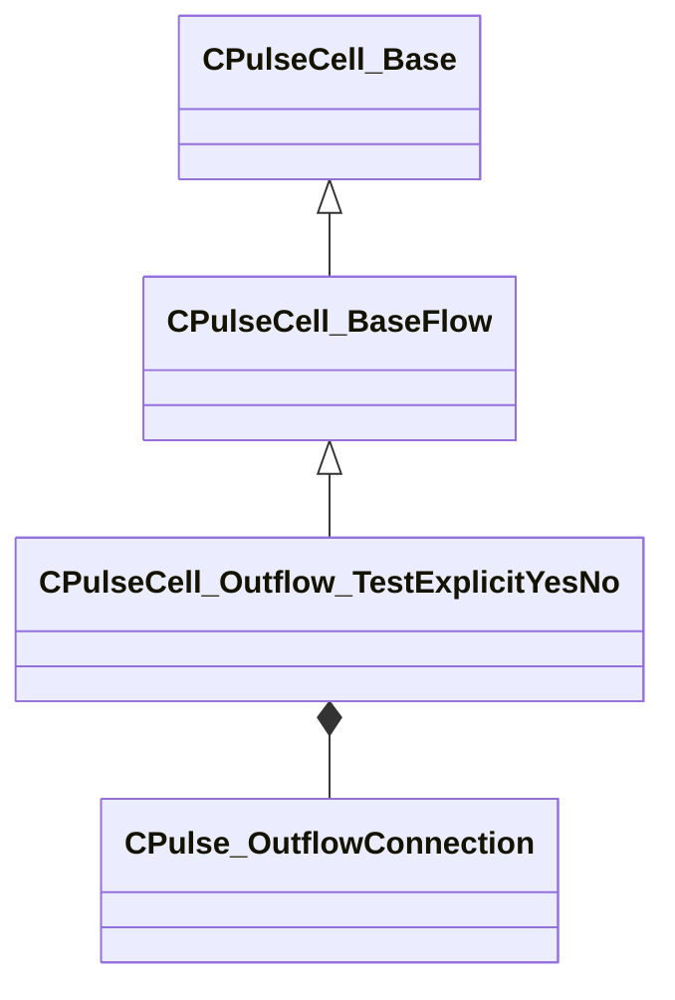
```mermaid
classDiagram
    CPulseCell_BaseFlow <|-- CPulseCell_Outflow_TestExplicitYesNo
    CPulseCell_Base <|-- CPulseCell_BaseFlow
    CPulseCell_Outflow_TestExplicitYesNo *-- CPulse_OutflowConnection
```

**Fields:**

| Name | Type | Annotations |
|------|------|-------------|
| `m_Yes` | [CPulse_OutflowConnection](../schemas/pulse_runtime_lib.md#cpulse_outflowconnection) | `MPropertyFriendlyName "Yes"` |
| `m_No` | [CPulse_OutflowConnection](../schemas/pulse_runtime_lib.md#cpulse_outflowconnection) | `MPropertyFriendlyName "No"` |

### CPulseCell_Outflow_TestRandomYesNo

**Inherits from:** [CPulseCell_BaseFlow](pulse_runtime_lib.md#cpulsecell_baseflow)

**Metadata:** `MGetKV3ClassDefaults {
	"_class": "CPulseCell_Outflow_TestRandomYesNo",
	"m_nEditorNodeID": -1,
	"m_Yes":
	{
		"m_SourceOutflowName": "",
		"m_nDestChunk": -1,
		"m_nInstruction": -1
	},
	"m_No":
	{
		"m_SourceOutflowName": "",
		"m_nDestChunk": -1,
		"m_nInstruction": -1
	}
}`, `MPropertyFriendlyName "[Test] Random Yes/No Outflow"`, `MPropertyDescription "Test node that randomly picks between two outflows."`

**Relationships:**

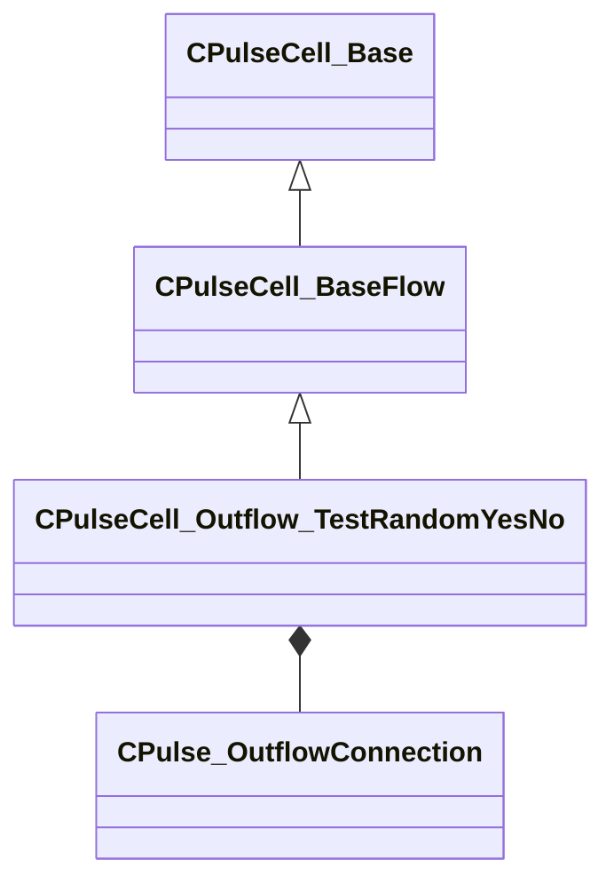
```mermaid
classDiagram
    CPulseCell_BaseFlow <|-- CPulseCell_Outflow_TestRandomYesNo
    CPulseCell_Base <|-- CPulseCell_BaseFlow
    CPulseCell_Outflow_TestRandomYesNo *-- CPulse_OutflowConnection
```

**Fields:**

| Name | Type | Annotations |
|------|------|-------------|
| `m_Yes` | [CPulse_OutflowConnection](../schemas/pulse_runtime_lib.md#cpulse_outflowconnection) | `MPropertyFriendlyName "Yes"` `MPropertyDescription "Randomly taken half of the time"` |
| `m_No` | [CPulse_OutflowConnection](../schemas/pulse_runtime_lib.md#cpulse_outflowconnection) | `MPropertyFriendlyName "No"` `MPropertyDescription "Randomly taken half of the time"` |

### CPulseCell_Step_TestDomainCreateFakeEntity

**Inherits from:** [CPulseCell_BaseFlow](pulse_runtime_lib.md#cpulsecell_baseflow)

**Metadata:** `MGetKV3ClassDefaults {
	"_class": "CPulseCell_Step_TestDomainCreateFakeEntity",
	"m_nEditorNodeID": -1
}`, `MPropertyFriendlyName "Spawn Fake Entity"`

**Relationships:**

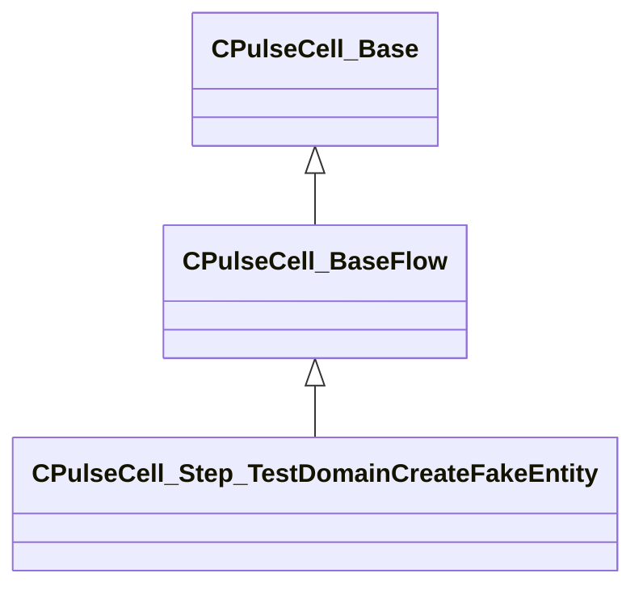
```mermaid
classDiagram
    CPulseCell_BaseFlow <|-- CPulseCell_Step_TestDomainCreateFakeEntity
    CPulseCell_Base <|-- CPulseCell_BaseFlow
```

### CPulseCell_Step_TestDomainDestroyFakeEntity

**Inherits from:** [CPulseCell_BaseFlow](pulse_runtime_lib.md#cpulsecell_baseflow)

**Metadata:** `MGetKV3ClassDefaults {
	"_class": "CPulseCell_Step_TestDomainDestroyFakeEntity",
	"m_nEditorNodeID": -1
}`, `MPropertyFriendlyName "Destroy Fake Entity"`

**Relationships:**

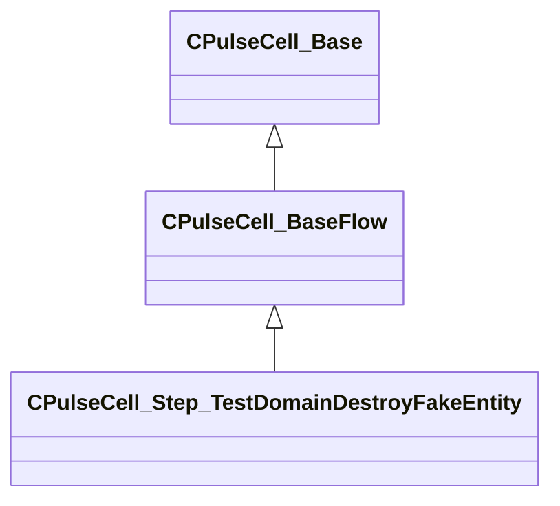
```mermaid
classDiagram
    CPulseCell_BaseFlow <|-- CPulseCell_Step_TestDomainDestroyFakeEntity
    CPulseCell_Base <|-- CPulseCell_BaseFlow
```

### CPulseCell_Step_TestDomainEntFire

**Inherits from:** [CPulseCell_BaseFlow](pulse_runtime_lib.md#cpulsecell_baseflow)

**Metadata:** `MGetKV3ClassDefaults {
	"_class": "CPulseCell_Step_TestDomainEntFire",
	"m_nEditorNodeID": -1,
	"m_Input": ""
}`, `MPropertyFriendlyName "Fake Ent-Fire"`, `MPulseEditorHeaderText "Fire input {m_Input}"`

**Relationships:**

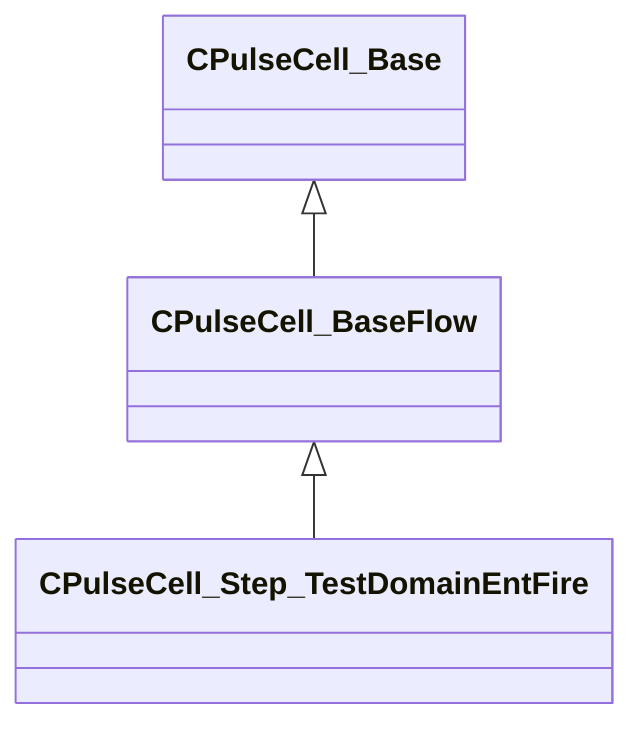
```mermaid
classDiagram
    CPulseCell_BaseFlow <|-- CPulseCell_Step_TestDomainEntFire
    CPulseCell_Base <|-- CPulseCell_BaseFlow
```

**Fields:**

| Name | Type | Annotations |
|------|------|-------------|
| `m_Input` | CUtlString |  |

### CPulseCell_Step_TestDomainTracepoint

**Inherits from:** [CPulseCell_BaseFlow](pulse_runtime_lib.md#cpulsecell_baseflow)

**Metadata:** `MGetKV3ClassDefaults {
	"_class": "CPulseCell_Step_TestDomainTracepoint",
	"m_nEditorNodeID": -1
}`, `MPropertyFriendlyName "Tracepoint"`

**Relationships:**

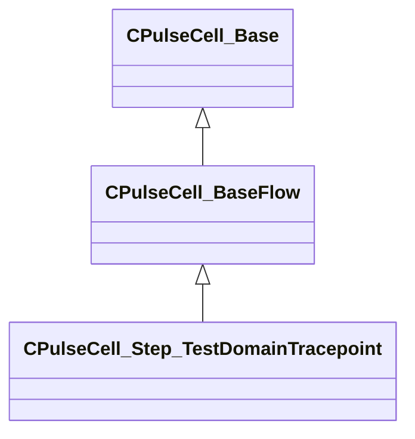
```mermaid
classDiagram
    CPulseCell_BaseFlow <|-- CPulseCell_Step_TestDomainTracepoint
    CPulseCell_Base <|-- CPulseCell_BaseFlow
```

### CPulseCell_TestWaitWithCursorState

**Inherits from:** [CPulseCell_BaseYieldingInflow](pulse_runtime_lib.md#cpulsecell_baseyieldinginflow)

**Metadata:** `MGetKV3ClassDefaults {
	"_class": "CPulseCell_TestWaitWithCursorState",
	"m_nEditorNodeID": -1,
	"m_WakeResume":
	{
		"m_SourceOutflowName": "",
		"m_nDestChunk": -1,
		"m_nInstruction": -1
	},
	"m_WakeCancel":
	{
		"m_SourceOutflowName": "",
		"m_nDestChunk": -1,
		"m_nInstruction": -1
	},
	"m_WakeFail":
	{
		"m_SourceOutflowName": "",
		"m_nDestChunk": -1,
		"m_nInstruction": -1
	}
}`

**Relationships:**

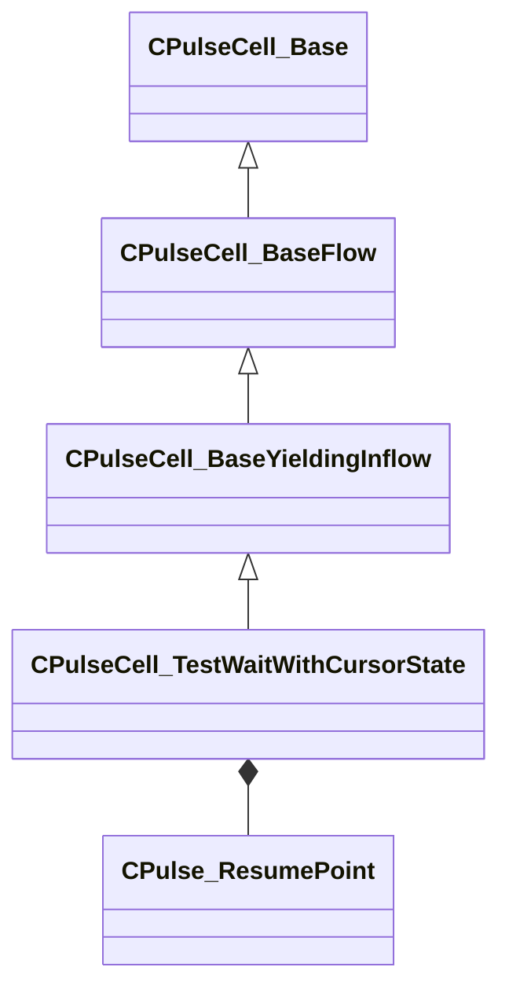
```mermaid
classDiagram
    CPulseCell_BaseYieldingInflow <|-- CPulseCell_TestWaitWithCursorState
    CPulseCell_BaseFlow <|-- CPulseCell_BaseYieldingInflow
    CPulseCell_Base <|-- CPulseCell_BaseFlow
    CPulseCell_TestWaitWithCursorState *-- CPulse_ResumePoint
```

**Fields:**

| Name | Type | Annotations |
|------|------|-------------|
| `m_WakeResume` | [CPulse_ResumePoint](../schemas/pulse_runtime_lib.md#cpulse_resumepoint) |  |
| `m_WakeCancel` | [CPulse_ResumePoint](../schemas/pulse_runtime_lib.md#cpulse_resumepoint) |  |
| `m_WakeFail` | [CPulse_ResumePoint](../schemas/pulse_runtime_lib.md#cpulse_resumepoint) |  |

### CPulseCell_TestWaitWithCursorState::CursorState_t

**Metadata:** `MGetKV3ClassDefaults {
	"flWaitValue": 0.000000,
	"bFailOnCancel": false
}`

**Fields:**

| Name | Type | Annotations |
|------|------|-------------|
| `flWaitValue` | float32 |  |
| `bFailOnCancel` | bool |  |

### CPulseCell_Test_MultiInflow_NoDefault

**Inherits from:** [CPulseCell_BaseFlow](pulse_runtime_lib.md#cpulsecell_baseflow)

**Metadata:** `MGetKV3ClassDefaults {
	"_class": "CPulseCell_Test_MultiInflow_NoDefault",
	"m_nEditorNodeID": -1
}`

**Relationships:**

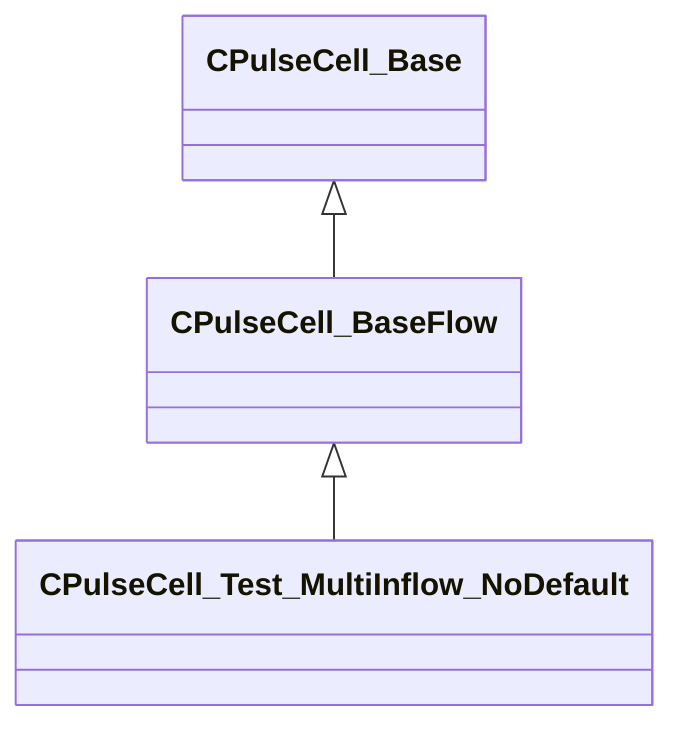
```mermaid
classDiagram
    CPulseCell_BaseFlow <|-- CPulseCell_Test_MultiInflow_NoDefault
    CPulseCell_Base <|-- CPulseCell_BaseFlow
```

### CPulseCell_Test_MultiInflow_WithDefault

**Inherits from:** [CPulseCell_BaseFlow](pulse_runtime_lib.md#cpulsecell_baseflow)

**Metadata:** `MGetKV3ClassDefaults {
	"_class": "CPulseCell_Test_MultiInflow_WithDefault",
	"m_nEditorNodeID": -1
}`

**Relationships:**

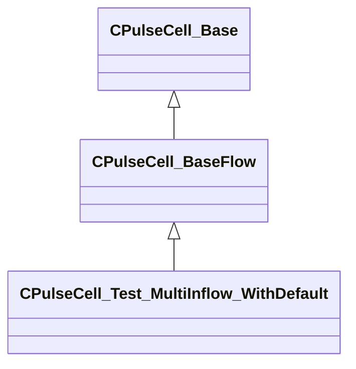
```mermaid
classDiagram
    CPulseCell_BaseFlow <|-- CPulseCell_Test_MultiInflow_WithDefault
    CPulseCell_Base <|-- CPulseCell_BaseFlow
```

### CPulseCell_Test_MultiOutflow_WithParams

**Inherits from:** [CPulseCell_BaseFlow](pulse_runtime_lib.md#cpulsecell_baseflow)

**Metadata:** `MGetKV3ClassDefaults {
	"_class": "CPulseCell_Test_MultiOutflow_WithParams",
	"m_nEditorNodeID": -1,
	"m_Out1":
	{
		"m_SourceOutflowName": "",
		"m_nDestChunk": -1,
		"m_nInstruction": -1
	},
	"m_Out2":
	{
		"m_SourceOutflowName": "",
		"m_nDestChunk": -1,
		"m_nInstruction": -1
	}
}`

**Relationships:**

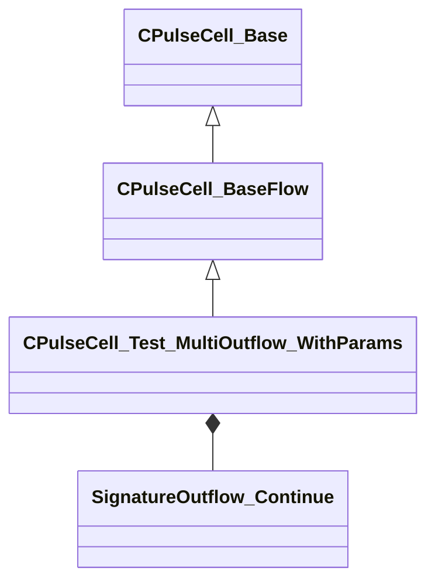
```mermaid
classDiagram
    CPulseCell_BaseFlow <|-- CPulseCell_Test_MultiOutflow_WithParams
    CPulseCell_Base <|-- CPulseCell_BaseFlow
    CPulseCell_Test_MultiOutflow_WithParams *-- SignatureOutflow_Continue
```

**Fields:**

| Name | Type | Annotations |
|------|------|-------------|
| `m_Out1` | [SignatureOutflow_Continue](../schemas/pulse_runtime_lib.md#signatureoutflow_continue) |  |
| `m_Out2` | [SignatureOutflow_Continue](../schemas/pulse_runtime_lib.md#signatureoutflow_continue) |  |

### CPulseCell_Test_MultiOutflow_WithParams_Yielding

**Inherits from:** [CPulseCell_BaseYieldingInflow](pulse_runtime_lib.md#cpulsecell_baseyieldinginflow)

**Metadata:** `MGetKV3ClassDefaults {
	"_class": "CPulseCell_Test_MultiOutflow_WithParams_Yielding",
	"m_nEditorNodeID": -1,
	"m_Out1":
	{
		"m_SourceOutflowName": "",
		"m_nDestChunk": -1,
		"m_nInstruction": -1
	},
	"m_AsyncChild1":
	{
		"m_SourceOutflowName": "",
		"m_nDestChunk": -1,
		"m_nInstruction": -1
	},
	"m_AsyncChild2":
	{
		"m_SourceOutflowName": "",
		"m_nDestChunk": -1,
		"m_nInstruction": -1
	},
	"m_YieldResume1":
	{
		"m_SourceOutflowName": "",
		"m_nDestChunk": -1,
		"m_nInstruction": -1
	},
	"m_YieldResume2":
	{
		"m_SourceOutflowName": "",
		"m_nDestChunk": -1,
		"m_nInstruction": -1
	}
}`

**Relationships:**

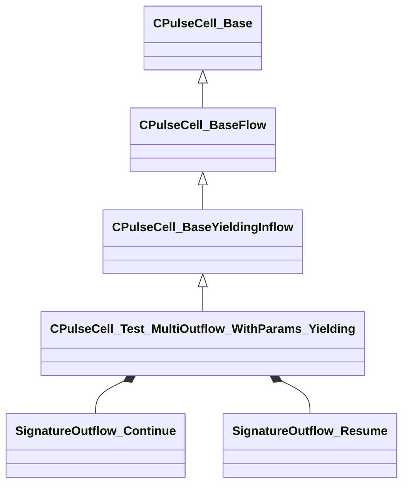
```mermaid
classDiagram
    CPulseCell_BaseYieldingInflow <|-- CPulseCell_Test_MultiOutflow_WithParams_Yielding
    CPulseCell_BaseFlow <|-- CPulseCell_BaseYieldingInflow
    CPulseCell_Base <|-- CPulseCell_BaseFlow
    CPulseCell_Test_MultiOutflow_WithParams_Yielding *-- SignatureOutflow_Continue
    CPulseCell_Test_MultiOutflow_WithParams_Yielding *-- SignatureOutflow_Resume
```

**Fields:**

| Name | Type | Annotations |
|------|------|-------------|
| `m_Out1` | [SignatureOutflow_Continue](../schemas/pulse_runtime_lib.md#signatureoutflow_continue) |  |
| `m_AsyncChild1` | [SignatureOutflow_Continue](../schemas/pulse_runtime_lib.md#signatureoutflow_continue) |  |
| `m_AsyncChild2` | [SignatureOutflow_Continue](../schemas/pulse_runtime_lib.md#signatureoutflow_continue) |  |
| `m_YieldResume1` | [SignatureOutflow_Resume](../schemas/pulse_runtime_lib.md#signatureoutflow_resume) |  |
| `m_YieldResume2` | [SignatureOutflow_Resume](../schemas/pulse_runtime_lib.md#signatureoutflow_resume) |  |

### CPulseCell_Test_MultiOutflow_WithParams_Yielding::CursorState_t

**Metadata:** `MGetKV3ClassDefaults {
	"nTestStep": 0
}`

**Fields:**

| Name | Type | Annotations |
|------|------|-------------|
| `nTestStep` | int32 |  |

### CPulseCell_Test_NoInflow

**Inherits from:** [CPulseCell_BaseFlow](pulse_runtime_lib.md#cpulsecell_baseflow)

**Metadata:** `MGetKV3ClassDefaults {
	"_class": "CPulseCell_Test_NoInflow",
	"m_nEditorNodeID": -1
}`

**Relationships:**

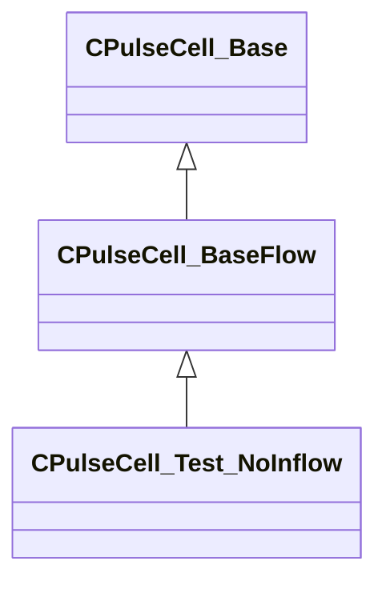
```mermaid
classDiagram
    CPulseCell_BaseFlow <|-- CPulseCell_Test_NoInflow
    CPulseCell_Base <|-- CPulseCell_BaseFlow
```

### CPulseCell_Val_TestDomainFindEntityByName

**Inherits from:** [CPulseCell_BaseValue](pulse_runtime_lib.md#cpulsecell_basevalue)

**Metadata:** `MGetKV3ClassDefaults {
	"_class": "CPulseCell_Val_TestDomainFindEntityByName",
	"m_nEditorNodeID": -1
}`, `MPropertyFriendlyName "Find Fake Entity"`

**Relationships:**

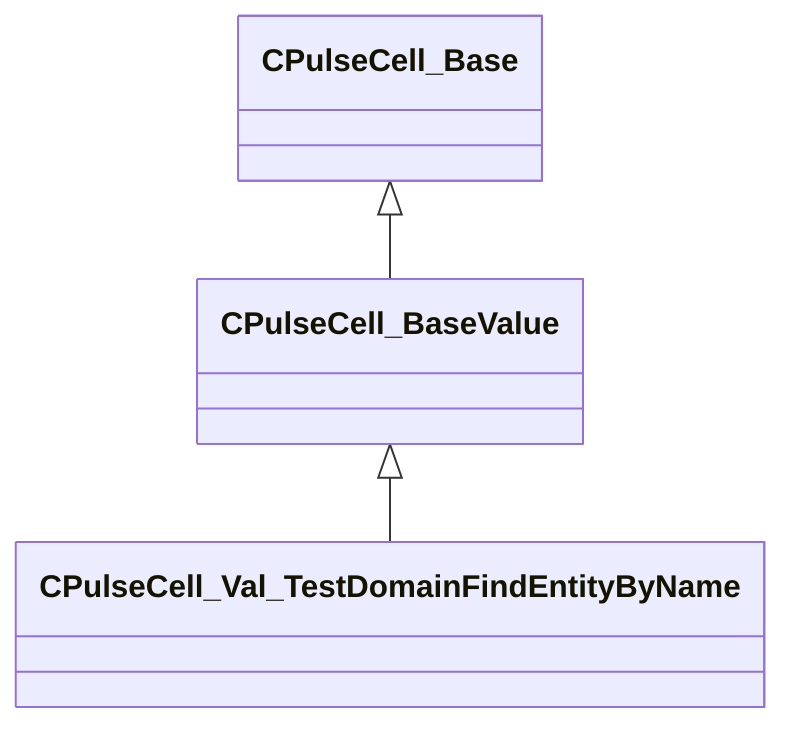
```mermaid
classDiagram
    CPulseCell_BaseValue <|-- CPulseCell_Val_TestDomainFindEntityByName
    CPulseCell_Base <|-- CPulseCell_BaseValue
```

### CPulseCell_Val_TestDomainGetEntityName

**Inherits from:** [CPulseCell_BaseValue](pulse_runtime_lib.md#cpulsecell_basevalue)

**Metadata:** `MGetKV3ClassDefaults {
	"_class": "CPulseCell_Val_TestDomainGetEntityName",
	"m_nEditorNodeID": -1
}`, `MPropertyFriendlyName "Get Fake Entity Name"`

**Relationships:**

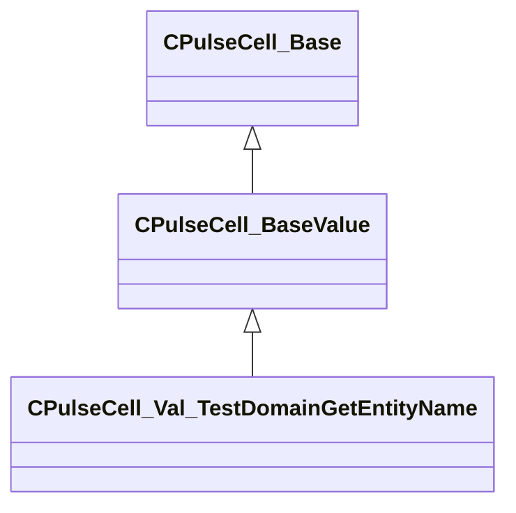
```mermaid
classDiagram
    CPulseCell_BaseValue <|-- CPulseCell_Val_TestDomainGetEntityName
    CPulseCell_Base <|-- CPulseCell_BaseValue
```

### CPulseCell_Value_TestValue50

**Inherits from:** [CPulseCell_BaseValue](pulse_runtime_lib.md#cpulsecell_basevalue)

**Metadata:** `MGetKV3ClassDefaults {
	"_class": "CPulseCell_Value_TestValue50",
	"m_nEditorNodeID": -1
}`, `MPropertyFriendlyName "[Test] Int Value 50"`, `MPropertyDescription "Test node that just generates the integer 50. Nothing to see here!"`

**Relationships:**

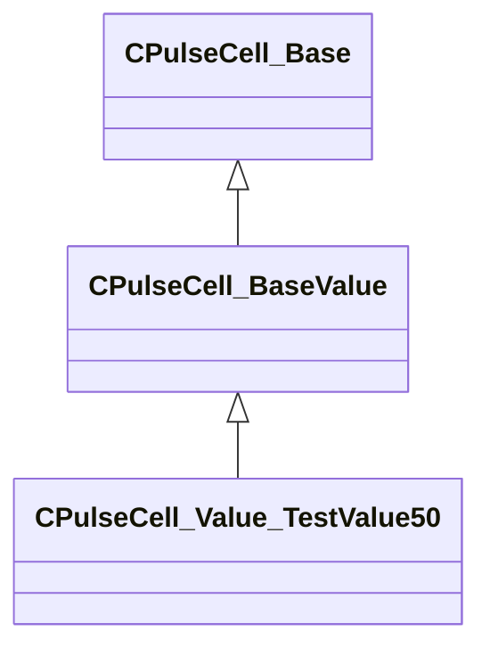
```mermaid
classDiagram
    CPulseCell_BaseValue <|-- CPulseCell_Value_TestValue50
    CPulseCell_Base <|-- CPulseCell_BaseValue
```

### CPulseGraphInstance_TestDomain

**Inherits from:** [CBasePulseGraphInstance](pulse_runtime_lib.md#cbasepulsegraphinstance)

**Derived by:** [CPulseGraphInstance_TestDomain_Derived](pulse_system.md#cpulsegraphinstance_testdomain_derived), [CPulseGraphInstance_TestDomain_UseReadOnlyBlackboardView](pulse_system.md#cpulsegraphinstance_testdomain_usereadonlyblackboardview)

**Relationships:**

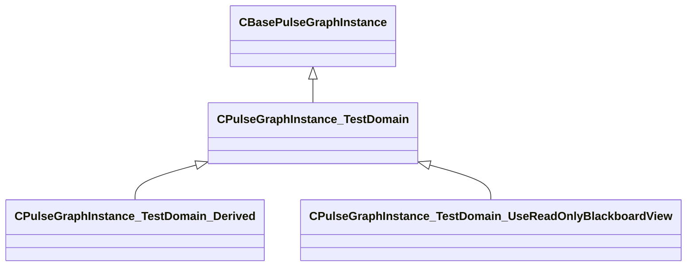
```mermaid
classDiagram
    CBasePulseGraphInstance <|-- CPulseGraphInstance_TestDomain
    CPulseGraphInstance_TestDomain <|-- CPulseGraphInstance_TestDomain_Derived
    CPulseGraphInstance_TestDomain <|-- CPulseGraphInstance_TestDomain_UseReadOnlyBlackboardView
```

**Fields:**

| Name | Type | Annotations |
|------|------|-------------|
| `m_bIsRunningUnitTests` | bool |  |
| `m_bExplicitTimeStepping` | bool |  |
| `m_bExpectingToDestroyWithYieldedCursors` | bool |  |
| `m_bQuietTracepoints` | bool |  |
| `m_bExpectingCursorTerminatedDueToMaxInstructions` | bool |  |
| `m_nCursorsTerminatedDueToMaxInstructions` | int32 |  |
| `m_nNextValidateIndex` | int32 |  |
| `m_Tracepoints` | CUtlVector<CUtlString> |  |
| `m_bTestYesOrNoPath` | bool |  |

### CPulseGraphInstance_TestDomain_Derived

**Inherits from:** [CPulseGraphInstance_TestDomain](pulse_system.md#cpulsegraphinstance_testdomain)

**Relationships:**

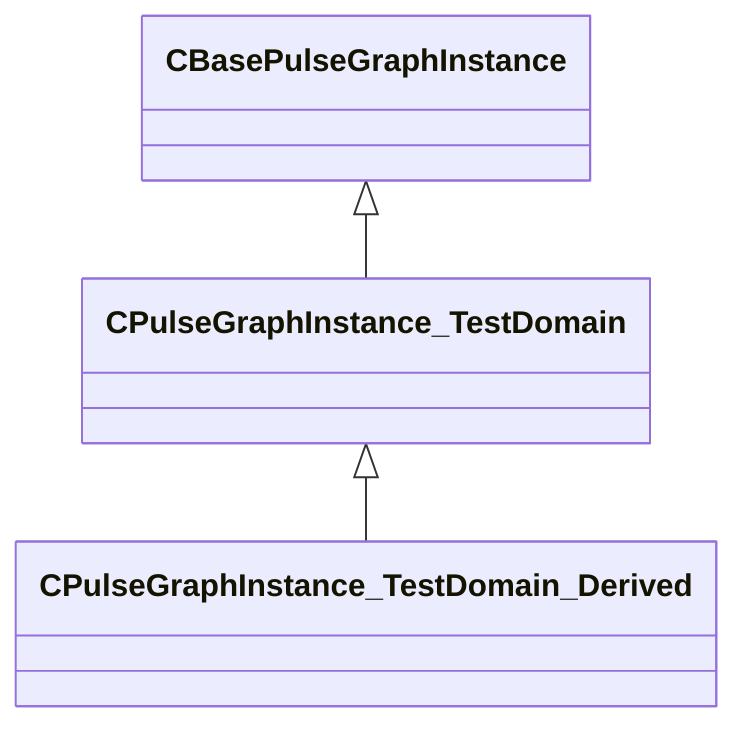
```mermaid
classDiagram
    CPulseGraphInstance_TestDomain <|-- CPulseGraphInstance_TestDomain_Derived
    CBasePulseGraphInstance <|-- CPulseGraphInstance_TestDomain
```

**Fields:**

| Name | Type | Annotations |
|------|------|-------------|
| `m_nInstanceValueX` | int32 |  |

### CPulseGraphInstance_TestDomain_FakeEntityOwner

**Inherits from:** [CBasePulseGraphInstance](pulse_runtime_lib.md#cbasepulsegraphinstance)

**Relationships:**

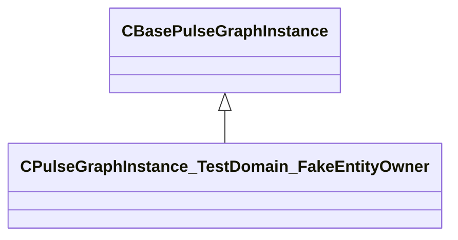
```mermaid
classDiagram
    CBasePulseGraphInstance <|-- CPulseGraphInstance_TestDomain_FakeEntityOwner
```

### CPulseGraphInstance_TestDomain_UseReadOnlyBlackboardView

**Inherits from:** [CPulseGraphInstance_TestDomain](pulse_system.md#cpulsegraphinstance_testdomain)

**Relationships:**

```mermaid
classDiagram
    CPulseGraphInstance_TestDomain <|-- CPulseGraphInstance_TestDomain_UseReadOnlyBlackboardView
    CBasePulseGraphInstance <|-- CPulseGraphInstance_TestDomain
```

### CPulseGraphInstance_TurtleGraphics

**Inherits from:** [CBasePulseGraphInstance](pulse_runtime_lib.md#cbasepulsegraphinstance)

**Relationships:**

```mermaid
classDiagram
    CBasePulseGraphInstance <|-- CPulseGraphInstance_TurtleGraphics
```

### CPulseTestFuncs_LibraryA

**Metadata:** `MPropertyDescription "Library for interacting with a few global test values."`

### CPulseTurtleGraphicsCursor

**Inherits from:** [CPulseExecCursor](pulse_runtime_lib.md#cpulseexeccursor)

**Relationships:**

```mermaid
classDiagram
    CPulseExecCursor <|-- CPulseTurtleGraphicsCursor
```

**Fields:**

| Name | Type | Annotations |
|------|------|-------------|
| `m_Color` | Color |  |
| `m_vPos` | Vector2D |  |
| `m_flHeadingDeg` | float32 |  |
| `m_bPenUp` | bool |  |

### CTestDomainDerived_Cursor

**Inherits from:** [CPulseExecCursor](pulse_runtime_lib.md#cpulseexeccursor)

**Relationships:**

```mermaid
classDiagram
    CPulseExecCursor <|-- CTestDomainDerived_Cursor
```

**Fields:**

| Name | Type | Annotations |
|------|------|-------------|
| `m_nCursorValueA` | int32 |  |
| `m_nCursorValueB` | int32 |  |

### FakeEntityDerivedA_tAPI

### FakeEntityDerivedB_tAPI

### FakeEntity_tAPI

### PulseTestEnumColor_t

**Values:**

| Name | Value | Description |
|------|-------|-------------|
| `BLACK` | 0 | Black |
| `WHITE` | 1 | White |
| `RED` | 2 | Red |
| `GREEN` | 3 | Green |
| `BLUE` | 4 | Blue |

### PulseTestEnumShape_t

**Values:**

| Name | Value | Description |
|------|-------|-------------|
| `CIRCLE` | 100 | Circle |
| `SQUARE` | 200 | Square |
| `TRIANGLE` | 300 | Triangle |

### TestComponent_t

**Fields:**

| Name | Type | Annotations |
|------|------|-------------|
| `m_ComponentData` | CUtlString |  |

### TestComponent_tAPI
