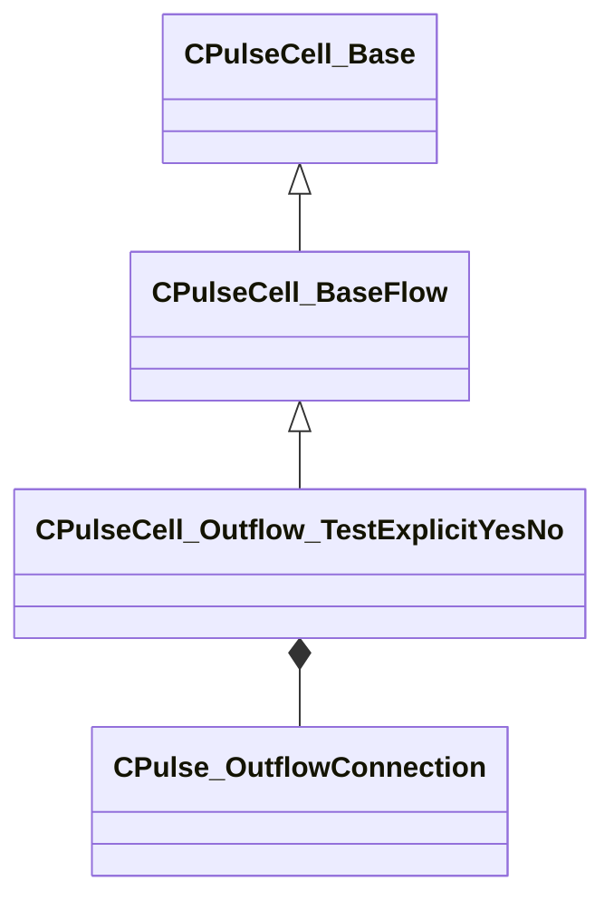

[Schemas](../../schemas.md) / [pulse_system](../pulse_system.md) / CPulseCell_Outflow_TestExplicitYesNo

# CPulseCell_Outflow_TestExplicitYesNo

> Source: **Build 25000182** · 2026-08-28 · `windows-x86_64` · schema `0.10.0`

**Kind:** class · **Size:** 216 bytes (`0xd8`) · **Align:** 8 · **Module:** pulse_system

**Inherits from:** [CPulseCell_BaseFlow](../pulse_runtime_lib/CPulseCell_BaseFlow.md)

**Metadata:** `MPropertyDescription Test node that picks between two outflows as specified in the test domain.`, `MPropertyFriendlyName [Test] Explicit Yes/No Outflow`

**Relationships:**

## Memory layout

3 fields (2 declared here, 1 inherited). Offsets are absolute from the object base.

| Offset | Field | Type | From | Annotations |
|--------|-------|------|------|-------------|
| `0x8` | `m_nEditorNodeID` | [PulseDocNodeID_t](../pulse_runtime_lib/PulseDocNodeID_t.md) | [CPulseCell_Base](../pulse_runtime_lib/CPulseCell_Base.md) | `MFgdFromSchemaCompletelySkipField` |
| `0x48` | `m_Yes` | [CPulse_OutflowConnection](../pulse_runtime_lib/CPulse_OutflowConnection.md) |  | `MPropertyFriendlyName Yes` |
| `0x90` | `m_No` | [CPulse_OutflowConnection](../pulse_runtime_lib/CPulse_OutflowConnection.md) |  | `MPropertyFriendlyName No` |

KV3 class defaults

<pre>{
	&quot;_class&quot;: &quot;CPulseCell_Outflow_TestExplicitYesNo&quot;,
	&quot;m_nEditorNodeID&quot;: -1,
	&quot;m_Yes&quot;:
	{
		&quot;m_SourceOutflowName&quot;: &quot;&quot;,
		&quot;m_nDestChunk&quot;: -1,
		&quot;m_nInstruction&quot;: -1
	},
	&quot;m_No&quot;:
	{
		&quot;m_SourceOutflowName&quot;: &quot;&quot;,
		&quot;m_nDestChunk&quot;: -1,
		&quot;m_nInstruction&quot;: -1
	}
}</pre>

