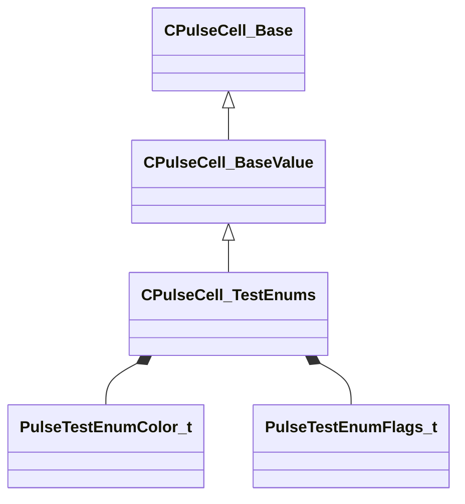

[Schemas](../../schemas.md) / [pulse_system](../pulse_system.md) / CPulseCell_TestEnums

# CPulseCell_TestEnums

> Source: **Build 25000182** · 2026-08-28 · `windows-x86_64` · schema `0.10.0`

**Kind:** class · **Size:** 80 bytes (`0x50`) · **Align:** 8 · **Module:** pulse_system

**Inherits from:** [CPulseCell_BaseValue](../pulse_runtime_lib/CPulseCell_BaseValue.md)

**Metadata:** `MPropertyFriendlyName Test Enums`

**Relationships:**

## Memory layout

3 fields (2 declared here, 1 inherited). Offsets are absolute from the object base.

| Offset | Field | Type | From | Annotations |
|--------|-------|------|------|-------------|
| `0x8` | `m_nEditorNodeID` | [PulseDocNodeID_t](../pulse_runtime_lib/PulseDocNodeID_t.md) | [CPulseCell_Base](../pulse_runtime_lib/CPulseCell_Base.md) | `MFgdFromSchemaCompletelySkipField` |
| `0x48` | `m_nReferenceColor` | [PulseTestEnumColor_t](../pulse_system/PulseTestEnumColor_t.md) |  |  |
| `0x4c` | `m_nReferenceFlags` | [PulseTestEnumFlags_t](../pulse_system/PulseTestEnumFlags_t.md) |  |  |

KV3 class defaults

<pre>{
	&quot;_class&quot;: &quot;CPulseCell_TestEnums&quot;,
	&quot;m_nEditorNodeID&quot;: -1,
	&quot;m_nReferenceColor&quot;: &quot;BLACK&quot;,
	&quot;m_nReferenceFlags&quot;: &quot;&quot;
}</pre>

