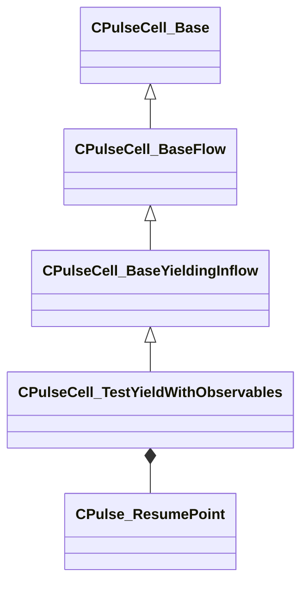

[Schemas](../../schemas.md) / [pulse_system](../pulse_system.md) / CPulseCell_TestYieldWithObservables

# CPulseCell_TestYieldWithObservables

> Source: **Build 25000182** · 2026-08-28 · `windows-x86_64` · schema `0.10.0`

**Kind:** class · **Size:** 544 bytes (`0x220`) · **Align:** 8 · **Module:** pulse_system

**Inherits from:** [CPulseCell_BaseYieldingInflow](../pulse_runtime_lib/CPulseCell_BaseYieldingInflow.md)

**Relationships:**

## Memory layout

8 fields (5 declared here, 3 inherited). Offsets are absolute from the object base.

| Offset | Field | Type | From | Annotations |
|--------|-------|------|------|-------------|
| `0x8` | `m_nEditorNodeID` | [PulseDocNodeID_t](../pulse_runtime_lib/PulseDocNodeID_t.md) | [CPulseCell_Base](../pulse_runtime_lib/CPulseCell_Base.md) | `MFgdFromSchemaCompletelySkipField` |
| `0x48` | `m_BaseFlow_OnAfterCancel` | [CPulse_ResumePoint](../pulse_runtime_lib/CPulse_ResumePoint.md) | [CPulseCell_BaseYieldingInflow](../pulse_runtime_lib/CPulseCell_BaseYieldingInflow.md) | `MPulseFGDSkipField` |
| `0x90` | `m_BaseFlow_WhileActive` | [CPulse_ResumePoint](../pulse_runtime_lib/CPulse_ResumePoint.md) | [CPulseCell_BaseYieldingInflow](../pulse_runtime_lib/CPulseCell_BaseYieldingInflow.md) | `MPulseFGDSkipField` |
| `0xd8` | `m_flWatchForFloatValue` | float32 |  |  |
| `0xe0` | `m_LiveFloatValue` | CPulseObservableExpression< float32 > |  |  |
| `0x158` | `m_WatchForStringValue` | CUtlString |  |  |
| `0x160` | `m_LiveStringValue` | CPulseObservableExpression< CUtlString > |  |  |
| `0x1d8` | `m_WakeResume` | [CPulse_ResumePoint](../pulse_runtime_lib/CPulse_ResumePoint.md) |  |  |

KV3 class defaults

<pre>{
	&quot;_class&quot;: &quot;CPulseCell_TestYieldWithObservables&quot;,
	&quot;m_nEditorNodeID&quot;: -1,
	&quot;m_BaseFlow_OnAfterCancel&quot;:
	{
		&quot;m_SourceOutflowName&quot;: &quot;&quot;,
		&quot;m_nDestChunk&quot;: -1,
		&quot;m_nInstruction&quot;: -1
	},
	&quot;m_BaseFlow_WhileActive&quot;:
	{
		&quot;m_SourceOutflowName&quot;: &quot;&quot;,
		&quot;m_nDestChunk&quot;: -1,
		&quot;m_nInstruction&quot;: -1
	},
	&quot;m_flWatchForFloatValue&quot;: 0.000000,
	&quot;m_LiveFloatValue&quot;:
	{
		&quot;m_EvaluateConnection&quot;:
		{
			&quot;m_SourceOutflowName&quot;: &quot;&quot;,
			&quot;m_nDestChunk&quot;: -1,
			&quot;m_nInstruction&quot;: -1
		},
		&quot;m_DependentObservableVars&quot;:
		[
		],
		&quot;m_DependentObservableBlackboardReferences&quot;:
		[
		]
	},
	&quot;m_WatchForStringValue&quot;: &quot;&quot;,
	&quot;m_LiveStringValue&quot;:
	{
		&quot;m_EvaluateConnection&quot;:
		{
			&quot;m_SourceOutflowName&quot;: &quot;&quot;,
			&quot;m_nDestChunk&quot;: -1,
			&quot;m_nInstruction&quot;: -1
		},
		&quot;m_DependentObservableVars&quot;:
		[
		],
		&quot;m_DependentObservableBlackboardReferences&quot;:
		[
		]
	},
	&quot;m_WakeResume&quot;:
	{
		&quot;m_SourceOutflowName&quot;: &quot;&quot;,
		&quot;m_nDestChunk&quot;: -1,
		&quot;m_nInstruction&quot;: -1
	}
}</pre>

