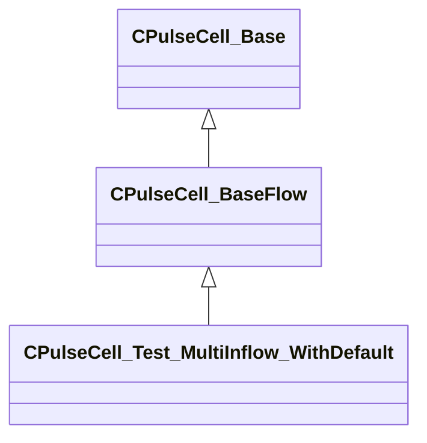

[Schemas](../../schemas.md) / [pulse_system](../pulse_system.md) / CPulseCell_Test_MultiInflow_WithDefault

# CPulseCell_Test_MultiInflow_WithDefault

**Kind:** class · **Size:** 72 bytes (`0x48`) · **Align:** 8 · **Module:** pulse_system

**Inherits from:** [CPulseCell_BaseFlow](../pulse_runtime_lib/CPulseCell_BaseFlow.md)

**Relationships:**

## Memory layout

1 fields (0 declared here, 1 inherited). Offsets are absolute from the object base.

| Offset | Field | Type | From | Annotations |
|--------|-------|------|------|-------------|
| `0x8` | `m_nEditorNodeID` | [PulseDocNodeID_t](../pulse_runtime_lib/PulseDocNodeID_t.md) | [CPulseCell_Base](../pulse_runtime_lib/CPulseCell_Base.md) | `MFgdFromSchemaCompletelySkipField` |

KV3 class defaults

<pre>{
	&quot;_class&quot;: &quot;CPulseCell_Test_MultiInflow_WithDefault&quot;,
	&quot;m_nEditorNodeID&quot;: -1
}</pre>

