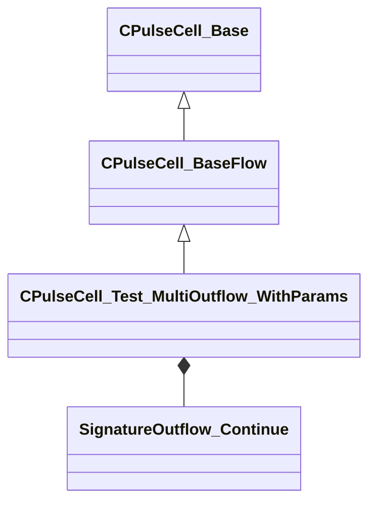

[Schemas](../../schemas.md) / [pulse_system](../pulse_system.md) / CPulseCell_Test_MultiOutflow_WithParams

# CPulseCell_Test_MultiOutflow_WithParams

> Source: **Build 25000182** · 2026-08-28 · `windows-x86_64` · schema `0.10.0`

**Kind:** class · **Size:** 216 bytes (`0xd8`) · **Align:** 8 · **Module:** pulse_system

**Inherits from:** [CPulseCell_BaseFlow](../pulse_runtime_lib/CPulseCell_BaseFlow.md)

**Relationships:**

## Memory layout

3 fields (2 declared here, 1 inherited). Offsets are absolute from the object base.

| Offset | Field | Type | From | Annotations |
|--------|-------|------|------|-------------|
| `0x8` | `m_nEditorNodeID` | [PulseDocNodeID_t](../pulse_runtime_lib/PulseDocNodeID_t.md) | [CPulseCell_Base](../pulse_runtime_lib/CPulseCell_Base.md) | `MFgdFromSchemaCompletelySkipField` |
| `0x48` | `m_Out1` | [SignatureOutflow_Continue](../pulse_runtime_lib/SignatureOutflow_Continue.md) |  |  |
| `0x90` | `m_Out2` | [SignatureOutflow_Continue](../pulse_runtime_lib/SignatureOutflow_Continue.md) |  |  |

KV3 class defaults

<pre>{
	&quot;_class&quot;: &quot;CPulseCell_Test_MultiOutflow_WithParams&quot;,
	&quot;m_nEditorNodeID&quot;: -1,
	&quot;m_Out1&quot;:
	{
		&quot;m_SourceOutflowName&quot;: &quot;&quot;,
		&quot;m_nDestChunk&quot;: -1,
		&quot;m_nInstruction&quot;: -1
	},
	&quot;m_Out2&quot;:
	{
		&quot;m_SourceOutflowName&quot;: &quot;&quot;,
		&quot;m_nDestChunk&quot;: -1,
		&quot;m_nInstruction&quot;: -1
	}
}</pre>

