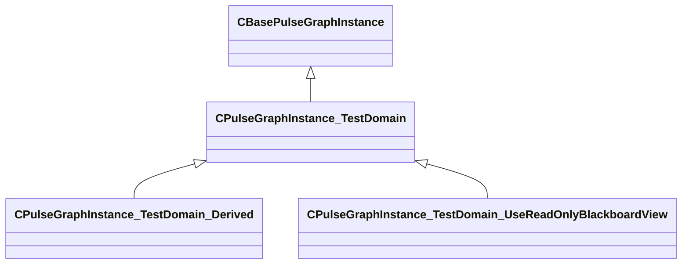

[Schemas](../../schemas.md) / [pulse_system](../pulse_system.md) / CPulseGraphInstance_TestDomain

# CPulseGraphInstance_TestDomain

> Source: **Build 25000182** · 2026-08-28 · `windows-x86_64` · schema `0.10.0`

**Kind:** class · **Size:** 344 bytes (`0x158`) · **Align:** n/a (unspecified) · **Module:** pulse_system

**Inherits from:** [CBasePulseGraphInstance](../pulse_runtime_lib/CBasePulseGraphInstance.md)

**Derived by:** [CPulseGraphInstance_TestDomain_Derived](../pulse_system/CPulseGraphInstance_TestDomain_Derived.md), [CPulseGraphInstance_TestDomain_UseReadOnlyBlackboardView](../pulse_system/CPulseGraphInstance_TestDomain_UseReadOnlyBlackboardView.md)

**Relationships:**

## Memory layout

9 fields (9 declared here, 0 inherited). Offsets are absolute from the object base.

| Offset | Field | Type | From | Annotations |
|--------|-------|------|------|-------------|
| `0x128` | `m_bIsRunningUnitTests` | bool |  |  |
| `0x129` | `m_bExplicitTimeStepping` | bool |  |  |
| `0x12a` | `m_bExpectingToDestroyWithYieldedCursors` | bool |  |  |
| `0x12b` | `m_bQuietTracepoints` | bool |  |  |
| `0x12c` | `m_bExpectingCursorTerminatedDueToMaxInstructions` | bool |  |  |
| `0x130` | `m_nCursorsTerminatedDueToMaxInstructions` | int32 |  |  |
| `0x134` | `m_nNextValidateIndex` | int32 |  |  |
| `0x138` | `m_Tracepoints` | CUtlVector< CUtlString > |  |  |
| `0x150` | `m_bTestYesOrNoPath` | bool |  |  |
