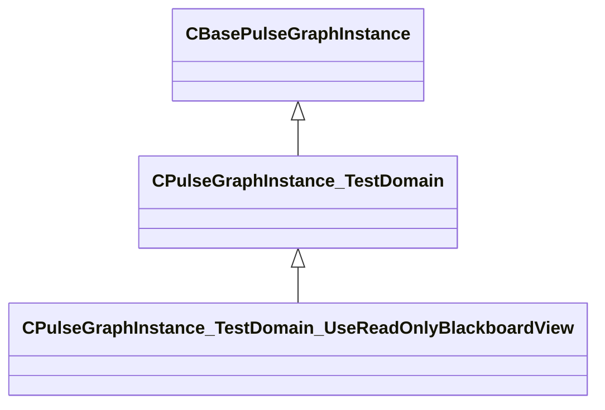

[Schemas](../../schemas.md) / [pulse_system](../pulse_system.md) / CPulseGraphInstance_TestDomain_UseReadOnlyBlackboardView

# CPulseGraphInstance_TestDomain_UseReadOnlyBlackboardView

**Kind:** class · **Size:** 344 bytes (`0x158`) · **Align:** 255 · **Module:** pulse_system

**Inherits from:** [CPulseGraphInstance_TestDomain](../pulse_system/CPulseGraphInstance_TestDomain.md)

**Relationships:**

## Memory layout

9 fields (0 declared here, 9 inherited). Offsets are absolute from the object base.

| Offset | Field | Type | From | Annotations |
|--------|-------|------|------|-------------|
| `0x128` | `m_bIsRunningUnitTests` | bool | [CPulseGraphInstance_TestDomain](../pulse_system/CPulseGraphInstance_TestDomain.md) |  |
| `0x129` | `m_bExplicitTimeStepping` | bool | [CPulseGraphInstance_TestDomain](../pulse_system/CPulseGraphInstance_TestDomain.md) |  |
| `0x12a` | `m_bExpectingToDestroyWithYieldedCursors` | bool | [CPulseGraphInstance_TestDomain](../pulse_system/CPulseGraphInstance_TestDomain.md) |  |
| `0x12b` | `m_bQuietTracepoints` | bool | [CPulseGraphInstance_TestDomain](../pulse_system/CPulseGraphInstance_TestDomain.md) |  |
| `0x12c` | `m_bExpectingCursorTerminatedDueToMaxInstructions` | bool | [CPulseGraphInstance_TestDomain](../pulse_system/CPulseGraphInstance_TestDomain.md) |  |
| `0x130` | `m_nCursorsTerminatedDueToMaxInstructions` | int32 | [CPulseGraphInstance_TestDomain](../pulse_system/CPulseGraphInstance_TestDomain.md) |  |
| `0x134` | `m_nNextValidateIndex` | int32 | [CPulseGraphInstance_TestDomain](../pulse_system/CPulseGraphInstance_TestDomain.md) |  |
| `0x138` | `m_Tracepoints` | CUtlVector< CUtlString > | [CPulseGraphInstance_TestDomain](../pulse_system/CPulseGraphInstance_TestDomain.md) |  |
| `0x150` | `m_bTestYesOrNoPath` | bool | [CPulseGraphInstance_TestDomain](../pulse_system/CPulseGraphInstance_TestDomain.md) |  |
