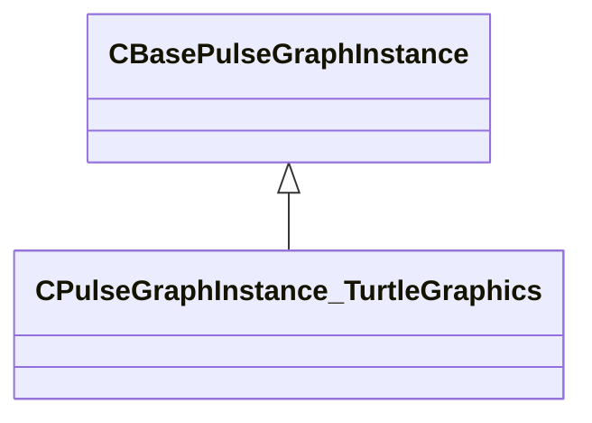

[Schemas](../../schemas.md) / [pulse_system](../pulse_system.md) / CPulseGraphInstance_TurtleGraphics

# CPulseGraphInstance_TurtleGraphics

**Kind:** class · **Size:** 312 bytes (`0x138`) · **Align:** 255 · **Module:** pulse_system

**Inherits from:** [CBasePulseGraphInstance](../pulse_runtime_lib/CBasePulseGraphInstance.md)

**Relationships:**

