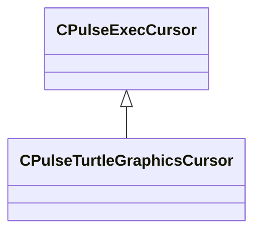

[Schemas](../../schemas.md) / [pulse_system](../pulse_system.md) / CPulseTurtleGraphicsCursor

# CPulseTurtleGraphicsCursor

> Source: **Build 25000182** · 2026-08-28 · `windows-x86_64` · schema `0.10.0`

**Kind:** class · **Size:** 240 bytes (`0xf0`) · **Align:** n/a (unspecified) · **Module:** pulse_system

**Inherits from:** [CPulseExecCursor](../pulse_runtime_lib/CPulseExecCursor.md)

**Relationships:**

## Memory layout

4 fields (4 declared here, 0 inherited). Offsets are absolute from the object base.

| Offset | Field | Type | From | Annotations |
|--------|-------|------|------|-------------|
| `0xd8` | `m_Color` | Color |  |  |
| `0xdc` | `m_vPos` | Vector2D |  |  |
| `0xe4` | `m_flHeadingDeg` | float32 |  |  |
| `0xe8` | `m_bPenUp` | bool |  |  |
