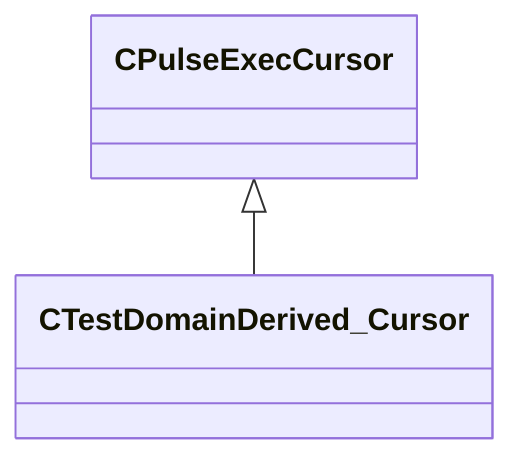

[Schemas](../../schemas.md) / [pulse_system](../pulse_system.md) / CTestDomainDerived_Cursor

# CTestDomainDerived_Cursor

**Kind:** class · **Size:** 224 bytes (`0xe0`) · **Align:** 255 · **Module:** pulse_system

**Inherits from:** [CPulseExecCursor](../pulse_runtime_lib/CPulseExecCursor.md)

**Relationships:**

## Memory layout

2 fields (2 declared here, 0 inherited). Offsets are absolute from the object base.

| Offset | Field | Type | From | Annotations |
|--------|-------|------|------|-------------|
| `0xd8` | `m_nCursorValueA` | int32 |  |  |
| `0xdc` | `m_nCursorValueB` | int32 |  |  |
