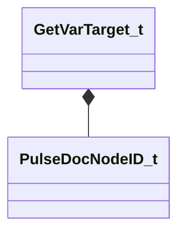
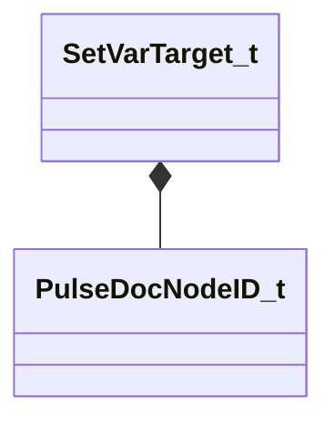

# Module: pulsedoc_lib

| Name | Kind | Bases | Fields |
|------|------|-------|--------|
| [CPulseEditorSettings](#cpulseeditorsettings) | class |  | 103 |
| [GetVarTarget_t](#getvartarget_t) | class |  | 2 |
| [PulsePortUserVisibility_t](#pulseportuservisibility_t) | enum |  | 3 |
| [SetVarTarget_t](#setvartarget_t) | class |  | 2 |

---

### CPulseEditorSettings

**Metadata:** `MGetKV3ClassDefaults {
	"m_colCanvasBackground":
	[
		16,
		16,
		16
	],
	"m_colCanvasBackgroundWhenDebugging":
	[
		45,
		16,
		16
	],
	"m_flGridSnapV2": 40.000000,
	"m_bSnapAbsToGrid": true,
	"m_bSnapSizeToGrid": true,
	"m_bGridMinorPoints": true,
	"m_flGridMinorSpacingV2": 40.000000,
	"m_flSuppressMinorGridFurtherThan": 5000.000000,
	"m_colGridMinorColor":
	[
		48,
		48,
		48
	],
	"m_flGridMinorWidth": 2.000000,
	"m_nGridMajorMultiple": 10,
	"m_colGridMajorColor":
	[
		31,
		31,
		31
	],
	"m_flGridMajorWidth": 1.500000,
	"m_colGridOriginColor":
	[
		0,
		54,
		55
	],
	"m_flGridOriginWidth": 1.500000,
	"m_nFlowTooltipBoxMargin": 4.000000,
	"m_FontSequencePoint": "Segoe UI,8,-1,5,50,0,0,0,0,0,Regular",
	"m_flSequencePointRadius": 21.000000,
	"m_flSequencePointLinkWidth": 2.000000,
	"m_colSequencePointFadeOverlay":
	[
		0,
		0,
		0,
		200
	],
	"m_colSequencePointSpontaneous":
	[
		0,
		255,
		0
	],
	"m_colSequencePointYield":
	[
		255,
		255,
		0
	],
	"m_colSequencePoint":
	[
		128,
		128,
		128
	],
	"m_colSequencePointLink":
	[
		200,
		200,
		200
	],
	"m_colSequencePointLinkYield":
	[
		200,
		200,
		0
	],
	"m_colSequencePointName":
	[
		255,
		255,
		255
	],
	"m_colFlowTooltipBorder":
	[
		0,
		0,
		0
	],
	"m_colFlowTooltipBackground":
	[
		100,
		100,
		100
	],
	"m_colFlowTooltipForeground":
	[
		255,
		255,
		255
	],
	"m_flPortDragOffCreateThreshold": 32.000000,
	"m_colBool":
	[
		142,
		47,
		0
	],
	"m_colNumber":
	[
		62,
		187,
		112
	],
	"m_colString":
	[
		0,
		109,
		187
	],
	"m_colOther":
	[
		156,
		115,
		0
	],
	"m_colCursorFlow":
	[
		140,
		140,
		140
	],
	"m_FontFlowTooltip": "Segoe UI,11,-1,5,50,0,0,0,0,0,Regular",
	"m_FontLiteral": "Barlow,13,-1,5,75,0,0,0,0,0,Bold",
	"m_FontDomainName": "Lucida Sans,72,-1,5,50,0,0,0,0,0,Regular",
	"m_vDomainNameOffsetPX":
	[
		10.000000,
		10.000000
	],
	"m_colDomainName":
	[
		64,
		64,
		64
	],
	"m_colDomainNameWhenDebugging":
	[
		128,
		64,
		64
	],
	"m_FontParentAssets": "Lucida Sans,20,-1,5,50,0,0,0,0,0,Regular",
	"m_colParentAssets":
	[
		64,
		64,
		64
	],
	"m_colParentAssetsBroken":
	[
		255,
		144,
		144
	],
	"m_flLiteralLabelSpacing": 8.000000,
	"m_colDebuggerBrokenBorder":
	[
		255,
		144,
		144
	],
	"m_DebuggerBrokenImg": "tools/images/pulse_editor/debugger_broken.png",
	"m_DebuggerBrokenOtherImg": "tools/images/pulse_editor/debugger_broken_other.png",
	"m_flDebuggerBrokenMarkerOffset": 2.000000,
	"m_flDebuggerBrokenMarkerSize": 18.000000,
	"m_DebuggerBreakpointImg": "tools/images/pulse_editor/debugger_breakpoint.png",
	"m_DebuggerBreakpointDisabledImg": "tools/images/pulse_editor/debugger_breakpoint_disabled.png",
	"m_flDebuggerBreakpointOffset": 2.000000,
	"m_flDebuggerBreakpointSize": 18.000000,
	"m_flYieldedCursorStackOffset": 8.000000,
	"m_GraphInstanceImg": "tools/images/pulse_editor/graph_instance.png",
	"m_flRecentExecTimeoutSec": 10.000000,
	"m_flRecentExecStartOffset": 20.000000,
	"m_flRecentExecEndOffset": 150.000000,
	"m_flRecentExecLineWidth": 4.000000,
	"m_colRecentExecStartColor":
	[
		150,
		255,
		150
	],
	"m_colRecentExecEndColor":
	[
		150,
		255,
		150,
		0
	],
	"m_colRecentExecRequirementFailStartColor":
	[
		200,
		150,
		150
	],
	"m_colRecentExecRequirementFailEndColor":
	[
		200,
		150,
		150,
		0
	],
	"m_flRecentExecConnectionIndicatorSize": 8.000000,
	"m_RecentExecConnectionIndicatorImg": "tools/images/pulse_editor/connection_execution_history.png",
	"m_bBreakOnExceptions": false,
	"m_bShowExecutionHistory": false,
	"m_bBoxSelectRequiresFullyContained": false,
	"m_flFlowMinWidth": 200.000000,
	"m_colSelectedBorder":
	[
		255,
		255,
		0
	],
	"m_flAppendButtonSize": 20.000000,
	"m_colAppendHover":
	[
		146,
		152,
		153
	],
	"m_AppendImg": "tools/images/pulse_editor/add_to_block.png",
	"m_flMoveChildArrowOffset": 5.000000,
	"m_flMoveChildArrowSize": 25.000000,
	"m_MoveChildArrowImg": "tools/images/pulse_editor/move_child.png",
	"m_colMoveChildArrow":
	[
		255,
		255,
		255
	],
	"m_flConnectionTangentStrength": 100.000000,
	"m_flConnectionCurveSpacing": 5.000000,
	"m_flConnectionDeltaLimitScale": 0.300000,
	"m_flBrokenConnectionOffset": 80.000000,
	"m_flConnectionInflowOffset": 0.000000,
	"m_flConnectionInparamOffset": 0.000000,
	"m_flConnectionInparamOffsetArray": 4.000000,
	"m_flConnectionCapBrokenSize": 8.000000,
	"m_ConnectionCapBrokenImg": "tools/images/pulse_editor/connection_cap_broken.png",
	"m_flConnectionColorLerpPercentageStart": 0.500000,
	"m_vecBlockCommentDefaultSize":
	[
		200.000000,
		200.000000
	],
	"m_vecBlockCommentMinSize":
	[
		200.000000,
		20.000000
	],
	"m_colBlockCommentDefault":
	[
		47,
		79,
		79
	],
	"m_colBlockCommentTextLight":
	[
		211,
		211,
		211
	],
	"m_colBlockCommentTextDark":
	[
		46,
		46,
		46
	],
	"m_flBlockCommentRegionAlpha": 0.160000,
	"m_flTimelineSeekBarHeight": 20.000000,
	"m_flTimelinePauseIconSize": 10.000000,
	"m_flTimelineCallModeIconSize": 18.000000,
	"m_FontTimelineTime": "Segoe UI,11,-1,5,50,0,0,0,0,0,Regular",
	"m_colTimelineLabel":
	[
		196,
		196,
		196
	],
	"m_vecTimelineIconFromPort":
	[
		-4.000000,
		-19.000000
	],
	"m_vecTimelinePauseIconOffset":
	[
		-8.000000,
		3.000000
	],
	"m_flTimelineCursorHeight": 12.000000,
	"m_flTimelineCursorTextHeight": 20.000000
}`

**Fields:**

| Name | Type | Annotations |
|------|------|-------------|
| `m_colCanvasBackground` | Color |  |
| `m_colCanvasBackgroundWhenDebugging` | Color |  |
| `m_flGridSnapV2` | float32 | `MPropertyStartGroup "+Grid"` |
| `m_bSnapAbsToGrid` | bool |  |
| `m_bSnapSizeToGrid` | bool |  |
| `m_bGridMinorPoints` | bool |  |
| `m_flGridMinorSpacingV2` | float32 |  |
| `m_flSuppressMinorGridFurtherThan` | float32 |  |
| `m_colGridMinorColor` | Color |  |
| `m_flGridMinorWidth` | float32 |  |
| `m_nGridMajorMultiple` | int32 | `MPropertyAttributeRange "1 25"` |
| `m_colGridMajorColor` | Color |  |
| `m_flGridMajorWidth` | float32 |  |
| `m_colGridOriginColor` | Color |  |
| `m_flGridOriginWidth` | float32 |  |
| `m_nFlowTooltipBoxMargin` | float32 | `MPropertyStartGroup "+Ports"` `MPropertyAttributeRange "0 32"` |
| `m_FontSequencePoint` | CUtlString | `MPropertyAttributeEditor "Font()"` |
| `m_flSequencePointRadius` | float32 | `MPropertyAttributeRange "0 32"` |
| `m_flSequencePointLinkWidth` | float32 | `MPropertyAttributeRange "0 32"` |
| `m_colSequencePointFadeOverlay` | Color | `MPropertyColorPlusAlpha` |
| `m_colSequencePointSpontaneous` | Color |  |
| `m_colSequencePointYield` | Color |  |
| `m_colSequencePoint` | Color |  |
| `m_colSequencePointLink` | Color |  |
| `m_colSequencePointLinkYield` | Color |  |
| `m_colSequencePointName` | Color |  |
| `m_colFlowTooltipBorder` | Color |  |
| `m_colFlowTooltipBackground` | Color |  |
| `m_colFlowTooltipForeground` | Color |  |
| `m_flPortDragOffCreateThreshold` | float32 | `MPropertyAttributeRange "-1 128"` |
| `m_colBool` | Color | `MPropertyStartGroup "+Types"` |
| `m_colNumber` | Color |  |
| `m_colString` | Color |  |
| `m_colOther` | Color |  |
| `m_colCursorFlow` | Color |  |
| `m_FontFlowTooltip` | CUtlString | `MPropertyStartGroup "+Fonts"` `MPropertyAttributeEditor "Font()"` |
| `m_FontLiteral` | CUtlString | `MPropertyAttributeEditor "Font()"` |
| `m_FontDomainName` | CUtlString | `MPropertyAttributeEditor "Font()"` |
| `m_vDomainNameOffsetPX` | Vector2D |  |
| `m_colDomainName` | Color |  |
| `m_colDomainNameWhenDebugging` | Color |  |
| `m_FontParentAssets` | CUtlString | `MPropertyAttributeEditor "Font()"` |
| `m_colParentAssets` | Color |  |
| `m_colParentAssetsBroken` | Color |  |
| `m_flLiteralLabelSpacing` | float32 | `MPropertyStartGroup "+Literals"` `MPropertyAttributeRange "0 32"` |
| `m_colDebuggerBrokenBorder` | Color | `MPropertyStartGroup "+Debugger"` |
| `m_DebuggerBrokenImg` | CUtlString |  |
| `m_DebuggerBrokenOtherImg` | CUtlString |  |
| `m_flDebuggerBrokenMarkerOffset` | float32 | `MPropertyAttributeRange "0 32"` |
| `m_flDebuggerBrokenMarkerSize` | float32 | `MPropertyAttributeRange "0 32"` |
| `m_DebuggerBreakpointImg` | CUtlString |  |
| `m_DebuggerBreakpointDisabledImg` | CUtlString |  |
| `m_flDebuggerBreakpointOffset` | float32 | `MPropertyAttributeRange "0 32"` |
| `m_flDebuggerBreakpointSize` | float32 | `MPropertyAttributeRange "0 32"` |
| `m_flYieldedCursorStackOffset` | float32 | `MPropertyAttributeRange "0 32"` |
| `m_GraphInstanceImg` | CUtlString |  |
| `m_flRecentExecTimeoutSec` | float32 | `MPropertyAttributeRange "0 32"` |
| `m_flRecentExecStartOffset` | float32 | `MPropertyAttributeRange "0 32"` |
| `m_flRecentExecEndOffset` | float32 | `MPropertyAttributeRange "0 64"` |
| `m_flRecentExecLineWidth` | float32 | `MPropertyAttributeRange "0 8"` |
| `m_colRecentExecStartColor` | Color | `MPropertyColorPlusAlpha` |
| `m_colRecentExecEndColor` | Color | `MPropertyColorPlusAlpha` |
| `m_colRecentExecRequirementFailStartColor` | Color | `MPropertyColorPlusAlpha` |
| `m_colRecentExecRequirementFailEndColor` | Color | `MPropertyColorPlusAlpha` |
| `m_flRecentExecConnectionIndicatorSize` | float32 | `MPropertyAttributeRange "0 32"` |
| `m_RecentExecConnectionIndicatorImg` | CUtlString |  |
| `m_bBreakOnExceptions` | bool |  |
| `m_bShowExecutionHistory` | bool |  |
| `m_bBoxSelectRequiresFullyContained` | bool |  |
| `m_flFlowMinWidth` | float32 | `MPropertyStartGroup "+Group Layout"` |
| `m_colSelectedBorder` | Color |  |
| `m_flAppendButtonSize` | float32 | `MPropertyAttributeRange "0 64"` |
| `m_colAppendHover` | Color |  |
| `m_AppendImg` | CUtlString |  |
| `m_flMoveChildArrowOffset` | float32 | `MPropertyAttributeRange "0 32"` |
| `m_flMoveChildArrowSize` | float32 | `MPropertyAttributeRange "0 32"` |
| `m_MoveChildArrowImg` | CUtlString |  |
| `m_colMoveChildArrow` | Color |  |
| `m_flConnectionTangentStrength` | float32 | `MPropertyStartGroup "+Connections"` `MPropertyAttributeRange "0 500"` |
| `m_flConnectionCurveSpacing` | float32 | `MPropertyAttributeRange "1 50"` |
| `m_flConnectionDeltaLimitScale` | float32 | `MPropertyAttributeRange "0 2"` |
| `m_flBrokenConnectionOffset` | float32 | `MPropertyAttributeRange "0 32"` |
| `m_flConnectionInflowOffset` | float32 | `MPropertyAttributeRange "0 32"` |
| `m_flConnectionInparamOffset` | float32 | `MPropertyAttributeRange "0 32"` |
| `m_flConnectionInparamOffsetArray` | float32 | `MPropertyAttributeRange "0 32"` |
| `m_flConnectionCapBrokenSize` | float32 | `MPropertyAttributeRange "0 32"` |
| `m_ConnectionCapBrokenImg` | CUtlString |  |
| `m_flConnectionColorLerpPercentageStart` | float32 | `MPropertyAttributeRange "0 1"` |
| `m_vecBlockCommentDefaultSize` | Vector2D | `MPropertyStartGroup "+Notes"` |
| `m_vecBlockCommentMinSize` | Vector2D |  |
| `m_colBlockCommentDefault` | Color |  |
| `m_colBlockCommentTextLight` | Color |  |
| `m_colBlockCommentTextDark` | Color |  |
| `m_flBlockCommentRegionAlpha` | float32 |  |
| `m_flTimelineSeekBarHeight` | float32 | `MPropertyStartGroup "+Timelines"` |
| `m_flTimelinePauseIconSize` | float32 |  |
| `m_flTimelineCallModeIconSize` | float32 |  |
| `m_FontTimelineTime` | CUtlString | `MPropertyAttributeEditor "Font()"` |
| `m_colTimelineLabel` | Color |  |
| `m_vecTimelineIconFromPort` | Vector2D |  |
| `m_vecTimelinePauseIconOffset` | Vector2D |  |
| `m_flTimelineCursorHeight` | float32 |  |
| `m_flTimelineCursorTextHeight` | float32 |  |

### GetVarTarget_t

**Metadata:** `MGetKV3ClassDefaults {
	"nVarDefID": -1,
	"strValueEncoded": ""
}`

**Relationships:**

**Fields:**

| Name | Type | Annotations |
|------|------|-------------|
| `nVarDefID` | [PulseDocNodeID_t](../schemas/pulse_runtime_lib.md#pulsedocnodeid_t) |  |
| `strValueEncoded` | CUtlString |  |

### PulsePortUserVisibility_t

**Values:**

| Name | Value | Description |
|------|-------|-------------|
| `UNSPECIFIED` | 0 |  |
| `SHOW` | 1 |  |
| `HIDE` | 2 |  |

### SetVarTarget_t

**Metadata:** `MGetKV3ClassDefaults {
	"nVarDefID": -1,
	"strValueEncoded": ""
}`

**Relationships:**

**Fields:**

| Name | Type | Annotations |
|------|------|-------------|
| `nVarDefID` | [PulseDocNodeID_t](../schemas/pulse_runtime_lib.md#pulsedocnodeid_t) |  |
| `strValueEncoded` | CUtlString |  |
