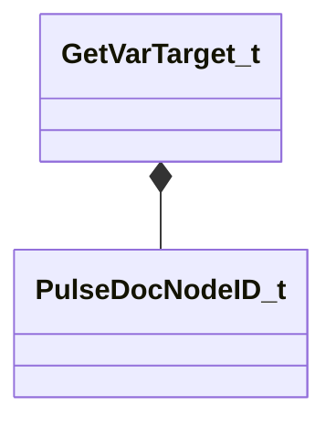
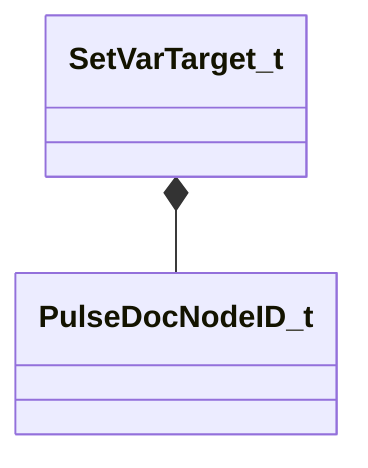

# Module: pulsedoc_lib

| Name | Kind | Bases | Fields |
|------|------|-------|--------|
| [CPulseEditorSettings](#cpulseeditorsettings) | class |  | 101 |
| [GetVarTarget_t](#getvartarget_t) | class |  | 2 |
| [SetVarTarget_t](#setvartarget_t) | class |  | 2 |

---

### CPulseEditorSettings

**Metadata:** `MGetKV3ClassDefaults`

**Fields:**

| Name | Type | Annotations |
|------|------|-------------|
| `m_colCanvasBackground` | Color |  |
| `m_colCanvasBackgroundWhenDebugging` | Color |  |
| `m_flGridSnapV2` | float32 | `MPropertyStartGroup +Grid` |
| `m_bSnapAbsToGrid` | bool |  |
| `m_bSnapSizeToGrid` | bool |  |
| `m_bGridMinorPoints` | bool |  |
| `m_flGridMinorSpacingV2` | float32 |  |
| `m_flSuppressMinorGridFurtherThan` | float32 |  |
| `m_colGridMinorColor` | Color |  |
| `m_flGridMinorWidth` | float32 |  |
| `m_nGridMajorMultiple` | int32 | `MPropertyAttributeRange 1 25` |
| `m_colGridMajorColor` | Color |  |
| `m_flGridMajorWidth` | float32 |  |
| `m_colGridOriginColor` | Color |  |
| `m_flGridOriginWidth` | float32 |  |
| `m_nFlowTooltipBoxMargin` | float32 | `MPropertyAttributeRange 0 32` `MPropertyStartGroup +Ports` |
| `m_FontSequencePoint` | CUtlString | `MPropertyAttributeEditor Font()` |
| `m_flSequencePointRadius` | float32 | `MPropertyAttributeRange 0 32` |
| `m_flSequencePointLinkWidth` | float32 | `MPropertyAttributeRange 0 32` |
| `m_colSequencePointFadeOverlay` | Color | `MPropertyColorPlusAlpha` |
| `m_colSequencePointSpontaneous` | Color |  |
| `m_colSequencePointYield` | Color |  |
| `m_colSequencePoint` | Color |  |
| `m_colSequencePointLink` | Color |  |
| `m_colSequencePointLinkYield` | Color |  |
| `m_colSequencePointName` | Color |  |
| `m_colFlowTooltipBorder` | Color |  |
| `m_colFlowTooltipBackground` | Color |  |
| `m_colFlowTooltipForeground` | Color |  |
| `m_flPortDragOffCreateThreshold` | float32 | `MPropertyAttributeRange -1 128` |
| `m_colBool` | Color | `MPropertyStartGroup +Types` |
| `m_colNumber` | Color |  |
| `m_colString` | Color |  |
| `m_colOther` | Color |  |
| `m_colCursorFlow` | Color |  |
| `m_FontFlowTooltip` | CUtlString | `MPropertyAttributeEditor Font()` `MPropertyStartGroup +Fonts` |
| `m_FontLiteral` | CUtlString | `MPropertyAttributeEditor Font()` |
| `m_FontDomainName` | CUtlString | `MPropertyAttributeEditor Font()` |
| `m_vDomainNameOffsetPX` | Vector2D |  |
| `m_colDomainName` | Color |  |
| `m_colDomainNameWhenDebugging` | Color |  |
| `m_FontParentAssets` | CUtlString | `MPropertyAttributeEditor Font()` |
| `m_colParentAssets` | Color |  |
| `m_colParentAssetsBroken` | Color |  |
| `m_flLiteralLabelSpacing` | float32 | `MPropertyAttributeRange 0 32` `MPropertyStartGroup +Literals` |
| `m_colDebuggerBrokenBorder` | Color | `MPropertyStartGroup +Debugger` |
| `m_DebuggerBrokenImg` | CUtlString |  |
| `m_DebuggerBrokenOtherImg` | CUtlString |  |
| `m_flDebuggerBrokenMarkerOffset` | float32 | `MPropertyAttributeRange 0 32` |
| `m_flDebuggerBrokenMarkerSize` | float32 | `MPropertyAttributeRange 0 32` |
| `m_DebuggerBreakpointImg` | CUtlString |  |
| `m_DebuggerBreakpointDisabledImg` | CUtlString |  |
| `m_flYieldedCursorStackOffset` | float32 | `MPropertyAttributeRange 0 32` |
| `m_GraphInstanceImg` | CUtlString |  |
| `m_flRecentExecTimeoutSec` | float32 | `MPropertyAttributeRange 0 32` |
| `m_flRecentExecStartOffset` | float32 | `MPropertyAttributeRange 0 32` |
| `m_flRecentExecEndOffset` | float32 | `MPropertyAttributeRange 0 64` |
| `m_flRecentExecLineWidth` | float32 | `MPropertyAttributeRange 0 8` |
| `m_colRecentExecStartColor` | Color | `MPropertyColorPlusAlpha` |
| `m_colRecentExecEndColor` | Color | `MPropertyColorPlusAlpha` |
| `m_colRecentExecRequirementFailStartColor` | Color | `MPropertyColorPlusAlpha` |
| `m_colRecentExecRequirementFailEndColor` | Color | `MPropertyColorPlusAlpha` |
| `m_flRecentExecConnectionIndicatorSize` | float32 | `MPropertyAttributeRange 0 32` |
| `m_RecentExecConnectionIndicatorImg` | CUtlString |  |
| `m_bBreakOnExceptions` | bool |  |
| `m_bShowExecutionHistory` | bool |  |
| `m_bBoxSelectRequiresFullyContained` | bool |  |
| `m_flFlowMinWidth` | float32 | `MPropertyStartGroup +Group Layout` |
| `m_colSelectedBorder` | Color |  |
| `m_flAppendButtonSize` | float32 | `MPropertyAttributeRange 0 64` |
| `m_colAppendHover` | Color |  |
| `m_AppendImg` | CUtlString |  |
| `m_flMoveChildArrowOffset` | float32 | `MPropertyAttributeRange 0 32` |
| `m_flMoveChildArrowSize` | float32 | `MPropertyAttributeRange 0 32` |
| `m_MoveChildArrowImg` | CUtlString |  |
| `m_colMoveChildArrow` | Color |  |
| `m_flConnectionTangentStrength` | float32 | `MPropertyAttributeRange 0 500` `MPropertyStartGroup +Connections` |
| `m_flConnectionCurveSpacing` | float32 | `MPropertyAttributeRange 1 50` |
| `m_flConnectionDeltaLimitScale` | float32 | `MPropertyAttributeRange 0 2` |
| `m_flBrokenConnectionOffset` | float32 | `MPropertyAttributeRange 0 32` |
| `m_flConnectionInflowOffset` | float32 | `MPropertyAttributeRange 0 32` |
| `m_flConnectionInparamOffset` | float32 | `MPropertyAttributeRange 0 32` |
| `m_flConnectionInparamOffsetArray` | float32 | `MPropertyAttributeRange 0 32` |
| `m_flConnectionCapBrokenSize` | float32 | `MPropertyAttributeRange 0 32` |
| `m_ConnectionCapBrokenImg` | CUtlString |  |
| `m_flConnectionColorLerpPercentageStart` | float32 | `MPropertyAttributeRange 0 1` |
| `m_vecBlockCommentDefaultSize` | Vector2D | `MPropertyStartGroup +Notes` |
| `m_vecBlockCommentMinSize` | Vector2D |  |
| `m_colBlockCommentDefault` | Color |  |
| `m_colBlockCommentTextLight` | Color |  |
| `m_colBlockCommentTextDark` | Color |  |
| `m_flBlockCommentRegionAlpha` | float32 |  |
| `m_flTimelineSeekBarHeight` | float32 | `MPropertyStartGroup +Timelines` |
| `m_flTimelinePauseIconSize` | float32 |  |
| `m_flTimelineCallModeIconSize` | float32 |  |
| `m_FontTimelineTime` | CUtlString | `MPropertyAttributeEditor Font()` |
| `m_colTimelineLabel` | Color |  |
| `m_vecTimelineIconFromPort` | Vector2D |  |
| `m_vecTimelinePauseIconOffset` | Vector2D |  |
| `m_flTimelineCursorHeight` | float32 |  |
| `m_flTimelineCursorTextHeight` | float32 |  |

### GetVarTarget_t

**Metadata:** `MGetKV3ClassDefaults`

**Relationships:**

```mermaid
classDiagram
    GetVarTarget_t *-- PulseDocNodeID_t
```

**Fields:**

| Name | Type | Annotations |
|------|------|-------------|
| `nVarDefID` | [PulseDocNodeID_t](../schemas/pulse_runtime_lib.md#pulsedocnodeid_t) |  |
| `strValueEncoded` | CUtlString |  |

### SetVarTarget_t

**Metadata:** `MGetKV3ClassDefaults`

**Relationships:**

```mermaid
classDiagram
    SetVarTarget_t *-- PulseDocNodeID_t
```

**Fields:**

| Name | Type | Annotations |
|------|------|-------------|
| `nVarDefID` | [PulseDocNodeID_t](../schemas/pulse_runtime_lib.md#pulsedocnodeid_t) |  |
| `strValueEncoded` | CUtlString |  |
