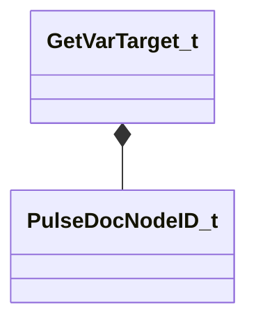

[Schemas](../../schemas.md) / [pulsedoc_lib](../pulsedoc_lib.md) / GetVarTarget_t

# GetVarTarget_t

> Source: **Build 25000182** · 2026-08-28 · `windows-x86_64` · schema `0.10.0`

**Kind:** class · **Size:** 16 bytes (`0x10`) · **Align:** 8 · **Module:** pulsedoc_lib

**Relationships:**

## Memory layout

2 fields (2 declared here, 0 inherited). Offsets are absolute from the object base.

| Offset | Field | Type | From | Annotations |
|--------|-------|------|------|-------------|
| `0x0` | `nVarDefID` | [PulseDocNodeID_t](../pulse_runtime_lib/PulseDocNodeID_t.md) |  |  |
| `0x8` | `strValueEncoded` | CUtlString |  |  |

KV3 class defaults

<pre>{
	&quot;nVarDefID&quot;: -1,
	&quot;strValueEncoded&quot;: &quot;&quot;
}</pre>

