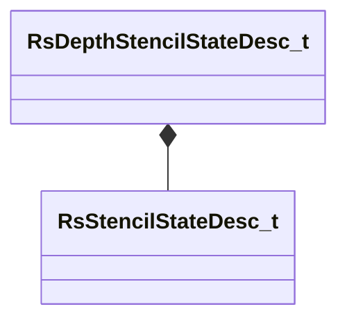
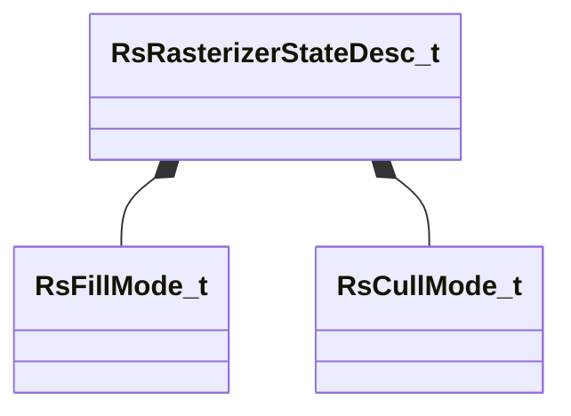

# Module: rendersystemdx11

[📊 View UML Diagram](../diagrams/rendersystemdx11.md)

| Name | Kind | Bases | Fields |
|------|------|-------|--------|
| [RsBlendStateDesc_t](#rsblendstatedesc_t) | class |  | 11 |
| [RsDepthStencilStateDesc_t](#rsdepthstencilstatedesc_t) | class |  | 4 |
| [RsRasterizerStateDesc_t](#rsrasterizerstatedesc_t) | class |  | 7 |
| [RsStencilStateDesc_t](#rsstencilstatedesc_t) | class |  | 11 |

---

### RsBlendStateDesc_t

**Fields:**

| Name | Type | Annotations |
|------|------|-------------|
| `m_bAlphaToCoverageEnable` | bitfield:1 |  |
| `m_bIndependentBlendEnable` | bitfield:1 |  |
| `m_blendOpBits` | bitfield:30 |  |
| `m_srcBlendBits` | uint32 |  |
| `m_destBlendBits` | uint32 |  |
| `m_srcBlendAlphaBits` | uint32 |  |
| `m_destBlendAlphaBits` | uint32 |  |
| `m_renderTargetWriteMaskBits` | uint32 |  |
| `m_blendOpAlphaBits` | uint32 |  |
| `m_blendEnableBits` | uint8 |  |
| `m_srgbWriteEnableBits` | uint8 |  |

### RsDepthStencilStateDesc_t

**Relationships:**

**Fields:**

| Name | Type | Annotations |
|------|------|-------------|
| `m_bDepthTestEnable` | bitfield:1 |  |
| `m_bDepthWriteEnable` | bitfield:1 |  |
| `m_depthFunc` | bitfield:4 |  |
| `m_stencilState` | [RsStencilStateDesc_t](../schemas/rendersystemdx11.md#rsstencilstatedesc_t) |  |

### RsRasterizerStateDesc_t

**Relationships:**

**Fields:**

| Name | Type | Annotations |
|------|------|-------------|
| `m_nFillMode` | [RsFillMode_t](../schemas/!GlobalTypes.md#rsfillmode_t) |  |
| `m_nCullMode` | [RsCullMode_t](../schemas/!GlobalTypes.md#rscullmode_t) |  |
| `m_bDepthClipEnable` | bool |  |
| `m_bMultisampleEnable` | bool |  |
| `m_nDepthBias` | int32 |  |
| `m_flDepthBiasClamp` | float32 |  |
| `m_flSlopeScaledDepthBias` | float32 |  |

### RsStencilStateDesc_t

**Fields:**

| Name | Type | Annotations |
|------|------|-------------|
| `m_bStencilEnable` | bitfield:1 |  |
| `m_backStencilDepthFailOp` | bitfield:3 |  |
| `m_backStencilFailOp` | bitfield:3 |  |
| `m_backStencilFunc` | bitfield:4 |  |
| `m_backStencilPassOp` | bitfield:3 |  |
| `m_frontStencilDepthFailOp` | bitfield:3 |  |
| `m_frontStencilFailOp` | bitfield:3 |  |
| `m_frontStencilFunc` | bitfield:4 |  |
| `m_frontStencilPassOp` | bitfield:3 |  |
| `m_nStencilReadMask` | uint8 |  |
| `m_nStencilWriteMask` | uint8 |  |
