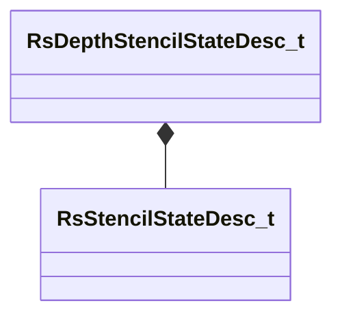

[Schemas](../../schemas.md) / [rendersystemdx11](../rendersystemdx11.md) / RsDepthStencilStateDesc_t

# RsDepthStencilStateDesc_t

> Source: **Build 25000182** · 2026-08-28 · `windows-x86_64` · schema `0.10.0`

**Kind:** class · **Size:** 8 bytes (`0x8`) · **Align:** n/a (unspecified) · **Module:** rendersystemdx11

**Relationships:**

## Memory layout

4 fields (4 declared here, 0 inherited). Offsets are absolute from the object base.

| Offset | Field | Type | From | Annotations |
|--------|-------|------|------|-------------|
| `0x0` bit 0 | `m_bDepthTestEnable` | bitfield:1 |  |  |
| `0x0` bit 1 | `m_bDepthWriteEnable` | bitfield:1 |  |  |
| `0x0` bits 2..5 | `m_depthFunc` | bitfield:4 |  |  |
| `0x2` | `m_stencilState` | [RsStencilStateDesc_t](../rendersystemdx11/RsStencilStateDesc_t.md) |  |  |
