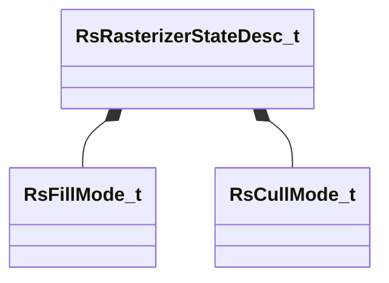

[Schemas](../../schemas.md) / [rendersystemdx11](../rendersystemdx11.md) / RsRasterizerStateDesc_t

# RsRasterizerStateDesc_t

> Source: **Build 25000182** · 2026-08-28 · `windows-x86_64` · schema `0.10.0`

**Kind:** class · **Size:** 16 bytes (`0x10`) · **Align:** n/a (unspecified) · **Module:** rendersystemdx11

**Relationships:**

## Memory layout

7 fields (7 declared here, 0 inherited). Offsets are absolute from the object base.

| Offset | Field | Type | From | Annotations |
|--------|-------|------|------|-------------|
| `0x0` | `m_nFillMode` | [RsFillMode_t](../rendersystemdx11/RsFillMode_t.md) |  |  |
| `0x1` | `m_nCullMode` | [RsCullMode_t](../rendersystemdx11/RsCullMode_t.md) |  |  |
| `0x2` | `m_bDepthClipEnable` | bool |  |  |
| `0x3` | `m_bMultisampleEnable` | bool |  |  |
| `0x4` | `m_nDepthBias` | int32 |  |  |
| `0x8` | `m_flDepthBiasClamp` | float32 |  |  |
| `0xc` | `m_flSlopeScaledDepthBias` | float32 |  |  |
