# Module: resourcecompiler

[📊 View UML Diagram](../diagrams/resourcecompiler.md)

| Name | Kind | Bases | Fields |
|------|------|-------|--------|
| [CBloomLayer](#cbloomlayer) | class | CColorCorrectionLayer | 1 |
| [CBrightnessContrastColorCorrectionLayer](#cbrightnesscontrastcolorcorrectionlayer) | class | CColorCorrectionLayer | 2 |
| [CColorBalanceColorCorrectionLayer](#ccolorbalancecolorcorrectionlayer) | class | CColorCorrectionLayer | 10 |
| [CColorCorrectionLayer](#ccolorcorrectionlayer) | class |  | 4 |
| [CColorLookupColorCorrectionLayer](#ccolorlookupcolorcorrectionlayer) | class | CColorCorrectionLayer | 3 |
| [CColorTintColorCorrectionLayer](#ccolortintcolorcorrectionlayer) | class | CColorCorrectionLayer | 5 |
| [CCurvesColorCorrectionLayer](#ccurvescolorcorrectionlayer) | class | CColorCorrectionLayer | 4 |
| [CFogScatteringLayer](#cfogscatteringlayer) | class | CColorCorrectionLayer | 1 |
| [CHueSaturationColorCorrectionLayer](#chuesaturationcolorcorrectionlayer) | class | CColorCorrectionLayer | 21 |
| [CLayerMask](#clayermask) | class |  | 4 |
| [CLevelsColorCorrectionLayer](#clevelscolorcorrectionlayer) | class | CColorCorrectionLayer | 20 |
| [CLocalContrastLayer](#clocalcontrastlayer) | class | CColorCorrectionLayer | 1 |
| [CLocalExposureLayer](#clocalexposurelayer) | class | CColorCorrectionLayer | 1 |
| [CPostProcessData](#cpostprocessdata) | class |  | 1 |
| [CToneMappingLayer](#ctonemappinglayer) | class | CColorCorrectionLayer | 1 |
| [CVibranceColorCorrectionLayer](#cvibrancecolorcorrectionlayer) | class | CColorCorrectionLayer | 2 |
| [CVignetteLayer](#cvignettelayer) | class | CColorCorrectionLayer | 1 |

---

### CBloomLayer

**Inherits from:** [CColorCorrectionLayer](resourcecompiler.md#ccolorcorrectionlayer)

**Metadata:** `MGetKV3ClassDefaults`

**Relationships:**

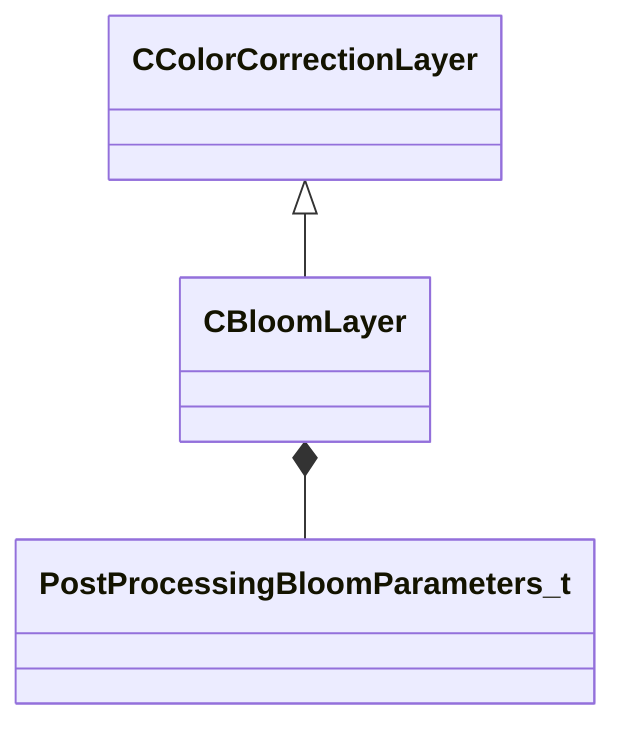

**Fields:**

| Name | Type | Annotations |
|------|------|-------------|
| `m_params` | [PostProcessingBloomParameters_t](../schemas/materialsystem2.md#postprocessingbloomparameters_t) |  |

### CBrightnessContrastColorCorrectionLayer

**Inherits from:** [CColorCorrectionLayer](resourcecompiler.md#ccolorcorrectionlayer)

**Metadata:** `MGetKV3ClassDefaults`

**Relationships:**

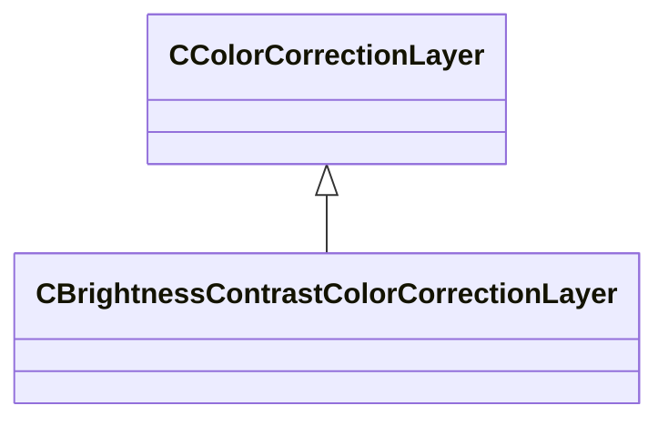

**Fields:**

| Name | Type | Annotations |
|------|------|-------------|
| `m_nBrightness` | int32 |  |
| `m_nContrast` | int32 |  |

### CColorBalanceColorCorrectionLayer

**Inherits from:** [CColorCorrectionLayer](resourcecompiler.md#ccolorcorrectionlayer)

**Metadata:** `MGetKV3ClassDefaults`

**Relationships:**

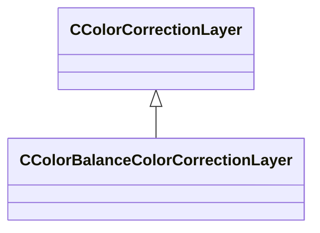

**Fields:**

| Name | Type | Annotations |
|------|------|-------------|
| `m_nRedCyanBalS` | int32 |  |
| `m_nRedCyanBalM` | int32 |  |
| `m_nRedCyanBalH` | int32 |  |
| `m_nGreenMagentaBalS` | int32 |  |
| `m_nGreenMagentaBalM` | int32 |  |
| `m_nGreenMagentaBalH` | int32 |  |
| `m_nBlueYellowBalS` | int32 |  |
| `m_nBlueYellowBalM` | int32 |  |
| `m_nBlueYellowBalH` | int32 |  |
| `m_bPreserveLuminosity` | bool |  |

### CColorCorrectionLayer

**Derived by:** [CBloomLayer](resourcecompiler.md#cbloomlayer), [CBrightnessContrastColorCorrectionLayer](resourcecompiler.md#cbrightnesscontrastcolorcorrectionlayer), [CColorBalanceColorCorrectionLayer](resourcecompiler.md#ccolorbalancecolorcorrectionlayer), [CColorLookupColorCorrectionLayer](resourcecompiler.md#ccolorlookupcolorcorrectionlayer), [CColorTintColorCorrectionLayer](resourcecompiler.md#ccolortintcolorcorrectionlayer), [CCurvesColorCorrectionLayer](resourcecompiler.md#ccurvescolorcorrectionlayer), [CFogScatteringLayer](resourcecompiler.md#cfogscatteringlayer), [CHueSaturationColorCorrectionLayer](resourcecompiler.md#chuesaturationcolorcorrectionlayer), [CLevelsColorCorrectionLayer](resourcecompiler.md#clevelscolorcorrectionlayer), [CLocalContrastLayer](resourcecompiler.md#clocalcontrastlayer), [CLocalExposureLayer](resourcecompiler.md#clocalexposurelayer), [CToneMappingLayer](resourcecompiler.md#ctonemappinglayer), [CVibranceColorCorrectionLayer](resourcecompiler.md#cvibrancecolorcorrectionlayer), [CVignetteLayer](resourcecompiler.md#cvignettelayer)

**Metadata:** `MGetKV3ClassDefaults`

**Relationships:**

```mermaid
classDiagram
    CColorCorrectionLayer <|-- CBloomLayer
    CColorCorrectionLayer <|-- CBrightnessContrastColorCorrectionLayer
    CColorCorrectionLayer <|-- CColorBalanceColorCorrectionLayer
    CColorCorrectionLayer <|-- CColorLookupColorCorrectionLayer
    CColorCorrectionLayer <|-- CColorTintColorCorrectionLayer
    CColorCorrectionLayer <|-- CCurvesColorCorrectionLayer
    CColorCorrectionLayer <|-- CFogScatteringLayer
    CColorCorrectionLayer <|-- CHueSaturationColorCorrectionLayer
    CColorCorrectionLayer <|-- CLevelsColorCorrectionLayer
    CColorCorrectionLayer <|-- CLocalContrastLayer
    CColorCorrectionLayer <|-- CLocalExposureLayer
    CColorCorrectionLayer <|-- CToneMappingLayer
    CColorCorrectionLayer <|-- CVibranceColorCorrectionLayer
    CColorCorrectionLayer <|-- CVignetteLayer
    CColorCorrectionLayer --> CLayerMask
```

**Fields:**

| Name | Type | Annotations |
|------|------|-------------|
| `m_name` | CUtlString |  |
| `m_nOpacityPercent` | int32 |  |
| `m_bVisible` | bool |  |
| `m_pLayerMask` | [CLayerMask](../schemas/resourcecompiler.md#clayermask)* |  |

### CColorLookupColorCorrectionLayer

**Inherits from:** [CColorCorrectionLayer](resourcecompiler.md#ccolorcorrectionlayer)

**Metadata:** `MGetKV3ClassDefaults`

**Relationships:**

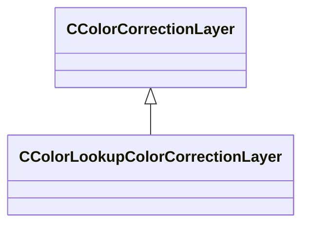

**Fields:**

| Name | Type | Annotations |
|------|------|-------------|
| `m_fileName` | CUtlString |  |
| `m_lut` | CUtlVector< float32 > |  |
| `m_nDim` | int32 |  |

### CColorTintColorCorrectionLayer

**Inherits from:** [CColorCorrectionLayer](resourcecompiler.md#ccolorcorrectionlayer)

**Metadata:** `MGetKV3ClassDefaults`

**Relationships:**

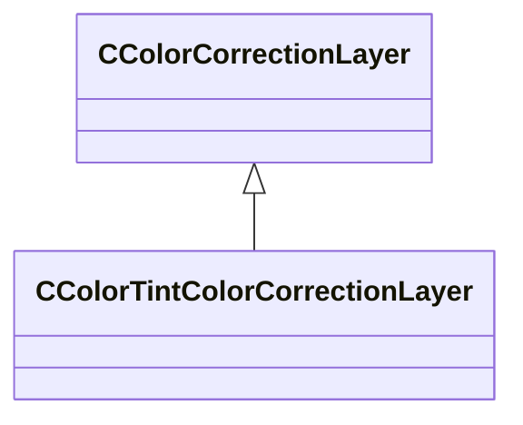

**Fields:**

| Name | Type | Annotations |
|------|------|-------------|
| `m_nTintColorR` | int32 |  |
| `m_nTintColorG` | int32 |  |
| `m_nTintColorB` | int32 |  |
| `m_nStrength` | int32 |  |
| `m_bPreserveLuminosity` | bool |  |

### CCurvesColorCorrectionLayer

**Inherits from:** [CColorCorrectionLayer](resourcecompiler.md#ccolorcorrectionlayer)

**Metadata:** `MGetKV3ClassDefaults`

**Relationships:**

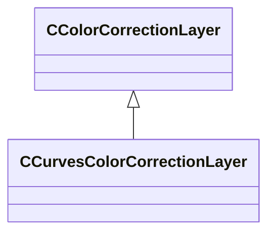

**Fields:**

| Name | Type | Annotations |
|------|------|-------------|
| `m_curvePointsRGB` | CUtlVector< Vector2D > |  |
| `m_curvePointsR` | CUtlVector< Vector2D > |  |
| `m_curvePointsG` | CUtlVector< Vector2D > |  |
| `m_curvePointsB` | CUtlVector< Vector2D > |  |

### CFogScatteringLayer

**Inherits from:** [CColorCorrectionLayer](resourcecompiler.md#ccolorcorrectionlayer)

**Metadata:** `MGetKV3ClassDefaults`

**Relationships:**

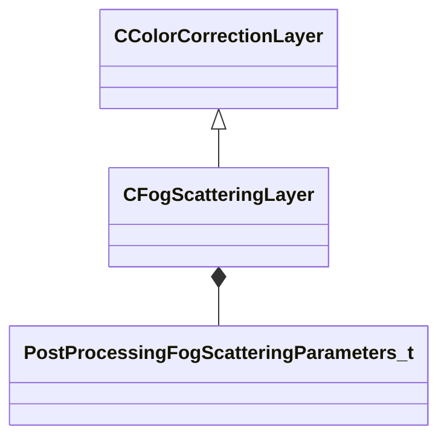

**Fields:**

| Name | Type | Annotations |
|------|------|-------------|
| `m_params` | [PostProcessingFogScatteringParameters_t](../schemas/materialsystem2.md#postprocessingfogscatteringparameters_t) |  |

### CHueSaturationColorCorrectionLayer

**Inherits from:** [CColorCorrectionLayer](resourcecompiler.md#ccolorcorrectionlayer)

**Metadata:** `MGetKV3ClassDefaults`

**Relationships:**

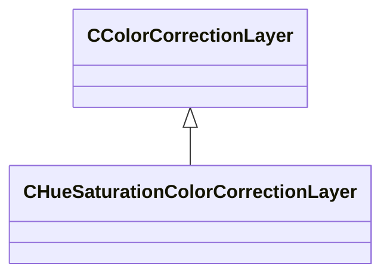

**Fields:**

| Name | Type | Annotations |
|------|------|-------------|
| `m_nHueMaster` | int32 |  |
| `m_nHueRed` | int32 |  |
| `m_nHueYellow` | int32 |  |
| `m_nHueGreen` | int32 |  |
| `m_nHueCyan` | int32 |  |
| `m_nHueBlue` | int32 |  |
| `m_nHueMagenta` | int32 |  |
| `m_nSaturationMaster` | int32 |  |
| `m_nSaturationRed` | int32 |  |
| `m_nSaturationYellow` | int32 |  |
| `m_nSaturationGreen` | int32 |  |
| `m_nSaturationCyan` | int32 |  |
| `m_nSaturationBlue` | int32 |  |
| `m_nSaturationMagenta` | int32 |  |
| `m_nBrightnessMaster` | int32 |  |
| `m_nBrightnessRed` | int32 |  |
| `m_nBrightnessYellow` | int32 |  |
| `m_nBrightnessGreen` | int32 |  |
| `m_nBrightnessCyan` | int32 |  |
| `m_nBrightnessBlue` | int32 |  |
| `m_nBrightnessMagenta` | int32 |  |

### CLayerMask

**Metadata:** `MGetKV3ClassDefaults`

**Fields:**

| Name | Type | Annotations |
|------|------|-------------|
| `m_nLumMaskCenter` | int32 |  |
| `m_nLumMaskWidth` | int32 |  |
| `m_nLumMaskShape` | int32 |  |
| `m_bInverted` | bool |  |

### CLevelsColorCorrectionLayer

**Inherits from:** [CColorCorrectionLayer](resourcecompiler.md#ccolorcorrectionlayer)

**Metadata:** `MGetKV3ClassDefaults`

**Relationships:**

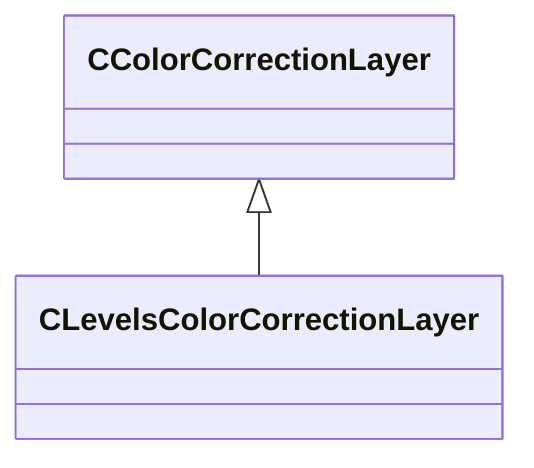

**Fields:**

| Name | Type | Annotations |
|------|------|-------------|
| `m_nInputBlackPointRGB` | int32 |  |
| `m_nInputBlackPointR` | int32 |  |
| `m_nInputBlackPointG` | int32 |  |
| `m_nInputBlackPointB` | int32 |  |
| `m_nInputWhitePointRGB` | int32 |  |
| `m_nInputWhitePointR` | int32 |  |
| `m_nInputWhitePointG` | int32 |  |
| `m_nInputWhitePointB` | int32 |  |
| `m_nOutputBlackPointRGB` | int32 |  |
| `m_nOutputBlackPointR` | int32 |  |
| `m_nOutputBlackPointG` | int32 |  |
| `m_nOutputBlackPointB` | int32 |  |
| `m_nOutputWhitePointRGB` | int32 |  |
| `m_nOutputWhitePointR` | int32 |  |
| `m_nOutputWhitePointG` | int32 |  |
| `m_nOutputWhitePointB` | int32 |  |
| `m_flGammaRGB` | float32 |  |
| `m_flGammaR` | float32 |  |
| `m_flGammaG` | float32 |  |
| `m_flGammaB` | float32 |  |

### CLocalContrastLayer

**Inherits from:** [CColorCorrectionLayer](resourcecompiler.md#ccolorcorrectionlayer)

**Metadata:** `MGetKV3ClassDefaults`

**Relationships:**

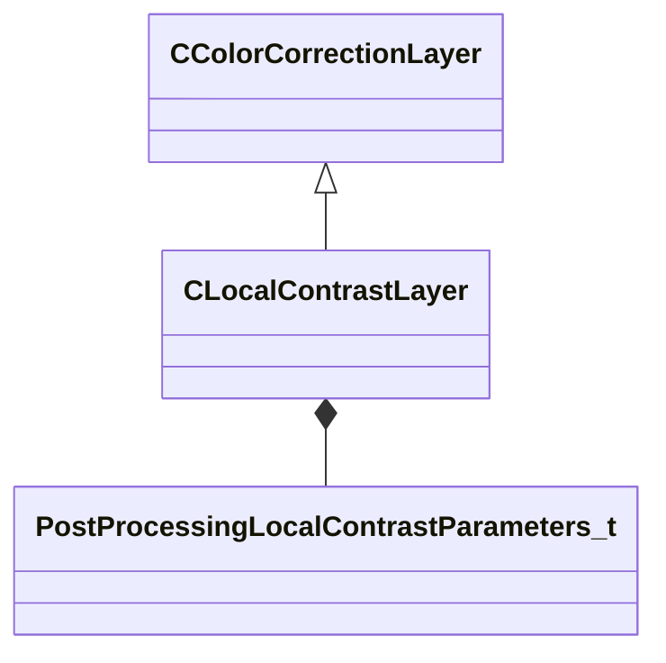

**Fields:**

| Name | Type | Annotations |
|------|------|-------------|
| `m_params` | [PostProcessingLocalContrastParameters_t](../schemas/materialsystem2.md#postprocessinglocalcontrastparameters_t) |  |

### CLocalExposureLayer

**Inherits from:** [CColorCorrectionLayer](resourcecompiler.md#ccolorcorrectionlayer)

**Metadata:** `MGetKV3ClassDefaults`

**Relationships:**

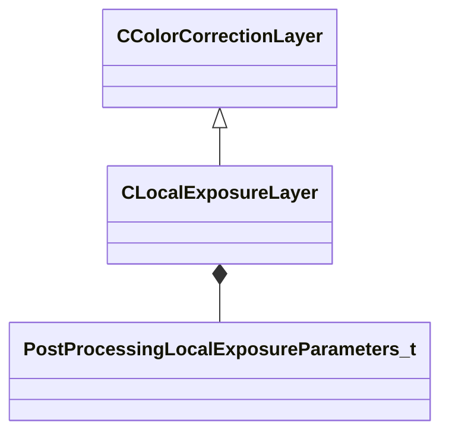

**Fields:**

| Name | Type | Annotations |
|------|------|-------------|
| `m_params` | [PostProcessingLocalExposureParameters_t](../schemas/materialsystem2.md#postprocessinglocalexposureparameters_t) |  |

### CPostProcessData

**Metadata:** `MGetKV3ClassDefaults`

**Relationships:**

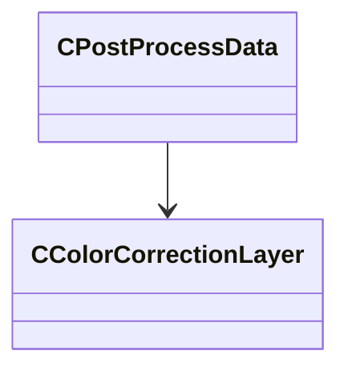

**Fields:**

| Name | Type | Annotations |
|------|------|-------------|
| `m_layers` | CUtlVector< [CColorCorrectionLayer](../schemas/resourcecompiler.md#ccolorcorrectionlayer)* > |  |

### CToneMappingLayer

**Inherits from:** [CColorCorrectionLayer](resourcecompiler.md#ccolorcorrectionlayer)

**Metadata:** `MGetKV3ClassDefaults`

**Relationships:**

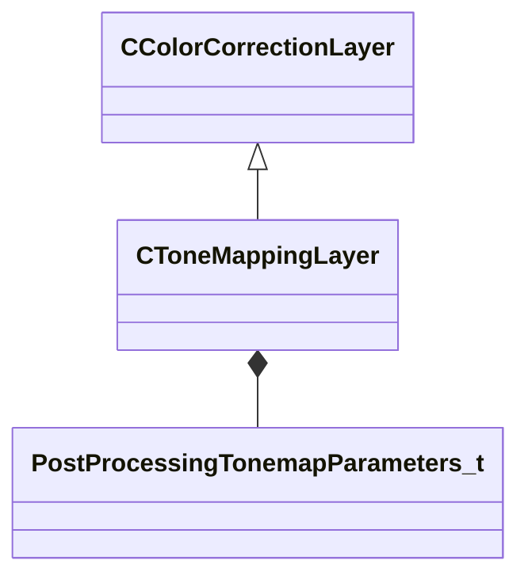

**Fields:**

| Name | Type | Annotations |
|------|------|-------------|
| `m_params` | [PostProcessingTonemapParameters_t](../schemas/materialsystem2.md#postprocessingtonemapparameters_t) |  |

### CVibranceColorCorrectionLayer

**Inherits from:** [CColorCorrectionLayer](resourcecompiler.md#ccolorcorrectionlayer)

**Metadata:** `MGetKV3ClassDefaults`

**Relationships:**

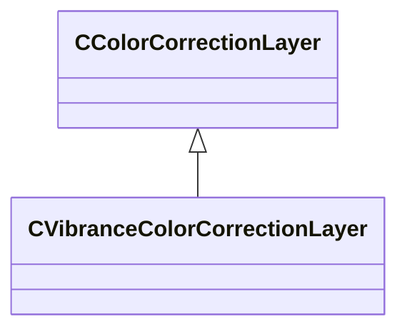

**Fields:**

| Name | Type | Annotations |
|------|------|-------------|
| `m_nVibrance` | int32 |  |
| `m_nSaturation` | int32 |  |

### CVignetteLayer

**Inherits from:** [CColorCorrectionLayer](resourcecompiler.md#ccolorcorrectionlayer)

**Metadata:** `MGetKV3ClassDefaults`

**Relationships:**

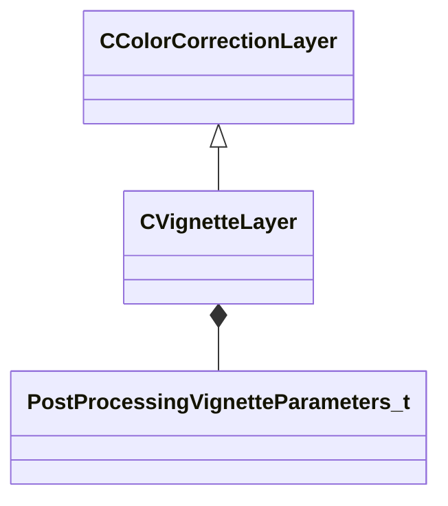

**Fields:**

| Name | Type | Annotations |
|------|------|-------------|
| `m_params` | [PostProcessingVignetteParameters_t](../schemas/materialsystem2.md#postprocessingvignetteparameters_t) |  |
