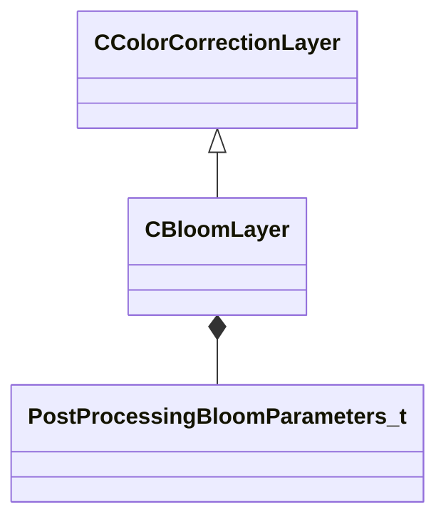

[Schemas](../../schemas.md) / [resourcecompiler](../resourcecompiler.md) / CBloomLayer

# CBloomLayer

> Source: **Build 25000182** · 2026-08-28 · `windows-x86_64` · schema `0.10.0`

**Kind:** class · **Size:** 176 bytes (`0xb0`) · **Align:** 8 · **Module:** resourcecompiler

**Inherits from:** [CColorCorrectionLayer](../resourcecompiler/CColorCorrectionLayer.md)

**Relationships:**

## Memory layout

5 fields (1 declared here, 4 inherited). Offsets are absolute from the object base.

| Offset | Field | Type | From | Annotations |
|--------|-------|------|------|-------------|
| `0x8` | `m_name` | CUtlString | [CColorCorrectionLayer](../resourcecompiler/CColorCorrectionLayer.md) |  |
| `0x10` | `m_nOpacityPercent` | int32 | [CColorCorrectionLayer](../resourcecompiler/CColorCorrectionLayer.md) |  |
| `0x14` | `m_bVisible` | bool | [CColorCorrectionLayer](../resourcecompiler/CColorCorrectionLayer.md) |  |
| `0x18` | `m_pLayerMask` | [CLayerMask](../resourcecompiler/CLayerMask.md)* | [CColorCorrectionLayer](../resourcecompiler/CColorCorrectionLayer.md) |  |
| `0x28` | `m_params` | [PostProcessingBloomParameters_t](../materialsystem2/PostProcessingBloomParameters_t.md) |  |  |

KV3 class defaults

<pre>{
	&quot;_class&quot;: &quot;CBloomLayer&quot;,
	&quot;m_name&quot;: &quot;Bloom 1&quot;,
	&quot;m_nOpacityPercent&quot;: 100,
	&quot;m_bVisible&quot;: true,
	&quot;m_pLayerMask&quot;: null,
	&quot;m_params&quot;:
	{
		&quot;m_blendMode&quot;: &quot;BLOOM_BLEND_ADD&quot;,
		&quot;m_flBloomStrength&quot;: 2.000000,
		&quot;m_flScreenBloomStrength&quot;: 1.000000,
		&quot;m_flBlurBloomStrength&quot;: 1.000000,
		&quot;m_flBloomThreshold&quot;: 0.000000,
		&quot;m_flBloomThresholdWidth&quot;: 1.000000,
		&quot;m_flSkyboxBloomStrength&quot;: 1.000000,
		&quot;m_flBloomStartValue&quot;: 1.000000,
		&quot;m_flComputeBloomStrength&quot;: 0.030000,
		&quot;m_flComputeBloomThreshold&quot;: 1.000000,
		&quot;m_flComputeBloomRadius&quot;: 0.600000,
		&quot;m_flComputeBloomEffectsScale&quot;: 1.000000,
		&quot;m_flComputeBloomLensDirtStrength&quot;: 0.000000,
		&quot;m_flComputeBloomLensDirtBlackLevel&quot;: 0.100000,
		&quot;m_flBlurWeight&quot;:
		[
			0.200000,
			0.200000,
			0.200000,
			0.200000,
			0.200000
		],
		&quot;m_vBlurTint&quot;:
		[
			[
				1.000000,
				1.000000,
				1.000000
			],
			[
				1.000000,
				1.000000,
				1.000000
			],
			[
				1.000000,
				1.000000,
				1.000000
			],
			[
				1.000000,
				1.000000,
				1.000000
			],
			[
				1.000000,
				1.000000,
				1.000000
			]
		]
	}
}</pre>

