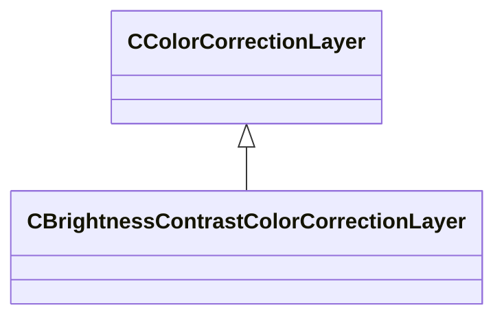

[Schemas](../../schemas.md) / [resourcecompiler](../resourcecompiler.md) / CBrightnessContrastColorCorrectionLayer

# CBrightnessContrastColorCorrectionLayer

**Kind:** class · **Size:** 48 bytes (`0x30`) · **Align:** 8 · **Module:** resourcecompiler

**Inherits from:** [CColorCorrectionLayer](../resourcecompiler/CColorCorrectionLayer.md)

**Relationships:**

## Memory layout

6 fields (2 declared here, 4 inherited). Offsets are absolute from the object base.

| Offset | Field | Type | From | Annotations |
|--------|-------|------|------|-------------|
| `0x8` | `m_name` | CUtlString | [CColorCorrectionLayer](../resourcecompiler/CColorCorrectionLayer.md) |  |
| `0x10` | `m_nOpacityPercent` | int32 | [CColorCorrectionLayer](../resourcecompiler/CColorCorrectionLayer.md) |  |
| `0x14` | `m_bVisible` | bool | [CColorCorrectionLayer](../resourcecompiler/CColorCorrectionLayer.md) |  |
| `0x18` | `m_pLayerMask` | [CLayerMask](../resourcecompiler/CLayerMask.md)* | [CColorCorrectionLayer](../resourcecompiler/CColorCorrectionLayer.md) |  |
| `0x28` | `m_nBrightness` | int32 |  |  |
| `0x2c` | `m_nContrast` | int32 |  |  |

KV3 class defaults

<pre>{
	&quot;_class&quot;: &quot;CBrightnessContrastColorCorrectionLayer&quot;,
	&quot;m_name&quot;: &quot;Brightness/Contrast 1&quot;,
	&quot;m_nOpacityPercent&quot;: 100,
	&quot;m_bVisible&quot;: true,
	&quot;m_pLayerMask&quot;: null,
	&quot;m_nBrightness&quot;: 0,
	&quot;m_nContrast&quot;: 0
}</pre>

