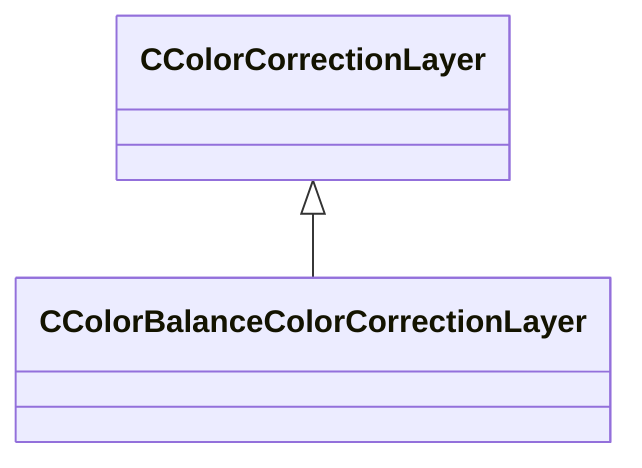

[Schemas](../../schemas.md) / [resourcecompiler](../resourcecompiler.md) / CColorBalanceColorCorrectionLayer

# CColorBalanceColorCorrectionLayer

**Kind:** class · **Size:** 80 bytes (`0x50`) · **Align:** 8 · **Module:** resourcecompiler

**Inherits from:** [CColorCorrectionLayer](../resourcecompiler/CColorCorrectionLayer.md)

**Relationships:**

## Memory layout

14 fields (10 declared here, 4 inherited). Offsets are absolute from the object base.

| Offset | Field | Type | From | Annotations |
|--------|-------|------|------|-------------|
| `0x8` | `m_name` | CUtlString | [CColorCorrectionLayer](../resourcecompiler/CColorCorrectionLayer.md) |  |
| `0x10` | `m_nOpacityPercent` | int32 | [CColorCorrectionLayer](../resourcecompiler/CColorCorrectionLayer.md) |  |
| `0x14` | `m_bVisible` | bool | [CColorCorrectionLayer](../resourcecompiler/CColorCorrectionLayer.md) |  |
| `0x18` | `m_pLayerMask` | [CLayerMask](../resourcecompiler/CLayerMask.md)* | [CColorCorrectionLayer](../resourcecompiler/CColorCorrectionLayer.md) |  |
| `0x28` | `m_nRedCyanBalS` | int32 |  |  |
| `0x2c` | `m_nRedCyanBalM` | int32 |  |  |
| `0x30` | `m_nRedCyanBalH` | int32 |  |  |
| `0x34` | `m_nGreenMagentaBalS` | int32 |  |  |
| `0x38` | `m_nGreenMagentaBalM` | int32 |  |  |
| `0x3c` | `m_nGreenMagentaBalH` | int32 |  |  |
| `0x40` | `m_nBlueYellowBalS` | int32 |  |  |
| `0x44` | `m_nBlueYellowBalM` | int32 |  |  |
| `0x48` | `m_nBlueYellowBalH` | int32 |  |  |
| `0x4c` | `m_bPreserveLuminosity` | bool |  |  |

KV3 class defaults

<pre>{
	&quot;_class&quot;: &quot;CColorBalanceColorCorrectionLayer&quot;,
	&quot;m_name&quot;: &quot;Color Balance 1&quot;,
	&quot;m_nOpacityPercent&quot;: 100,
	&quot;m_bVisible&quot;: true,
	&quot;m_pLayerMask&quot;: null,
	&quot;m_nRedCyanBalS&quot;: 0,
	&quot;m_nRedCyanBalM&quot;: 0,
	&quot;m_nRedCyanBalH&quot;: 0,
	&quot;m_nGreenMagentaBalS&quot;: 0,
	&quot;m_nGreenMagentaBalM&quot;: 0,
	&quot;m_nGreenMagentaBalH&quot;: 0,
	&quot;m_nBlueYellowBalS&quot;: 0,
	&quot;m_nBlueYellowBalM&quot;: 0,
	&quot;m_nBlueYellowBalH&quot;: 0,
	&quot;m_bPreserveLuminosity&quot;: true
}</pre>

