[Schemas](../../schemas.md) / [resourcecompiler](../resourcecompiler.md) / CColorCorrectionLayer

# CColorCorrectionLayer

> Source: **Build 25000182** · 2026-08-28 · `windows-x86_64` · schema `0.10.0`

**Kind:** class · **Size:** 40 bytes (`0x28`) · **Align:** n/a (unspecified) · **Module:** resourcecompiler

**Derived by:** [CBloomLayer](../resourcecompiler/CBloomLayer.md), [CBrightnessContrastColorCorrectionLayer](../resourcecompiler/CBrightnessContrastColorCorrectionLayer.md), [CColorBalanceColorCorrectionLayer](../resourcecompiler/CColorBalanceColorCorrectionLayer.md), [CColorLookupColorCorrectionLayer](../resourcecompiler/CColorLookupColorCorrectionLayer.md), [CColorTintColorCorrectionLayer](../resourcecompiler/CColorTintColorCorrectionLayer.md), [CCurvesColorCorrectionLayer](../resourcecompiler/CCurvesColorCorrectionLayer.md), [CFogScatteringLayer](../resourcecompiler/CFogScatteringLayer.md), [CHueSaturationColorCorrectionLayer](../resourcecompiler/CHueSaturationColorCorrectionLayer.md), [CLevelsColorCorrectionLayer](../resourcecompiler/CLevelsColorCorrectionLayer.md), [CLocalContrastLayer](../resourcecompiler/CLocalContrastLayer.md), [CLocalExposureLayer](../resourcecompiler/CLocalExposureLayer.md), [CToneMappingLayer](../resourcecompiler/CToneMappingLayer.md), [CVibranceColorCorrectionLayer](../resourcecompiler/CVibranceColorCorrectionLayer.md), [CVignetteLayer](../resourcecompiler/CVignetteLayer.md)

**Relationships:**

```mermaid
classDiagram
    CColorCorrectionLayer <|-- CBloomLayer
    CColorCorrectionLayer <|-- CBrightnessContrastColorCorrectionLayer
    CColorCorrectionLayer <|-- CColorBalanceColorCorrectionLayer
    CColorCorrectionLayer <|-- CColorLookupColorCorrectionLayer
    CColorCorrectionLayer <|-- CColorTintColorCorrectionLayer
    CColorCorrectionLayer <|-- CCurvesColorCorrectionLayer
    CColorCorrectionLayer <|-- CFogScatteringLayer
    CColorCorrectionLayer <|-- CHueSaturationColorCorrectionLayer
    CColorCorrectionLayer <|-- CLevelsColorCorrectionLayer
    CColorCorrectionLayer <|-- CLocalContrastLayer
    CColorCorrectionLayer <|-- CLocalExposureLayer
    CColorCorrectionLayer <|-- CToneMappingLayer
    CColorCorrectionLayer <|-- CVibranceColorCorrectionLayer
    CColorCorrectionLayer <|-- CVignetteLayer
    CColorCorrectionLayer --> CLayerMask
```

## Memory layout

4 fields (4 declared here, 0 inherited). Offsets are absolute from the object base.

| Offset | Field | Type | From | Annotations |
|--------|-------|------|------|-------------|
| `0x8` | `m_name` | CUtlString |  |  |
| `0x10` | `m_nOpacityPercent` | int32 |  |  |
| `0x14` | `m_bVisible` | bool |  |  |
| `0x18` | `m_pLayerMask` | [CLayerMask](../resourcecompiler/CLayerMask.md)* |  |  |
