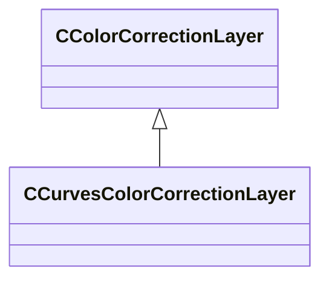

[Schemas](../../schemas.md) / [resourcecompiler](../resourcecompiler.md) / CCurvesColorCorrectionLayer

# CCurvesColorCorrectionLayer

**Kind:** class · **Size:** 232 bytes (`0xe8`) · **Align:** 8 · **Module:** resourcecompiler

**Inherits from:** [CColorCorrectionLayer](../resourcecompiler/CColorCorrectionLayer.md)

**Relationships:**

## Memory layout

8 fields (4 declared here, 4 inherited). Offsets are absolute from the object base.

| Offset | Field | Type | From | Annotations |
|--------|-------|------|------|-------------|
| `0x8` | `m_name` | CUtlString | [CColorCorrectionLayer](../resourcecompiler/CColorCorrectionLayer.md) |  |
| `0x10` | `m_nOpacityPercent` | int32 | [CColorCorrectionLayer](../resourcecompiler/CColorCorrectionLayer.md) |  |
| `0x14` | `m_bVisible` | bool | [CColorCorrectionLayer](../resourcecompiler/CColorCorrectionLayer.md) |  |
| `0x18` | `m_pLayerMask` | [CLayerMask](../resourcecompiler/CLayerMask.md)* | [CColorCorrectionLayer](../resourcecompiler/CColorCorrectionLayer.md) |  |
| `0x28` | `m_curvePointsRGB` | CUtlVector< Vector2D > |  |  |
| `0x40` | `m_curvePointsR` | CUtlVector< Vector2D > |  |  |
| `0x58` | `m_curvePointsG` | CUtlVector< Vector2D > |  |  |
| `0x70` | `m_curvePointsB` | CUtlVector< Vector2D > |  |  |

KV3 class defaults

<pre>{
	&quot;_class&quot;: &quot;CCurvesColorCorrectionLayer&quot;,
	&quot;m_name&quot;: &quot;Curves 1&quot;,
	&quot;m_nOpacityPercent&quot;: 100,
	&quot;m_bVisible&quot;: true,
	&quot;m_pLayerMask&quot;: null,
	&quot;m_curvePointsRGB&quot;:
	[
		[
			0.000000,
			0.000000
		],
		[
			255.000000,
			255.000000
		]
	],
	&quot;m_curvePointsR&quot;:
	[
		[
			0.000000,
			0.000000
		],
		[
			255.000000,
			255.000000
		]
	],
	&quot;m_curvePointsG&quot;:
	[
		[
			0.000000,
			0.000000
		],
		[
			255.000000,
			255.000000
		]
	],
	&quot;m_curvePointsB&quot;:
	[
		[
			0.000000,
			0.000000
		],
		[
			255.000000,
			255.000000
		]
	]
}</pre>

