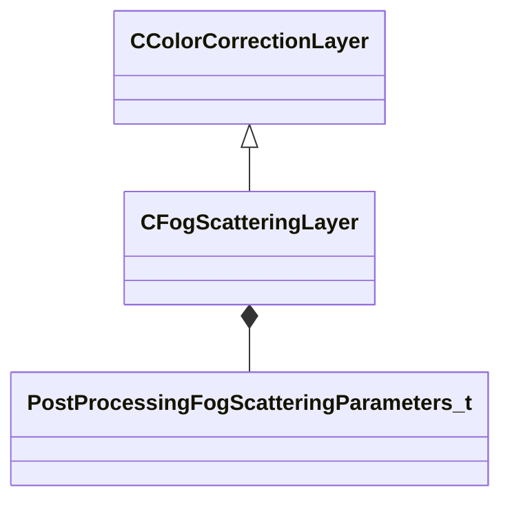

[Schemas](../../schemas.md) / [resourcecompiler](../resourcecompiler.md) / CFogScatteringLayer

# CFogScatteringLayer

> Source: **Build 25000182** · 2026-08-28 · `windows-x86_64` · schema `0.10.0`

**Kind:** class · **Size:** 72 bytes (`0x48`) · **Align:** 8 · **Module:** resourcecompiler

**Inherits from:** [CColorCorrectionLayer](../resourcecompiler/CColorCorrectionLayer.md)

**Relationships:**

## Memory layout

5 fields (1 declared here, 4 inherited). Offsets are absolute from the object base.

| Offset | Field | Type | From | Annotations |
|--------|-------|------|------|-------------|
| `0x8` | `m_name` | CUtlString | [CColorCorrectionLayer](../resourcecompiler/CColorCorrectionLayer.md) |  |
| `0x10` | `m_nOpacityPercent` | int32 | [CColorCorrectionLayer](../resourcecompiler/CColorCorrectionLayer.md) |  |
| `0x14` | `m_bVisible` | bool | [CColorCorrectionLayer](../resourcecompiler/CColorCorrectionLayer.md) |  |
| `0x18` | `m_pLayerMask` | [CLayerMask](../resourcecompiler/CLayerMask.md)* | [CColorCorrectionLayer](../resourcecompiler/CColorCorrectionLayer.md) |  |
| `0x28` | `m_params` | [PostProcessingFogScatteringParameters_t](../materialsystem2/PostProcessingFogScatteringParameters_t.md) |  |  |

KV3 class defaults

<pre>{
	&quot;_class&quot;: &quot;CFogScatteringLayer&quot;,
	&quot;m_name&quot;: &quot;Fog Scattering 1&quot;,
	&quot;m_nOpacityPercent&quot;: 100,
	&quot;m_bVisible&quot;: true,
	&quot;m_pLayerMask&quot;: null,
	&quot;m_params&quot;:
	{
		&quot;m_fRadius&quot;: 0.750000,
		&quot;m_fScale&quot;: 0.000000,
		&quot;m_fCubemapScale&quot;: 1.000000,
		&quot;m_fVolumetricScale&quot;: 1.000000,
		&quot;m_fGradientScale&quot;: 1.000000,
		&quot;m_fWaterScale&quot;: 0.000000,
		&quot;m_fWaterDensity&quot;: 0.000000,
		&quot;m_fWaterDepthBlurRadius&quot;: 0.000000
	}
}</pre>

