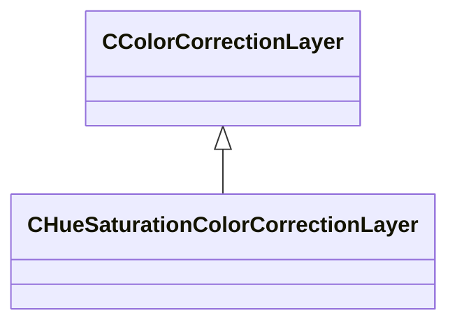

[Schemas](../../schemas.md) / [resourcecompiler](../resourcecompiler.md) / CHueSaturationColorCorrectionLayer

# CHueSaturationColorCorrectionLayer

> Source: **Build 25000182** · 2026-08-28 · `windows-x86_64` · schema `0.10.0`

**Kind:** class · **Size:** 128 bytes (`0x80`) · **Align:** 8 · **Module:** resourcecompiler

**Inherits from:** [CColorCorrectionLayer](../resourcecompiler/CColorCorrectionLayer.md)

**Relationships:**

## Memory layout

25 fields (21 declared here, 4 inherited). Offsets are absolute from the object base.

| Offset | Field | Type | From | Annotations |
|--------|-------|------|------|-------------|
| `0x8` | `m_name` | CUtlString | [CColorCorrectionLayer](../resourcecompiler/CColorCorrectionLayer.md) |  |
| `0x10` | `m_nOpacityPercent` | int32 | [CColorCorrectionLayer](../resourcecompiler/CColorCorrectionLayer.md) |  |
| `0x14` | `m_bVisible` | bool | [CColorCorrectionLayer](../resourcecompiler/CColorCorrectionLayer.md) |  |
| `0x18` | `m_pLayerMask` | [CLayerMask](../resourcecompiler/CLayerMask.md)* | [CColorCorrectionLayer](../resourcecompiler/CColorCorrectionLayer.md) |  |
| `0x28` | `m_nHueMaster` | int32 |  |  |
| `0x2c` | `m_nHueRed` | int32 |  |  |
| `0x30` | `m_nHueYellow` | int32 |  |  |
| `0x34` | `m_nHueGreen` | int32 |  |  |
| `0x38` | `m_nHueCyan` | int32 |  |  |
| `0x3c` | `m_nHueBlue` | int32 |  |  |
| `0x40` | `m_nHueMagenta` | int32 |  |  |
| `0x44` | `m_nSaturationMaster` | int32 |  |  |
| `0x48` | `m_nSaturationRed` | int32 |  |  |
| `0x4c` | `m_nSaturationYellow` | int32 |  |  |
| `0x50` | `m_nSaturationGreen` | int32 |  |  |
| `0x54` | `m_nSaturationCyan` | int32 |  |  |
| `0x58` | `m_nSaturationBlue` | int32 |  |  |
| `0x5c` | `m_nSaturationMagenta` | int32 |  |  |
| `0x60` | `m_nBrightnessMaster` | int32 |  |  |
| `0x64` | `m_nBrightnessRed` | int32 |  |  |
| `0x68` | `m_nBrightnessYellow` | int32 |  |  |
| `0x6c` | `m_nBrightnessGreen` | int32 |  |  |
| `0x70` | `m_nBrightnessCyan` | int32 |  |  |
| `0x74` | `m_nBrightnessBlue` | int32 |  |  |
| `0x78` | `m_nBrightnessMagenta` | int32 |  |  |

KV3 class defaults

<pre>{
	&quot;_class&quot;: &quot;CHueSaturationColorCorrectionLayer&quot;,
	&quot;m_name&quot;: &quot;Hue/Saturation 1&quot;,
	&quot;m_nOpacityPercent&quot;: 100,
	&quot;m_bVisible&quot;: true,
	&quot;m_pLayerMask&quot;: null,
	&quot;m_nHueMaster&quot;: 0,
	&quot;m_nHueRed&quot;: 0,
	&quot;m_nHueYellow&quot;: 0,
	&quot;m_nHueGreen&quot;: 0,
	&quot;m_nHueCyan&quot;: 0,
	&quot;m_nHueBlue&quot;: 0,
	&quot;m_nHueMagenta&quot;: 0,
	&quot;m_nSaturationMaster&quot;: 0,
	&quot;m_nSaturationRed&quot;: 0,
	&quot;m_nSaturationYellow&quot;: 0,
	&quot;m_nSaturationGreen&quot;: 0,
	&quot;m_nSaturationCyan&quot;: 0,
	&quot;m_nSaturationBlue&quot;: 0,
	&quot;m_nSaturationMagenta&quot;: 0,
	&quot;m_nBrightnessMaster&quot;: 0,
	&quot;m_nBrightnessRed&quot;: 0,
	&quot;m_nBrightnessYellow&quot;: 0,
	&quot;m_nBrightnessGreen&quot;: 0,
	&quot;m_nBrightnessCyan&quot;: 0,
	&quot;m_nBrightnessBlue&quot;: 0,
	&quot;m_nBrightnessMagenta&quot;: 0
}</pre>

