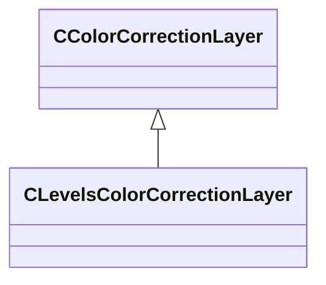

[Schemas](../../schemas.md) / [resourcecompiler](../resourcecompiler.md) / CLevelsColorCorrectionLayer

# CLevelsColorCorrectionLayer

**Kind:** class · **Size:** 120 bytes (`0x78`) · **Align:** 8 · **Module:** resourcecompiler

**Inherits from:** [CColorCorrectionLayer](../resourcecompiler/CColorCorrectionLayer.md)

**Relationships:**

## Memory layout

24 fields (20 declared here, 4 inherited). Offsets are absolute from the object base.

| Offset | Field | Type | From | Annotations |
|--------|-------|------|------|-------------|
| `0x8` | `m_name` | CUtlString | [CColorCorrectionLayer](../resourcecompiler/CColorCorrectionLayer.md) |  |
| `0x10` | `m_nOpacityPercent` | int32 | [CColorCorrectionLayer](../resourcecompiler/CColorCorrectionLayer.md) |  |
| `0x14` | `m_bVisible` | bool | [CColorCorrectionLayer](../resourcecompiler/CColorCorrectionLayer.md) |  |
| `0x18` | `m_pLayerMask` | [CLayerMask](../resourcecompiler/CLayerMask.md)* | [CColorCorrectionLayer](../resourcecompiler/CColorCorrectionLayer.md) |  |
| `0x28` | `m_nInputBlackPointRGB` | int32 |  |  |
| `0x2c` | `m_nInputBlackPointR` | int32 |  |  |
| `0x30` | `m_nInputBlackPointG` | int32 |  |  |
| `0x34` | `m_nInputBlackPointB` | int32 |  |  |
| `0x38` | `m_nInputWhitePointRGB` | int32 |  |  |
| `0x3c` | `m_nInputWhitePointR` | int32 |  |  |
| `0x40` | `m_nInputWhitePointG` | int32 |  |  |
| `0x44` | `m_nInputWhitePointB` | int32 |  |  |
| `0x48` | `m_nOutputBlackPointRGB` | int32 |  |  |
| `0x4c` | `m_nOutputBlackPointR` | int32 |  |  |
| `0x50` | `m_nOutputBlackPointG` | int32 |  |  |
| `0x54` | `m_nOutputBlackPointB` | int32 |  |  |
| `0x58` | `m_nOutputWhitePointRGB` | int32 |  |  |
| `0x5c` | `m_nOutputWhitePointR` | int32 |  |  |
| `0x60` | `m_nOutputWhitePointG` | int32 |  |  |
| `0x64` | `m_nOutputWhitePointB` | int32 |  |  |
| `0x68` | `m_flGammaRGB` | float32 |  |  |
| `0x6c` | `m_flGammaR` | float32 |  |  |
| `0x70` | `m_flGammaG` | float32 |  |  |
| `0x74` | `m_flGammaB` | float32 |  |  |

KV3 class defaults

<pre>{
	&quot;_class&quot;: &quot;CLevelsColorCorrectionLayer&quot;,
	&quot;m_name&quot;: &quot;Levels 1&quot;,
	&quot;m_nOpacityPercent&quot;: 100,
	&quot;m_bVisible&quot;: true,
	&quot;m_pLayerMask&quot;: null,
	&quot;m_nInputBlackPointRGB&quot;: 0,
	&quot;m_nInputBlackPointR&quot;: 0,
	&quot;m_nInputBlackPointG&quot;: 0,
	&quot;m_nInputBlackPointB&quot;: 0,
	&quot;m_nInputWhitePointRGB&quot;: 255,
	&quot;m_nInputWhitePointR&quot;: 255,
	&quot;m_nInputWhitePointG&quot;: 255,
	&quot;m_nInputWhitePointB&quot;: 255,
	&quot;m_nOutputBlackPointRGB&quot;: 0,
	&quot;m_nOutputBlackPointR&quot;: 0,
	&quot;m_nOutputBlackPointG&quot;: 0,
	&quot;m_nOutputBlackPointB&quot;: 0,
	&quot;m_nOutputWhitePointRGB&quot;: 255,
	&quot;m_nOutputWhitePointR&quot;: 255,
	&quot;m_nOutputWhitePointG&quot;: 255,
	&quot;m_nOutputWhitePointB&quot;: 255,
	&quot;m_flGammaRGB&quot;: 1.000000,
	&quot;m_flGammaR&quot;: 1.000000,
	&quot;m_flGammaG&quot;: 1.000000,
	&quot;m_flGammaB&quot;: 1.000000
}</pre>

