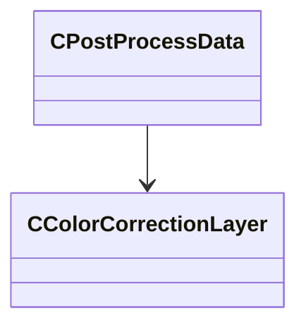

[Schemas](../../schemas.md) / [resourcecompiler](../resourcecompiler.md) / CPostProcessData

# CPostProcessData

**Kind:** class · **Size:** 32 bytes (`0x20`) · **Align:** 8 · **Module:** resourcecompiler

**Relationships:**

## Memory layout

1 fields (1 declared here, 0 inherited). Offsets are absolute from the object base.

| Offset | Field | Type | From | Annotations |
|--------|-------|------|------|-------------|
| `0x8` | `m_layers` | CUtlVector< [CColorCorrectionLayer](../resourcecompiler/CColorCorrectionLayer.md)* > |  |  |

KV3 class defaults

<pre>{
	&quot;_class&quot;: &quot;CPostProcessData&quot;,
	&quot;m_layers&quot;:
	[
	]
}</pre>

