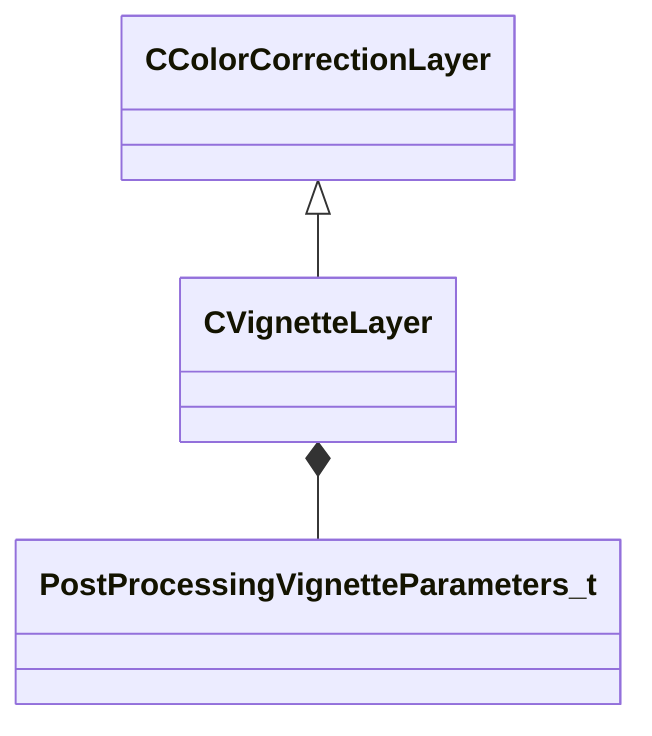

[Schemas](../../schemas.md) / [resourcecompiler](../resourcecompiler.md) / CVignetteLayer

# CVignetteLayer

**Kind:** class · **Size:** 80 bytes (`0x50`) · **Align:** 8 · **Module:** resourcecompiler

**Inherits from:** [CColorCorrectionLayer](../resourcecompiler/CColorCorrectionLayer.md)

**Relationships:**

## Memory layout

5 fields (1 declared here, 4 inherited). Offsets are absolute from the object base.

| Offset | Field | Type | From | Annotations |
|--------|-------|------|------|-------------|
| `0x8` | `m_name` | CUtlString | [CColorCorrectionLayer](../resourcecompiler/CColorCorrectionLayer.md) |  |
| `0x10` | `m_nOpacityPercent` | int32 | [CColorCorrectionLayer](../resourcecompiler/CColorCorrectionLayer.md) |  |
| `0x14` | `m_bVisible` | bool | [CColorCorrectionLayer](../resourcecompiler/CColorCorrectionLayer.md) |  |
| `0x18` | `m_pLayerMask` | [CLayerMask](../resourcecompiler/CLayerMask.md)* | [CColorCorrectionLayer](../resourcecompiler/CColorCorrectionLayer.md) |  |
| `0x28` | `m_params` | [PostProcessingVignetteParameters_t](../materialsystem2/PostProcessingVignetteParameters_t.md) |  |  |

KV3 class defaults

<pre>{
	&quot;_class&quot;: &quot;CVignetteLayer&quot;,
	&quot;m_name&quot;: &quot;Vignette 1&quot;,
	&quot;m_nOpacityPercent&quot;: 100,
	&quot;m_bVisible&quot;: true,
	&quot;m_pLayerMask&quot;: null,
	&quot;m_params&quot;:
	{
		&quot;m_flVignetteStrength&quot;: 0.000000,
		&quot;m_vCenter&quot;:
		[
			0.000000,
			0.000000
		],
		&quot;m_flRadius&quot;: 0.500000,
		&quot;m_flRoundness&quot;: 1.000000,
		&quot;m_flFeather&quot;: 0.500000,
		&quot;m_vColorTint&quot;:
		[
			1.000000,
			1.000000,
			1.000000
		]
	}
}</pre>

