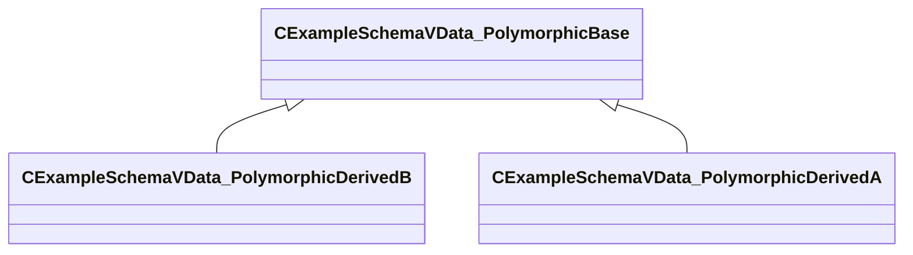
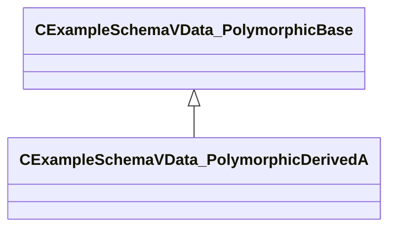

# Module: resourcefile

[📊 View UML Diagram](../diagrams/resourcefile.md)

| Name | Kind | Bases | Fields |
|------|------|-------|--------|
| [CExampleSchemaVData_Monomorphic](#cexampleschemavdata_monomorphic) | class |  | 2 |
| [CExampleSchemaVData_PolymorphicBase](#cexampleschemavdata_polymorphicbase) | class |  | 1 |
| [CExampleSchemaVData_PolymorphicDerivedA](#cexampleschemavdata_polymorphicderiveda) | class | CExampleSchemaVData_PolymorphicBase | 1 |
| [CExampleSchemaVData_PolymorphicDerivedB](#cexampleschemavdata_polymorphicderivedb) | class | CExampleSchemaVData_PolymorphicBase | 1 |
| [InfoForResourceTypeCResourceManifestInternal](#infoforresourcetypecresourcemanifestinternal) | class |  | 0 |
| [ResourceId_t](#resourceid_t) | class |  | 1 |

---

### CExampleSchemaVData_Monomorphic

**Metadata:** `MGetKV3ClassDefaults {
	"m_nExample1": 5,
	"m_nExample2": 5
}`

**Fields:**

| Name | Type | Annotations |
|------|------|-------------|
| `m_nExample1` | int32 |  |
| `m_nExample2` | int32 |  |

### CExampleSchemaVData_PolymorphicBase

**Derived by:** [CExampleSchemaVData_PolymorphicDerivedA](resourcefile.md#cexampleschemavdata_polymorphicderiveda), [CExampleSchemaVData_PolymorphicDerivedB](resourcefile.md#cexampleschemavdata_polymorphicderivedb)

**Metadata:** `MGetKV3ClassDefaults {
	"_class": "CExampleSchemaVData_PolymorphicBase",
	"m_nBase": 5
}`

**Relationships:**

**Fields:**

| Name | Type | Annotations |
|------|------|-------------|
| `m_nBase` | int32 |  |

### CExampleSchemaVData_PolymorphicDerivedA

**Inherits from:** [CExampleSchemaVData_PolymorphicBase](resourcefile.md#cexampleschemavdata_polymorphicbase)

**Metadata:** `MGetKV3ClassDefaults {
	"_class": "CExampleSchemaVData_PolymorphicDerivedA",
	"m_nBase": 5,
	"m_nDerivedA": 5
}`

**Relationships:**

**Fields:**

| Name | Type | Annotations |
|------|------|-------------|
| `m_nDerivedA` | int32 |  |

### CExampleSchemaVData_PolymorphicDerivedB

**Inherits from:** [CExampleSchemaVData_PolymorphicBase](resourcefile.md#cexampleschemavdata_polymorphicbase)

**Metadata:** `MGetKV3ClassDefaults {
	"_class": "CExampleSchemaVData_PolymorphicDerivedB",
	"m_nBase": 5,
	"m_nDerivedB": 5
}`

**Relationships:**

**Fields:**

| Name | Type | Annotations |
|------|------|-------------|
| `m_nDerivedB` | int32 |  |

### InfoForResourceTypeCResourceManifestInternal

**Metadata:** `MResourceTypeForInfoType "vrman"`

### ResourceId_t

**Metadata:** `MIsBoxedIntegerType`

**Fields:**

| Name | Type | Annotations |
|------|------|-------------|
| `m_Value` | uint64 |  |
