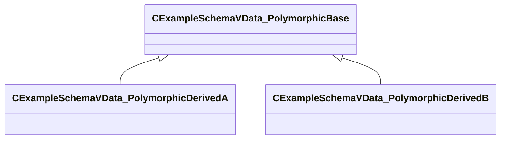

[Schemas](../../schemas.md) / [resourcefile](../resourcefile.md) / CExampleSchemaVData_PolymorphicBase

# CExampleSchemaVData_PolymorphicBase

**Kind:** class · **Size:** 16 bytes (`0x10`) · **Align:** 8 · **Module:** resourcefile

**Derived by:** [CExampleSchemaVData_PolymorphicDerivedA](../resourcefile/CExampleSchemaVData_PolymorphicDerivedA.md), [CExampleSchemaVData_PolymorphicDerivedB](../resourcefile/CExampleSchemaVData_PolymorphicDerivedB.md)

**Relationships:**

## Memory layout

1 fields (1 declared here, 0 inherited). Offsets are absolute from the object base.

| Offset | Field | Type | From | Annotations |
|--------|-------|------|------|-------------|
| `0x8` | `m_nBase` | int32 |  |  |

KV3 class defaults

<pre>{
	&quot;_class&quot;: &quot;CExampleSchemaVData_PolymorphicBase&quot;,
	&quot;m_nBase&quot;: 5
}</pre>

