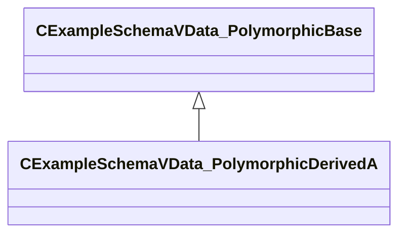

[Schemas](../../schemas.md) / [resourcefile](../resourcefile.md) / CExampleSchemaVData_PolymorphicDerivedA

# CExampleSchemaVData_PolymorphicDerivedA

> Source: **Build 25000182** · 2026-08-28 · `windows-x86_64` · schema `0.10.0`

**Kind:** class · **Size:** 24 bytes (`0x18`) · **Align:** 8 · **Module:** resourcefile

**Inherits from:** [CExampleSchemaVData_PolymorphicBase](../resourcefile/CExampleSchemaVData_PolymorphicBase.md)

**Relationships:**

## Memory layout

2 fields (1 declared here, 1 inherited). Offsets are absolute from the object base.

| Offset | Field | Type | From | Annotations |
|--------|-------|------|------|-------------|
| `0x8` | `m_nBase` | int32 | [CExampleSchemaVData_PolymorphicBase](../resourcefile/CExampleSchemaVData_PolymorphicBase.md) |  |
| `0x10` | `m_nDerivedA` | int32 |  |  |

KV3 class defaults

<pre>{
	&quot;_class&quot;: &quot;CExampleSchemaVData_PolymorphicDerivedA&quot;,
	&quot;m_nBase&quot;: 5,
	&quot;m_nDerivedA&quot;: 5
}</pre>

