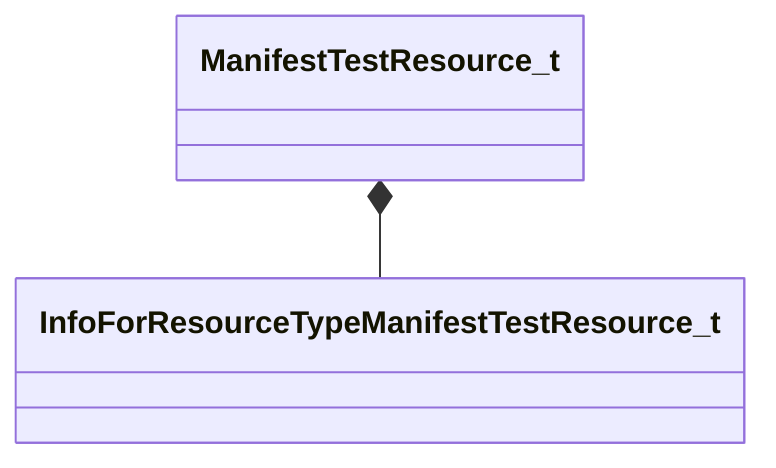

# Module: resourcesystem

[📊 View UML Diagram](../diagrams/resourcesystem.md)

| Name | Kind | Bases | Fields |
|------|------|-------|--------|
| [InfoForResourceTypeCAnimData](#infoforresourcetypecanimdata) | class |  | 0 |
| [InfoForResourceTypeCAnimationGroup](#infoforresourcetypecanimationgroup) | class |  | 0 |
| [InfoForResourceTypeCCSGOEconItem](#infoforresourcetypeccsgoeconitem) | class |  | 0 |
| [InfoForResourceTypeCChoreoSceneResource](#infoforresourcetypecchoreosceneresource) | class |  | 0 |
| [InfoForResourceTypeCCompositeMaterialKit](#infoforresourcetypeccompositematerialkit) | class |  | 0 |
| [InfoForResourceTypeCDOTANovelsList](#infoforresourcetypecdotanovelslist) | class |  | 0 |
| [InfoForResourceTypeCDOTAPatchNotesList](#infoforresourcetypecdotapatchnoteslist) | class |  | 0 |
| [InfoForResourceTypeCDotaItemDefinitionResource](#infoforresourcetypecdotaitemdefinitionresource) | class |  | 0 |
| [InfoForResourceTypeCEntityLump](#infoforresourcetypecentitylump) | class |  | 0 |
| [InfoForResourceTypeCGcExportableExternalData](#infoforresourcetypecgcexportableexternaldata) | class |  | 0 |
| [InfoForResourceTypeCJavaScriptResource](#infoforresourcetypecjavascriptresource) | class |  | 0 |
| [InfoForResourceTypeCModel](#infoforresourcetypecmodel) | class |  | 0 |
| [InfoForResourceTypeCMorphSetData](#infoforresourcetypecmorphsetdata) | class |  | 0 |
| [InfoForResourceTypeCNmClip](#infoforresourcetypecnmclip) | class |  | 0 |
| [InfoForResourceTypeCNmGraphDefinition](#infoforresourcetypecnmgraphdefinition) | class |  | 0 |
| [InfoForResourceTypeCNmSkeleton](#infoforresourcetypecnmskeleton) | class |  | 0 |
| [InfoForResourceTypeCPanoramaDynamicImages](#infoforresourcetypecpanoramadynamicimages) | class |  | 0 |
| [InfoForResourceTypeCPanoramaLayout](#infoforresourcetypecpanoramalayout) | class |  | 0 |
| [InfoForResourceTypeCPanoramaStyle](#infoforresourcetypecpanoramastyle) | class |  | 0 |
| [InfoForResourceTypeCPhysAggregateData](#infoforresourcetypecphysaggregatedata) | class |  | 0 |
| [InfoForResourceTypeCPostProcessingResource](#infoforresourcetypecpostprocessingresource) | class |  | 0 |
| [InfoForResourceTypeCRenderMesh](#infoforresourcetypecrendermesh) | class |  | 0 |
| [InfoForResourceTypeCResponseRulesList](#infoforresourcetypecresponseruleslist) | class |  | 0 |
| [InfoForResourceTypeCSequenceGroupData](#infoforresourcetypecsequencegroupdata) | class |  | 0 |
| [InfoForResourceTypeCSmartProp](#infoforresourcetypecsmartprop) | class |  | 0 |
| [InfoForResourceTypeCSurfaceGraph](#infoforresourcetypecsurfacegraph) | class |  | 0 |
| [InfoForResourceTypeCTestResourceData](#infoforresourcetypectestresourcedata) | class |  | 0 |
| [InfoForResourceTypeCTextureBase](#infoforresourcetypectexturebase) | class |  | 0 |
| [InfoForResourceTypeCTypeScriptResource](#infoforresourcetypectypescriptresource) | class |  | 0 |
| [InfoForResourceTypeCVDataItemDefs](#infoforresourcetypecvdataitemdefs) | class |  | 0 |
| [InfoForResourceTypeCVDataResource](#infoforresourcetypecvdataresource) | class |  | 0 |
| [InfoForResourceTypeCVMixListResource](#infoforresourcetypecvmixlistresource) | class |  | 0 |
| [InfoForResourceTypeCVPhysXSurfacePropertiesList](#infoforresourcetypecvphysxsurfacepropertieslist) | class |  | 0 |
| [InfoForResourceTypeCVSoundEventScriptList](#infoforresourcetypecvsoundeventscriptlist) | class |  | 0 |
| [InfoForResourceTypeCVSoundStackScriptList](#infoforresourcetypecvsoundstackscriptlist) | class |  | 0 |
| [InfoForResourceTypeCVoiceContainerBase](#infoforresourcetypecvoicecontainerbase) | class |  | 0 |
| [InfoForResourceTypeCVoxelVisibility](#infoforresourcetypecvoxelvisibility) | class |  | 0 |
| [InfoForResourceTypeCWorldNode](#infoforresourcetypecworldnode) | class |  | 0 |
| [InfoForResourceTypeIAnimGraphModelBinding](#infoforresourcetypeianimgraphmodelbinding) | class |  | 0 |
| [InfoForResourceTypeIMaterial2](#infoforresourcetypeimaterial2) | class |  | 0 |
| [InfoForResourceTypeIParticleSnapshot](#infoforresourcetypeiparticlesnapshot) | class |  | 0 |
| [InfoForResourceTypeIParticleSystemDefinition](#infoforresourcetypeiparticlesystemdefinition) | class |  | 0 |
| [InfoForResourceTypeIPulseGraphDef](#infoforresourcetypeipulsegraphdef) | class |  | 0 |
| [InfoForResourceTypeIVectorGraphic](#infoforresourcetypeivectorgraphic) | class |  | 0 |
| [InfoForResourceTypeManifestTestResource_t](#infoforresourcetypemanifesttestresource_t) | class |  | 0 |
| [InfoForResourceTypeProceduralTestResource_t](#infoforresourcetypeproceduraltestresource_t) | class |  | 0 |
| [InfoForResourceTypeWorld_t](#infoforresourcetypeworld_t) | class |  | 0 |
| [ManifestTestResource_t](#manifesttestresource_t) | class |  | 2 |

---

### InfoForResourceTypeCAnimData

**Metadata:** `MResourceTypeForInfoType`

### InfoForResourceTypeCAnimationGroup

**Metadata:** `MResourceTypeForInfoType`

### InfoForResourceTypeCCSGOEconItem

**Metadata:** `MResourceTypeForInfoType`

### InfoForResourceTypeCChoreoSceneResource

**Metadata:** `MResourceTypeForInfoType`

### InfoForResourceTypeCCompositeMaterialKit

**Metadata:** `MResourceTypeForInfoType`

### InfoForResourceTypeCDOTANovelsList

**Metadata:** `MResourceTypeForInfoType`

### InfoForResourceTypeCDOTAPatchNotesList

**Metadata:** `MResourceTypeForInfoType`

### InfoForResourceTypeCDotaItemDefinitionResource

**Metadata:** `MResourceTypeForInfoType`

### InfoForResourceTypeCEntityLump

**Metadata:** `MResourceTypeForInfoType`

### InfoForResourceTypeCGcExportableExternalData

**Metadata:** `MResourceTypeForInfoType`

### InfoForResourceTypeCJavaScriptResource

**Metadata:** `MResourceTypeForInfoType`

### InfoForResourceTypeCModel

**Metadata:** `MResourceTypeForInfoType`

### InfoForResourceTypeCMorphSetData

**Metadata:** `MResourceTypeForInfoType`

### InfoForResourceTypeCNmClip

**Metadata:** `MResourceTypeForInfoType`

### InfoForResourceTypeCNmGraphDefinition

**Metadata:** `MResourceTypeForInfoType`

### InfoForResourceTypeCNmSkeleton

**Metadata:** `MResourceTypeForInfoType`

### InfoForResourceTypeCPanoramaDynamicImages

**Metadata:** `MResourceTypeForInfoType`

### InfoForResourceTypeCPanoramaLayout

**Metadata:** `MResourceTypeForInfoType`

### InfoForResourceTypeCPanoramaStyle

**Metadata:** `MResourceTypeForInfoType`

### InfoForResourceTypeCPhysAggregateData

**Metadata:** `MResourceTypeForInfoType`

### InfoForResourceTypeCPostProcessingResource

**Metadata:** `MResourceTypeForInfoType`

### InfoForResourceTypeCRenderMesh

**Metadata:** `MResourceTypeForInfoType`

### InfoForResourceTypeCResponseRulesList

**Metadata:** `MResourceTypeForInfoType`

### InfoForResourceTypeCSequenceGroupData

**Metadata:** `MResourceTypeForInfoType`

### InfoForResourceTypeCSmartProp

**Metadata:** `MResourceTypeForInfoType`

### InfoForResourceTypeCSurfaceGraph

**Metadata:** `MResourceTypeForInfoType`

### InfoForResourceTypeCTestResourceData

**Metadata:** `MResourceTypeForInfoType`

### InfoForResourceTypeCTextureBase

**Metadata:** `MResourceTypeForInfoType`

### InfoForResourceTypeCTypeScriptResource

**Metadata:** `MResourceTypeForInfoType`

### InfoForResourceTypeCVDataItemDefs

**Metadata:** `MResourceTypeForInfoType`

### InfoForResourceTypeCVDataResource

**Metadata:** `MResourceTypeForInfoType`

### InfoForResourceTypeCVMixListResource

**Metadata:** `MResourceTypeForInfoType`

### InfoForResourceTypeCVPhysXSurfacePropertiesList

**Metadata:** `MResourceTypeForInfoType`

### InfoForResourceTypeCVSoundEventScriptList

**Metadata:** `MResourceTypeForInfoType`

### InfoForResourceTypeCVSoundStackScriptList

**Metadata:** `MResourceTypeForInfoType`

### InfoForResourceTypeCVoiceContainerBase

**Metadata:** `MResourceTypeForInfoType`

### InfoForResourceTypeCVoxelVisibility

**Metadata:** `MResourceTypeForInfoType`

### InfoForResourceTypeCWorldNode

**Metadata:** `MResourceTypeForInfoType`

### InfoForResourceTypeIAnimGraphModelBinding

**Metadata:** `MResourceTypeForInfoType`

### InfoForResourceTypeIMaterial2

**Metadata:** `MResourceTypeForInfoType`

### InfoForResourceTypeIParticleSnapshot

**Metadata:** `MResourceTypeForInfoType`

### InfoForResourceTypeIParticleSystemDefinition

**Metadata:** `MResourceTypeForInfoType`

### InfoForResourceTypeIPulseGraphDef

**Metadata:** `MResourceTypeForInfoType`

### InfoForResourceTypeIVectorGraphic

**Metadata:** `MResourceTypeForInfoType`

### InfoForResourceTypeManifestTestResource_t

**Metadata:** `MResourceTypeForInfoType`

### InfoForResourceTypeProceduralTestResource_t

**Metadata:** `MResourceTypeForInfoType`

### InfoForResourceTypeWorld_t

**Metadata:** `MResourceTypeForInfoType`

### ManifestTestResource_t

**Metadata:** `MGetKV3ClassDefaults`

**Relationships:**

**Fields:**

| Name | Type | Annotations |
|------|------|-------------|
| `m_name` | CUtlString | `MKV3TransferName name` |
| `m_child` | CStrongHandle< [InfoForResourceTypeManifestTestResource_t](../schemas/resourcesystem.md#infoforresourcetypemanifesttestresource_t) > | `MKV3TransferName child` |
