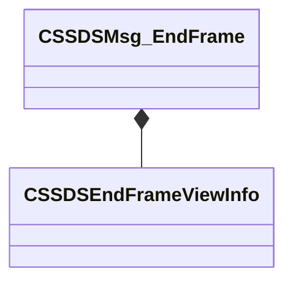
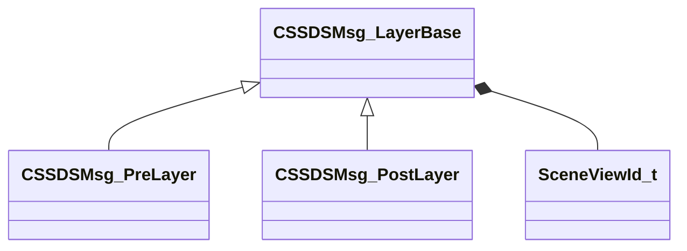
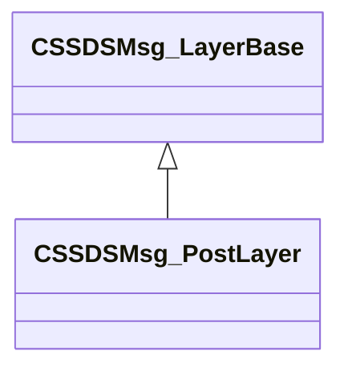
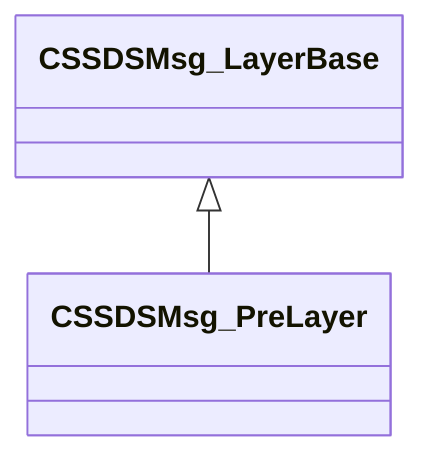
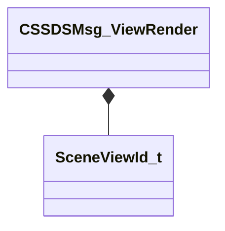
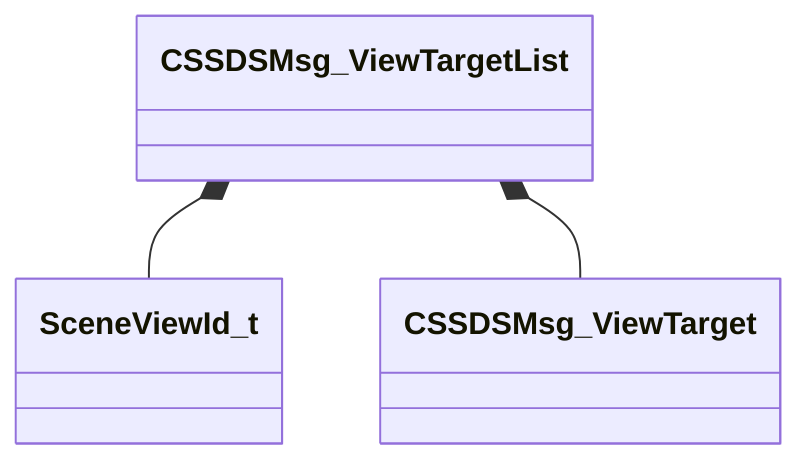

# Module: scenesystem

[📊 View UML Diagram](../diagrams/scenesystem.md)

| Name | Kind | Bases | Fields |
|------|------|-------|--------|
| [CSSDSEndFrameViewInfo](#cssdsendframeviewinfo) | class |  | 2 |
| [CSSDSMsg_EndFrame](#cssdsmsg_endframe) | class |  | 1 |
| [CSSDSMsg_LayerBase](#cssdsmsg_layerbase) | class |  | 5 |
| [CSSDSMsg_PostLayer](#cssdsmsg_postlayer) | class | CSSDSMsg_LayerBase | 0 |
| [CSSDSMsg_PreLayer](#cssdsmsg_prelayer) | class | CSSDSMsg_LayerBase | 0 |
| [CSSDSMsg_ViewRender](#cssdsmsg_viewrender) | class |  | 2 |
| [CSSDSMsg_ViewTarget](#cssdsmsg_viewtarget) | class |  | 10 |
| [CSSDSMsg_ViewTargetList](#cssdsmsg_viewtargetlist) | class |  | 3 |
| [DisableShadows_t](#disableshadows_t) | enum |  | 5 |
| [ESceneObjectVisualization](#esceneobjectvisualization) | enum |  | 6 |
| [ESilhouetteType_t](#esilhouettetype_t) | enum |  | 4 |
| [SceneViewId_t](#sceneviewid_t) | class |  | 2 |

---

### CSSDSEndFrameViewInfo

**Metadata:** `MGetKV3ClassDefaults {
	"m_nViewId": 0,
	"m_ViewName": ""
}`

**Fields:**

| Name | Type | Annotations |
|------|------|-------------|
| `m_nViewId` | uint64 |  |
| `m_ViewName` | CUtlString |  |

### CSSDSMsg_EndFrame

**Metadata:** `MGetKV3ClassDefaults {
	"m_Views":
	[
	]
}`

**Relationships:**

**Fields:**

| Name | Type | Annotations |
|------|------|-------------|
| `m_Views` | CUtlVector<[CSSDSEndFrameViewInfo](../schemas/scenesystem.md#cssdsendframeviewinfo)> |  |

### CSSDSMsg_LayerBase

**Derived by:** [CSSDSMsg_PostLayer](scenesystem.md#cssdsmsg_postlayer), [CSSDSMsg_PreLayer](scenesystem.md#cssdsmsg_prelayer)

**Metadata:** `MGetKV3ClassDefaults {
	"m_viewId":
	{
		"m_nViewId": 0,
		"m_nFrameCount": 0
	},
	"m_ViewName": "",
	"m_nLayerId": 0,
	"m_LayerName": "",
	"m_displayText": ""
}`

**Relationships:**

**Fields:**

| Name | Type | Annotations |
|------|------|-------------|
| `m_viewId` | [SceneViewId_t](../schemas/scenesystem.md#sceneviewid_t) |  |
| `m_ViewName` | CUtlString |  |
| `m_nLayerId` | uint64 |  |
| `m_LayerName` | CUtlString |  |
| `m_displayText` | CUtlString |  |

### CSSDSMsg_PostLayer

**Inherits from:** [CSSDSMsg_LayerBase](scenesystem.md#cssdsmsg_layerbase)

**Metadata:** `MGetKV3ClassDefaults {
	"m_viewId":
	{
		"m_nViewId": 0,
		"m_nFrameCount": 0
	},
	"m_ViewName": "",
	"m_nLayerId": 0,
	"m_LayerName": "",
	"m_displayText": ""
}`

**Relationships:**

### CSSDSMsg_PreLayer

**Inherits from:** [CSSDSMsg_LayerBase](scenesystem.md#cssdsmsg_layerbase)

**Metadata:** `MGetKV3ClassDefaults {
	"m_viewId":
	{
		"m_nViewId": 0,
		"m_nFrameCount": 0
	},
	"m_ViewName": "",
	"m_nLayerId": 0,
	"m_LayerName": "",
	"m_displayText": ""
}`

**Relationships:**

### CSSDSMsg_ViewRender

**Metadata:** `MGetKV3ClassDefaults {
	"m_viewId":
	{
		"m_nViewId": 0,
		"m_nFrameCount": 0
	},
	"m_ViewName": ""
}`

**Relationships:**

**Fields:**

| Name | Type | Annotations |
|------|------|-------------|
| `m_viewId` | [SceneViewId_t](../schemas/scenesystem.md#sceneviewid_t) |  |
| `m_ViewName` | CUtlString |  |

### CSSDSMsg_ViewTarget

**Metadata:** `MGetKV3ClassDefaults {
	"m_Name": "",
	"m_TextureId": 0,
	"m_nWidth": 0,
	"m_nHeight": 0,
	"m_nRequestedWidth": 0,
	"m_nRequestedHeight": 0,
	"m_nNumMipLevels": 0,
	"m_nDepth": 0,
	"m_nMultisampleNumSamples": 0,
	"m_nFormat": 0
}`

**Fields:**

| Name | Type | Annotations |
|------|------|-------------|
| `m_Name` | CUtlString |  |
| `m_TextureId` | uint64 |  |
| `m_nWidth` | int32 |  |
| `m_nHeight` | int32 |  |
| `m_nRequestedWidth` | int32 |  |
| `m_nRequestedHeight` | int32 |  |
| `m_nNumMipLevels` | int32 |  |
| `m_nDepth` | int32 |  |
| `m_nMultisampleNumSamples` | int32 |  |
| `m_nFormat` | int32 |  |

### CSSDSMsg_ViewTargetList

**Metadata:** `MGetKV3ClassDefaults {
	"m_viewId":
	{
		"m_nViewId": 0,
		"m_nFrameCount": 0
	},
	"m_ViewName": "",
	"m_Targets":
	[
	]
}`

**Relationships:**

**Fields:**

| Name | Type | Annotations |
|------|------|-------------|
| `m_viewId` | [SceneViewId_t](../schemas/scenesystem.md#sceneviewid_t) |  |
| `m_ViewName` | CUtlString |  |
| `m_Targets` | CUtlVector<[CSSDSMsg_ViewTarget](../schemas/scenesystem.md#cssdsmsg_viewtarget)> |  |

### DisableShadows_t

**Values:**

| Name | Value | Description |
|------|-------|-------------|
| `kDisableShadows_None` | 0 |  |
| `kDisableShadows_All` | 1 |  |
| `kDisableShadows_Baked` | 2 |  |
| `kDisableShadows_Realtime` | 3 |  |
| `kDisableShadows_ReallyNone` | 4 |  |

### ESceneObjectVisualization

**Values:**

| Name | Value | Description |
|------|-------|-------------|
| `SCENEOBJECT_VIS_NONE` | 0 |  |
| `SCENEOBJECT_VIS_OBJECT` | 1 |  |
| `SCENEOBJECT_VIS_MATERIAL` | 2 |  |
| `SCENEOBJECT_VIS_TEXTURE_SIZE` | 3 |  |
| `SCENEOBJECT_VIS_LOD` | 4 |  |
| `SCENEOBJECT_VIS_INSTANCING` | 5 |  |

### ESilhouetteType_t

**Values:**

| Name | Value | Description |
|------|-------|-------------|
| `SILHOUETTE_NONE` | 0 |  |
| `SILHOUETTE_LIGHT` | 1 |  |
| `SILHOUETTE_ENVMAP` | 2 |  |
| `SILHOUETTE_LPV` | 4 |  |

### SceneViewId_t

**Metadata:** `MGetKV3ClassDefaults {
	"m_nViewId": 4294967295,
	"m_nFrameCount": 4294967295
}`

**Fields:**

| Name | Type | Annotations |
|------|------|-------------|
| `m_nViewId` | uint64 |  |
| `m_nFrameCount` | uint64 |  |
