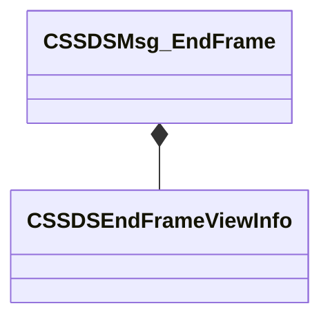
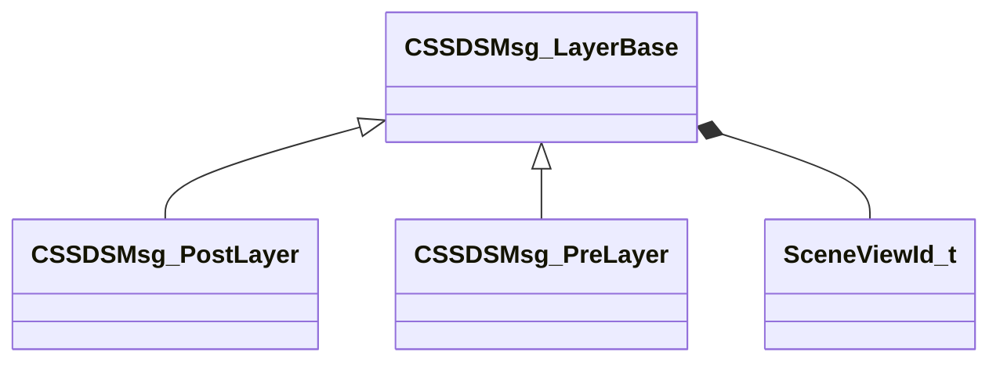
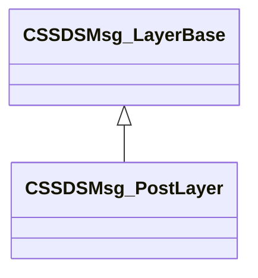
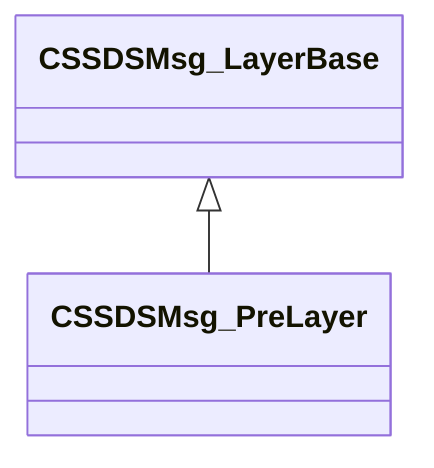
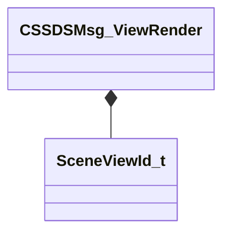
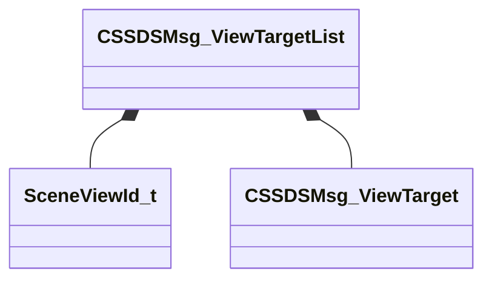

# Module: scenesystem

[📊 View UML Diagram](../diagrams/scenesystem.md)

| Name | Kind | Bases | Fields |
|------|------|-------|--------|
| [CSSDSEndFrameViewInfo](#cssdsendframeviewinfo) | class |  | 2 |
| [CSSDSMsg_EndFrame](#cssdsmsg_endframe) | class |  | 1 |
| [CSSDSMsg_LayerBase](#cssdsmsg_layerbase) | class |  | 5 |
| [CSSDSMsg_PostLayer](#cssdsmsg_postlayer) | class | CSSDSMsg_LayerBase | 0 |
| [CSSDSMsg_PreLayer](#cssdsmsg_prelayer) | class | CSSDSMsg_LayerBase | 0 |
| [CSSDSMsg_ViewRender](#cssdsmsg_viewrender) | class |  | 2 |
| [CSSDSMsg_ViewTarget](#cssdsmsg_viewtarget) | class |  | 10 |
| [CSSDSMsg_ViewTargetList](#cssdsmsg_viewtargetlist) | class |  | 3 |
| [SceneViewId_t](#sceneviewid_t) | class |  | 2 |

---

### CSSDSEndFrameViewInfo

**Metadata:** `MGetKV3ClassDefaults`

**Fields:**

| Name | Type | Annotations |
|------|------|-------------|
| `m_nViewId` | uint64 |  |
| `m_ViewName` | CUtlString |  |

### CSSDSMsg_EndFrame

**Metadata:** `MGetKV3ClassDefaults`

**Relationships:**

```mermaid
classDiagram
    CSSDSMsg_EndFrame *-- CSSDSEndFrameViewInfo
```

**Fields:**

| Name | Type | Annotations |
|------|------|-------------|
| `m_Views` | CUtlVector< [CSSDSEndFrameViewInfo](../schemas/scenesystem.md#cssdsendframeviewinfo) > |  |

### CSSDSMsg_LayerBase

**Derived by:** [CSSDSMsg_PostLayer](scenesystem.md#cssdsmsg_postlayer), [CSSDSMsg_PreLayer](scenesystem.md#cssdsmsg_prelayer)

**Metadata:** `MGetKV3ClassDefaults`

**Relationships:**

```mermaid
classDiagram
    CSSDSMsg_LayerBase <|-- CSSDSMsg_PostLayer
    CSSDSMsg_LayerBase <|-- CSSDSMsg_PreLayer
    CSSDSMsg_LayerBase *-- SceneViewId_t
```

**Fields:**

| Name | Type | Annotations |
|------|------|-------------|
| `m_viewId` | [SceneViewId_t](../schemas/scenesystem.md#sceneviewid_t) |  |
| `m_ViewName` | CUtlString |  |
| `m_nLayerId` | uint64 |  |
| `m_LayerName` | CUtlString |  |
| `m_displayText` | CUtlString |  |

### CSSDSMsg_PostLayer

**Inherits from:** [CSSDSMsg_LayerBase](scenesystem.md#cssdsmsg_layerbase)

**Metadata:** `MGetKV3ClassDefaults`

**Relationships:**

```mermaid
classDiagram
    CSSDSMsg_LayerBase <|-- CSSDSMsg_PostLayer
```

### CSSDSMsg_PreLayer

**Inherits from:** [CSSDSMsg_LayerBase](scenesystem.md#cssdsmsg_layerbase)

**Metadata:** `MGetKV3ClassDefaults`

**Relationships:**

```mermaid
classDiagram
    CSSDSMsg_LayerBase <|-- CSSDSMsg_PreLayer
```

### CSSDSMsg_ViewRender

**Metadata:** `MGetKV3ClassDefaults`

**Relationships:**

```mermaid
classDiagram
    CSSDSMsg_ViewRender *-- SceneViewId_t
```

**Fields:**

| Name | Type | Annotations |
|------|------|-------------|
| `m_viewId` | [SceneViewId_t](../schemas/scenesystem.md#sceneviewid_t) |  |
| `m_ViewName` | CUtlString |  |

### CSSDSMsg_ViewTarget

**Metadata:** `MGetKV3ClassDefaults`

**Fields:**

| Name | Type | Annotations |
|------|------|-------------|
| `m_Name` | CUtlString |  |
| `m_TextureId` | uint64 |  |
| `m_nWidth` | int32 |  |
| `m_nHeight` | int32 |  |
| `m_nRequestedWidth` | int32 |  |
| `m_nRequestedHeight` | int32 |  |
| `m_nNumMipLevels` | int32 |  |
| `m_nDepth` | int32 |  |
| `m_nMultisampleNumSamples` | int32 |  |
| `m_nFormat` | int32 |  |

### CSSDSMsg_ViewTargetList

**Metadata:** `MGetKV3ClassDefaults`

**Relationships:**

```mermaid
classDiagram
    CSSDSMsg_ViewTargetList *-- SceneViewId_t
    CSSDSMsg_ViewTargetList *-- CSSDSMsg_ViewTarget
```

**Fields:**

| Name | Type | Annotations |
|------|------|-------------|
| `m_viewId` | [SceneViewId_t](../schemas/scenesystem.md#sceneviewid_t) |  |
| `m_ViewName` | CUtlString |  |
| `m_Targets` | CUtlVector< [CSSDSMsg_ViewTarget](../schemas/scenesystem.md#cssdsmsg_viewtarget) > |  |

### SceneViewId_t

**Metadata:** `MGetKV3ClassDefaults`

**Fields:**

| Name | Type | Annotations |
|------|------|-------------|
| `m_nViewId` | uint64 |  |
| `m_nFrameCount` | uint64 |  |
