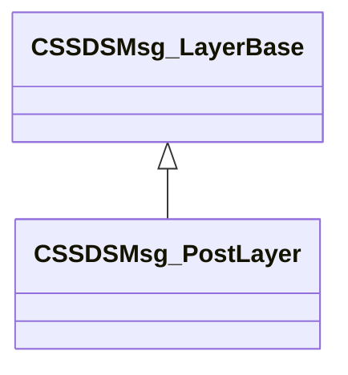

[Schemas](../../schemas.md) / [scenesystem](../scenesystem.md) / CSSDSMsg_PostLayer

# CSSDSMsg_PostLayer

**Kind:** class · **Size:** 48 bytes (`0x30`) · **Align:** 8 · **Module:** scenesystem

**Inherits from:** [CSSDSMsg_LayerBase](../scenesystem/CSSDSMsg_LayerBase.md)

**Relationships:**

## Memory layout

5 fields (0 declared here, 5 inherited). Offsets are absolute from the object base.

| Offset | Field | Type | From | Annotations |
|--------|-------|------|------|-------------|
| `0x0` | `m_viewId` | [SceneViewId_t](../scenesystem/SceneViewId_t.md) | [CSSDSMsg_LayerBase](../scenesystem/CSSDSMsg_LayerBase.md) |  |
| `0x10` | `m_ViewName` | CUtlString | [CSSDSMsg_LayerBase](../scenesystem/CSSDSMsg_LayerBase.md) |  |
| `0x18` | `m_nLayerId` | uint64 | [CSSDSMsg_LayerBase](../scenesystem/CSSDSMsg_LayerBase.md) |  |
| `0x20` | `m_LayerName` | CUtlString | [CSSDSMsg_LayerBase](../scenesystem/CSSDSMsg_LayerBase.md) |  |
| `0x28` | `m_displayText` | CUtlString | [CSSDSMsg_LayerBase](../scenesystem/CSSDSMsg_LayerBase.md) |  |

KV3 class defaults

<pre>{
	&quot;m_viewId&quot;:
	{
		&quot;m_nViewId&quot;: 0,
		&quot;m_nFrameCount&quot;: 0
	},
	&quot;m_ViewName&quot;: &quot;&quot;,
	&quot;m_nLayerId&quot;: 0,
	&quot;m_LayerName&quot;: &quot;&quot;,
	&quot;m_displayText&quot;: &quot;&quot;
}</pre>

