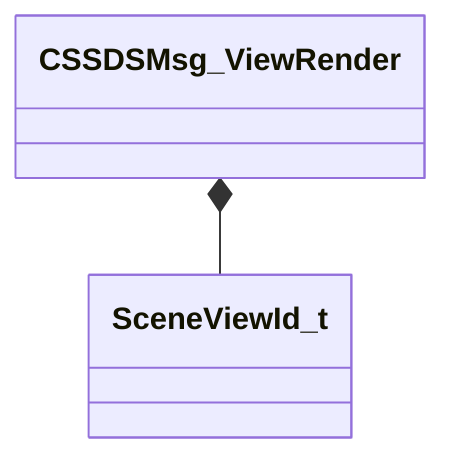

[Schemas](../../schemas.md) / [scenesystem](../scenesystem.md) / CSSDSMsg_ViewRender

# CSSDSMsg_ViewRender

**Kind:** class · **Size:** 24 bytes (`0x18`) · **Align:** 8 · **Module:** scenesystem

**Relationships:**

## Memory layout

2 fields (2 declared here, 0 inherited). Offsets are absolute from the object base.

| Offset | Field | Type | From | Annotations |
|--------|-------|------|------|-------------|
| `0x0` | `m_viewId` | [SceneViewId_t](../scenesystem/SceneViewId_t.md) |  |  |
| `0x10` | `m_ViewName` | CUtlString |  |  |

KV3 class defaults

<pre>{
	&quot;m_viewId&quot;:
	{
		&quot;m_nViewId&quot;: 0,
		&quot;m_nFrameCount&quot;: 0
	},
	&quot;m_ViewName&quot;: &quot;&quot;
}</pre>

