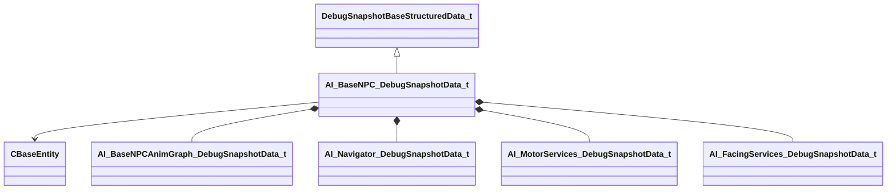

[Schemas](../../schemas.md) / [server](../server.md) / AI_BaseNPC_DebugSnapshotData_t

# AI_BaseNPC_DebugSnapshotData_t

**Kind:** class · **Size:** 376 bytes (`0x178`) · **Align:** 8 · **Module:** server

**Inherits from:** [DebugSnapshotBaseStructuredData_t](../server/DebugSnapshotBaseStructuredData_t.md)

**Metadata:** `MPropertyFriendlyName Base NPC`

**Relationships:**

## Memory layout

13 fields (13 declared here, 0 inherited). Offsets are absolute from the object base.

| Offset | Field | Type | From | Annotations |
|--------|-------|------|------|-------------|
| `0x8` | `npc_state` | CGlobalSymbol |  |  |
| `0x10` | `current_enemy` | CHandle< [CBaseEntity](../server/CBaseEntity.md) > |  |  |
| `0x18` | `s_current_schedule` | CUtlString |  |  |
| `0x20` | `s_current_task` | CGlobalSymbol |  |  |
| `0x28` | `s_prev_schedule` | CUtlString |  |  |
| `0x30` | `s_npc_current_movement` | CUtlString |  |  |
| `0x38` | `s_last_task_end_location` | CUtlString |  |  |
| `0x40` | `conditions` | CUtlVector< CGlobalSymbol > |  |  |
| `0x58` | `anim_events` | CUtlVector< CGlobalSymbol > |  |  |
| `0x70` | `animgraph` | [AI_BaseNPCAnimGraph_DebugSnapshotData_t](../server/AI_BaseNPCAnimGraph_DebugSnapshotData_t.md) |  |  |
| `0xb0` | `navigator` | [AI_Navigator_DebugSnapshotData_t](../server/AI_Navigator_DebugSnapshotData_t.md) |  |  |
| `0x100` | `motorServices` | [AI_MotorServices_DebugSnapshotData_t](../server/AI_MotorServices_DebugSnapshotData_t.md) |  |  |
| `0x130` | `facingServices` | [AI_FacingServices_DebugSnapshotData_t](../server/AI_FacingServices_DebugSnapshotData_t.md) |  |  |

KV3 class defaults

<pre>{
	&quot;_class&quot;: &quot;AI_BaseNPC_DebugSnapshotData_t&quot;,
	&quot;npc_state&quot;: &quot;&quot;,
	&quot;current_enemy&quot;: null,
	&quot;s_current_schedule&quot;: &quot;&quot;,
	&quot;s_current_task&quot;: &quot;&quot;,
	&quot;s_prev_schedule&quot;: &quot;&quot;,
	&quot;s_npc_current_movement&quot;: &quot;&quot;,
	&quot;s_last_task_end_location&quot;: &quot;&quot;,
	&quot;conditions&quot;:
	[
	],
	&quot;anim_events&quot;:
	[
	],
	&quot;animgraph&quot;:
	{
		&quot;e_action_desired&quot;: &quot;&quot;,
		&quot;e_action_handshake_restart&quot;: &quot;&quot;,
		&quot;e_action_handshake_body_authority_current&quot;: &quot;&quot;,
		&quot;e_action_handshake_body_authority_desired&quot;: &quot;&quot;,
		&quot;e_movement_type_desired&quot;: &quot;&quot;,
		&quot;e_movement_handshake_restart&quot;: &quot;&quot;,
		&quot;e_movement_handshake_body_authority_current&quot;: &quot;&quot;,
		&quot;e_movement_handshake_body_authority_desired&quot;: &quot;&quot;
	},
	&quot;navigator&quot;:
	{
		&quot;s_movement_id&quot;: &quot;&quot;,
		&quot;s_movement_serial_number&quot;: 0,
		&quot;s_goal_source_location&quot;: &quot;&quot;,
		&quot;last_waypoint_pos&quot;: null,
		&quot;goal_location&quot;: null,
		&quot;waypoints&quot;:
		[
		],
		&quot;s_arrival_movement_gait_set&quot;: &quot;&quot;
	},
	&quot;motorServices&quot;:
	{
		&quot;active_motor&quot;: &quot;&quot;,
		&quot;desired_speed&quot;: 0.000000,
		&quot;motor_velocity&quot;:
		[
			0.000000,
			0.000000,
			0.000000
		],
		&quot;motor_path&quot;:
		[
		]
	},
	&quot;facingServices&quot;:
	{
		&quot;npc_position&quot;: null,
		&quot;facing_target_source&quot;: &quot;&quot;,
		&quot;facing_target&quot;: null,
		&quot;schedule_facing_priority&quot;: &quot;&quot;,
		&quot;strafing_source&quot;: &quot;&quot;,
		&quot;strafing_enabled&quot;: false,
		&quot;movement_id&quot;: &quot;&quot;
	}
}</pre>

